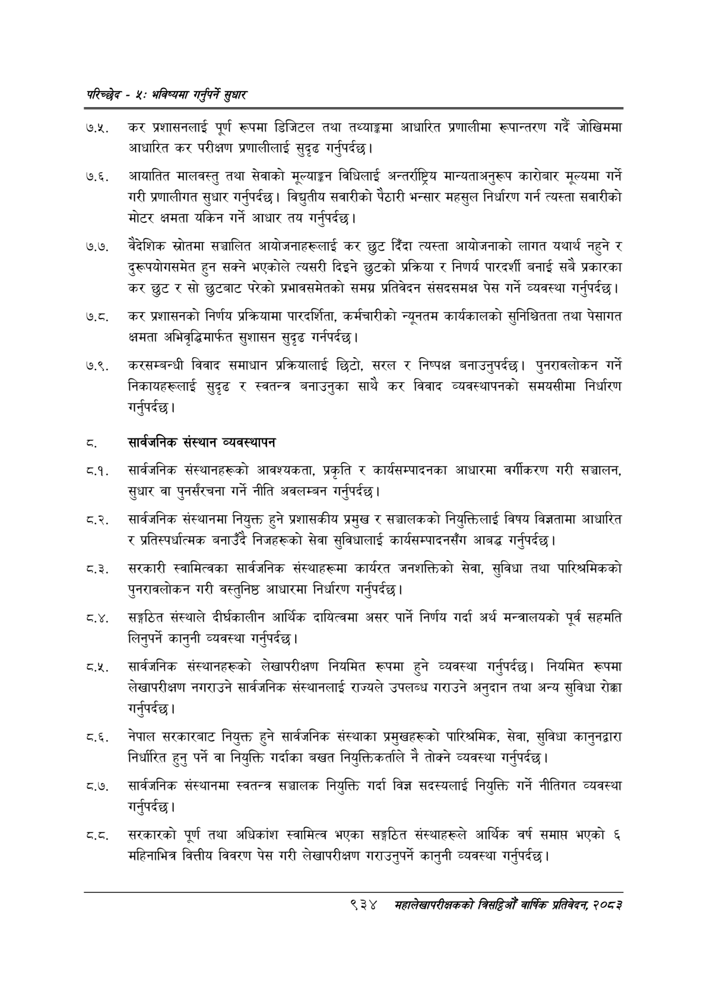

# Page 992 QA

## Rendered page


## Extracted text

```text
परिच्छेष -४: भविष्यमा गर्नुपर्ने सुधार
७.५. कर प्रशासनलाई पूर्ण रूपमा डिजिटल तथा तथ्याङ्कमा आधारित प्रणालीमा रूपान्तरण गर्दै जोखिममा आधारित कर परीक्षण प्रणालीलाई सुदृढ गर्नुपर्दछ।
७.६. आयातित मालवस्तु तथा सेवाको मूल्याङ्कन विधिलाई अन्तर्राष्ट्रिय मान्यताअनुरूप कारोबार मूल्यमा गर्ने गरी प्रणालीगत सुधार गर्नुपर्दछ। विद्युतीय सवारीको पैठारी भन्सार महसुल निर्धारण गर्न त्यस्ता सवारीको मोटर क्षमता यकिन गर्ने आधार तय गर्नुपर्दछ |
७.७. वैदेशिक स्रोतमा सञ्चालित आयोजनाहरूलाई कर छुट दिँदा त्यस्ता आयोजनाको लागत यथार्थ नहुने र दुरूपयोगसमेत हुन सक्ने भएकोले त्यसरी दिइने छुटको प्रक्रिया र निणर्य पारदर्शी बनाई सबै प्रकारका कर छुट र सो छुटबाट परेको प्रभावसमेतको समग्र प्रतिवेदन संसदसमक्ष पेस गर्ने व्यवस्था गर्नुपर्दछ |
कर प्रशासनको निर्णय प्रक्रियामा पारदर्शिता, कर्मचारीको न्यूनतम कार्यकालको सुनिश्चितता तथा पेसागत क्षमता अभिवृद्धिमार्फत सुशासन सुदृढ गर्नपर्दछ।
७.९. करसम्बन्धी विवाद समाधान प्रक्रियालाई छिटो, सरल र निष्पक्ष बनाउनुपर्दछ। पुनरावलोकन गर्ने निकायहरूलाई सुदृढ र स्वतन्त्र बनाउनुका साथै कर विवाद व्यवस्थापनको समयसीमा निर्धारण गर्नुपर्दछ |
सार्वजनिक संस्थान व्यवस्थापन
८.१. सार्वजनिक संस्थानहरूको आवश्यकता, प्रकृति र कार्यसम्पादनका आधारमा वर्गीकरण गरी सञ्चालन, सुधार वा पुनर्संरचना गर्ने नीति अवलम्बन गर्नुपर्दछ |
[ सार्वजनिक संस्थानमा नियुक्त हुने प्रशासकीय प्रमुख र सञ्चालकको नियुक्तिलाई विषय विज्ञतामा आधारित र प्रतिस्पर्धात्मक बनाउँदै निजहरूको सेवा सुविधालाई कार्यसम्पादनसँग आबद्ध गर्नुपर्दछ |
.३. सरकारी स्वामित्वका सार्वजनिक संस्थाहरूमा कार्यरत जनशक्तिको सेवा, सुविधा तथा पारिश्रमिकको पुनरावलोकन गरी वस्तुनिष्ठ आधारमा निर्धारण गर्नुपर्दछ।
ठ. ४. सङ्गठित संस्थाले दीर्घकालीन आर्थिक दायित्वमा असर पार्ने निर्णय गर्दा अर्थ मन्त्रालयको पूर्व सहमति लिनुपर्ने कानुनी व्यवस्था गर्नुपर्दछ |
८.२. सार्वजनिक संस्थानहरूको लेखापरीक्षण नियमित रूपमा हुने व्यवस्था गर्नुपर्दछ। नियमित रूपमा लेखापरीक्षण नगराउने सार्वजनिक संस्थानलाई राज्यले उपलब्ध गराउने अनुदान तथा अन्य सुविधा रोक्का गर्नुपर्दछ |
ट.६. नेपाल सरकारबाट नियुक्त हुने सार्वजनिक संस्थाका प्रमुखहरूको पारिश्रमिक, सेवा, सुविधा कानुनद्वारा निर्धारित हुन्‌ पर्ने वा नियुक्ति गर्दाका बखत नियुक्तिकर्ताले नै तोक्ने व्यवस्था गर्नुपर्दछ |
ठ.७. सार्वजनिक संस्थानमा स्वतन्त्र सञ्चालक नियुक्ति गर्दा विज्ञ सदस्यलाई नियुक्ति गर्ने नीतिगत व्यवस्था गर्नुपर्दछ |
सरकारको पूर्ण तथा अधिकांश स्वामित्व भएका सङ्गठित संस्थाहरूले आर्थिक वर्ष समाप्त भएको ६ महिनाभित्र वित्तीय विवरण पेस गरी लेखापरीक्षण गराउनुपर्ने कानुनी व्यवस्था गर्नुपर्दछ |
९३४ मंहालेखापरीक्षकको वार्षिक प्रतिवेदन; २०८२
```

## Flags
- None
