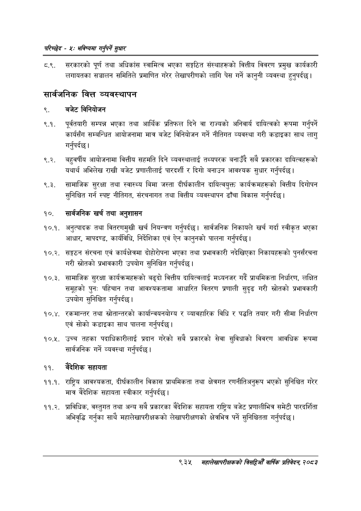

# Page 993 QA

## Rendered page


## Extracted text

```text
परिच्छेष -४: भविष्यमा गर्नुपर्ने सुधार
.. सरकारको पूर्ण तथा अधिकांस स्वामित्व भएका सङ्गठित संस्थाहरूको वित्तीय विवरण प्रमुख कार्यकारी लगायतका सञ्चालन समितिले प्रमाणित गरेर लेखापरीणको लागि पेस गर्ने कानुनी व्यवस्था हुनुपर्दछ |
सार्वजनिक वित्त व्यवस्थापन
९. बजेट विनियोजन
९.१. पूर्वतयारी सम्पन्न भएका तथा आर्थिक प्रतिफल दिने वा राज्यको अनिवार्य दायित्वको रूपमा गर्नुपर्ने कार्यसँग सम्बन्धित आयोजनामा मात्र बजेट विनियोजन गर्ने नीतिगत व्यवस्था गरी कडाइका साथ लागु गर्नुपर्दछ |
९.२. बहुवर्षीय आयोजनामा वित्तीय सहमति दिने व्यवस्थालाई तथ्यपरक बनाउँदै सबै प्रकारका दायित्वहरूको यथार्थ अभिलेख राखी बजेट प्रणालीलाई पारदर्शी र दिगो बनाउन आवश्यक सुधार गर्नुपर्दछ।
९.३. सामाजिक सुरक्षा तथा स्वास्थ्य बिमा जस्ता दीर्घकालीन दायित्वयुक्त कार्यक्रमहरूको वित्तीय दिगोपन सुनिश्चित गर्न स्पष्ट नीतिगत, संरचनागत तथा वित्तीय व्यवस्थापन ढाँचा विकास गर्नुपर्दछ |
१०. सार्वजनिक खर्च तथा अनुशासन
१०.१. अनुत्पादक तथा वितरणमुखी खर्च नियन्त्रण गर्नुपर्दछ। सार्वजनिक निकायले खर्च गर्दा स्वीकृत भएका आधार, मापदण्ड, कार्यविधि, निर्देशिका एवं ऐन कानुनको पालना गर्नुपर्दछ |
१०.२. सङ्गठन संरचना एवं कार्यक्षेत्रमा दोहोरोपना भएका तथा प्रभावकारी नदेखिएका निकायहरूको पुनर्संरचना गरी स्रोतको प्रभावकारी उपयोग सुनिश्चित गर्नुपर्दछ |
१०.३. सामाजिक सुरक्षा कार्यक्रमहरूको बढ्दो वित्तीय दायित्वलाई मध्यनजर गर्दै प्राथमिकता निर्धारण, लक्षित समूहको पुनः पहिचान तथा आवश्यकतामा आधारित वितरण प्रणाली सुदृढ गरी स्रोतको प्रभावकारी उपयोग सुनिश्चित गर्नुपर्दछ |
१०.४. रकमान्तर तथा स्रोतान्तरको कार्यान्वयनयोग्य र व्यावहारिक विधि र पद्धति तयार गरी सीमा निर्धारण एवं सोको कडाइका साथ पालना गर्नुपर्दछ |
१०.२५. उच्च तहका पदाधिकारीलाई प्रदान गरेको सबै प्रकारको सेवा सुविधाको विवरण आवधिक रूपमा सार्वजनिक गर्ने व्यवस्था गर्नुपर्दछ |
वैदेशिक सहायता
. राष्ट्रिय आवश्यकता, दीर्घकालीन विकास प्राथमिकता तथा क्षेत्रगत रणनीतिअनुरूप भएको सुनिश्चित गरेर मात्र वैदेशिक सहायता स्वीकार गर्नुपर्दछ |
. प्राविधिक, वस्तुगत तथा अन्य सबै प्रकारका वैदेशिक सहायता राष्ट्रिय बजेट प्रणालीभित्र समेटी पारदर्शिता अभिवृद्धि गर्नुका साथै महालेखापरीक्षकको लेखापरीक्षणको क्षेत्रभित्र पर्ने सुनिश्चितता गर्नुपर्दछ |
९३५
मसंहालेखापरीक्षकको बितदिमो वार्षिक प्रतिवेदन; २०८२
```

## Flags
- None
