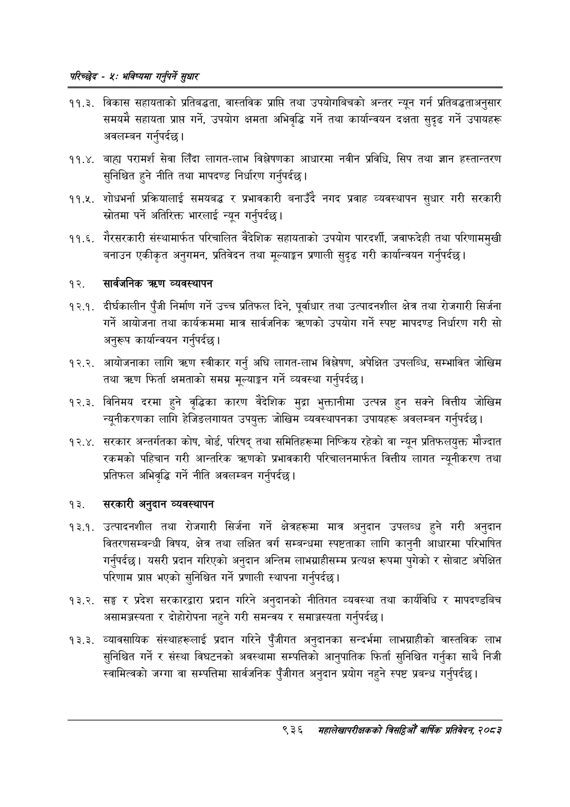

# Page 994 QA

## Rendered page


## Extracted text

```text
परिच्छेष -४: भविष्यमा गर्नुपर्ने सुधार
११.३. विकास सहायताको प्रतिबद्धता, वास्तविक प्राप्ति तथा उपयोगबिचको अन्तर न्यून गर्न प्रतिबद्धताअनुसार समयमै सहायता प्राप्त गर्ने, उपयोग क्षमता अभिवृद्धि गर्ने तथा कार्यान्वयन दक्षता सुदृढ गर्ने उपायहरू अवलम्बन गर्नुपर्दछ |
. बाहाय परामर्श सेवा लिँदा लागत-लाभ विश्लेषणका आधारमा नवीन प्रविधि, सिप तथा ज्ञान हस्तान्तरण सुनिश्चित हुने नीति तथा मापदण्ड निर्धारण गर्नुपर्दछ |
. शोधभर्ना प्रक्रियालाई समयबद्ध र प्रभावकारी बनाउँदै नगद प्रवाह व्यवस्थापन सुधार गरी सरकारी स्रोतमा पर्ने अतिरिक्त भारलाई न्यून गर्नुपर्दछ |
. गैरसरकारी संस्थामार्फत परिचालित वैदेशिक सहायताको उपयोग पारदर्शी, जवाफदेही तथा परिणाममुखी बनाउन एकीकृत अनुगमन, प्रतिवेदन तथा मूल्याङ्कन प्रणाली सुदृढ गरी कार्यान्वयन गर्नुपर्दछ |
सार्वजनिक त्रण व्यवस्थापन
. दीर्घकालीन पुँजी निर्माण गर्ने उच्च प्रतिफल दिने, पूर्वाधार तथा उत्पादनशील क्षेत्र तथा रोजगारी सिर्जना गर्ने आयोजना तथा कार्यक्रममा मात्र सार्वजनिक उपयोग गर्ने स्पष्ट मापदण्ड निर्धारण गरी सो अनुरूप कार्यान्वयन गर्नुपर्दछ |
आयोजनाका लागि त्रण स्वीकार गर्नु अघि लागत-लाभ विश्लेषण, अपेक्षित उपलब्धि, सम्भावित जोखिम तथा त्रहण फिर्ता क्षमताको समग्र मूल्याङ्कन गर्ने व्यवस्था गर्नुपर्दछ |
. विनिमय दरमा हुने वृद्धिका कारण वैदेशिक मुद्रा भुक्तानीमा उत्पन्न हुन सक्ने वित्तीय जोखिम न्यूनीकरणका लागि हेजिङलगायत उपयुक्त जोखिम व्यवस्थापनका उपायहरू अवलम्बन गर्नुपर्दछ।
. सरकार अन्तर्गतका कोष, बोर्ड, परिषद्‌ तथा समितिहरूमा निष्क्रिय रहेको वा न्यून प्रतिफलयुक्त मौज्दात रकमको पहिचान गरी आन्तरिक त्रणको प्रभावकारी परिचालनमार्फत वित्तीय लागत न्यूनीकरण तथा प्रतिफल अभिवृद्धि गर्ने नीति अवलम्बन गर्नुपर्दछ |
सरकारी अनुदान व्यवस्थापन
. उत्पादनशील तथा रोजगारी सिर्जना गर्ने क्षेत्रहरूमा मात्र अनुदान उपलब्ध हुने गरी अनुदान वितरणसम्बन्धी विषय, क्षेत्र तथा लक्षित वर्ग सम्बन्धमा स्पष्टताका लागि कानुनी आधारमा परिभाषित गर्नुपर्दछ। यसरी प्रदान गरिएको अनुदान अन्तिम लाभग्राहीसम्म प्रत्यक्ष रूपमा पुगेको र सोबाट अपेक्षित परिणाम प्रापत भएको सुनिश्चित गर्ने प्रणाली स्थापना गर्नुपर्दछ |
१३.२. सङ्घ र प्रदेश सरकारद्वारा प्रदान गरिने अनुदानको नीतिगत व्यवस्था तथा कार्यविधि र मापदण्डबिच असामञ्जस्यता र दोहोरोपना नहुने गरी समन्वय र समाझ्जस्यता गर्नुपर्दछ |
. व्यावसायिक संस्थाहरूलाई प्रदान गरिने पुँजीगत अनुदानका सन्दर्भमा लाभग्राहीको वास्तविक लाभ सुनिश्चित गर्ने र संस्था विघटनको अवस्थामा सम्पत्तिको आनुपातिक फिर्ता सुनिश्चित गर्नुका साथै निजी स्वामित्वको जग्गा वा सम्पत्तिमा सार्वजनिक पुँजीगत अनुदान प्रयोग नहुने स्पष्ट प्रबन्ध गर्नुपर्दछ |
९३६ मंहालेखापरीक्षकको बितद्िमो वार्षिक प्रतिवेदन; २०८२
```

## Flags
- None
