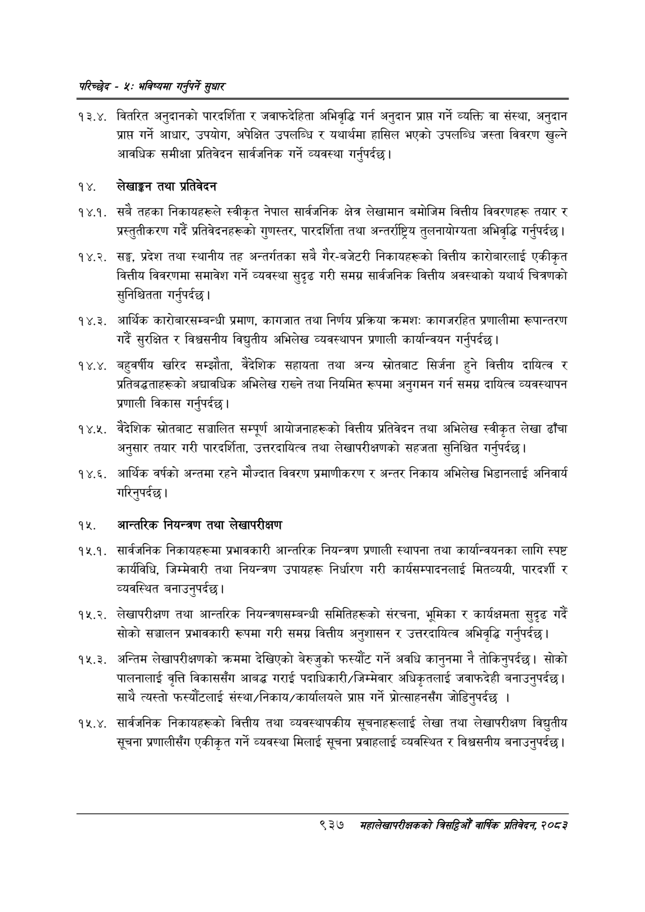

# Page 995 QA

## Rendered page


## Extracted text

```text
परिच्छेद -४: भविष्यसा गनुपर्ने सुधार
१३.४. वितरित अनुदानको पारदर्शिता र जवाफदेहिता अभिवृद्धि गर्न अनुदान प्राप्त गर्ने व्यक्ति वा संस्था, अनुदान प्राप्त गर्ने आधार, उपयोग, अपेक्षित उपलब्धि र यथार्थमा हासिल भएको उपलब्धि जस्ता विवरण खुल्ने आवधिक समीक्षा प्रतिवेदन सार्वजनिक गर्ने व्यवस्था गर्नुपर्दछ |
१४. लेखाङ्गन तथा प्रतिवेदन
१४.१. सबै तहका निकायहरूले स्वीकृत नेपाल सार्वजनिक क्षेत्र लेखामान बमोजिम वित्तीय विवरणहरू तयार र प्रस्तुतीकरण गर्दै प्रतिवेदनहरूको गुणस्तर, पारदर्शिता तथा अन्तर्राष्ट्रिय तुलनायोग्यता अभिवृद्धि गर्नुपर्दछ |
१४.२. सङ्घ, प्रदेश तथा स्थानीय तह अन्तर्गतका सबै गैर-बजेटरी निकायहरूको वित्तीय कारोबारलाई एकीकृत वित्तीय विवरणमा समावेश गर्ने व्यवस्था सुदृढ गरी समग्र सार्वजनिक वित्तीय अवस्थाको यथार्थ चित्रणको सुनिश्चितता गर्नुपर्दछ |
१४.३. आर्थिक कारोबारसम्बन्धी प्रमाण, कागजात तथा निर्णय प्रक्रिया क्रमशः कागजरहित प्रणालीमा रूपान्तरण गर्दै सुरक्षित र विश्वसनीय विद्युतीय अभिलेख व्यवस्थापन प्रणाली कार्यान्वयन गर्नुपर्दछ |
१४.४. बहुवर्षीय खरिद सम्झौता, वैदेशिक सहायता तथा अन्य स्रोतबाट सिर्जना हुने वित्तीय दायित्व र प्रतिबद्धताहरूको अद्यावधिक अभिलेख राख्ने तथा नियमित रूपमा अनुगमन गर्न समग्र दायित्व व्यवस्थापन प्रणाली विकास गर्नुपर्दछ |
१४.२. वैदेशिक स्रोतबाट सञ्चालित सम्पूर्ण आयोजनाहरूको वित्तीय प्रतिवेदन तथा अभिलेख स्वीकृत लेखा ढाँचा अनुसार तयार गरी पारदर्शिता, उत्तरदायित्व तथा लेखापरीक्षणको सहजता सुनिश्चित गर्नुपर्दछ |
१४.६. आर्थिक वर्षको अन्तमा रहने मौज्दात विवरण प्रमाणीकरण र अन्तर निकाय अभिलेख भिडानलाई अनिवार्य गरिनुपर्दछ |
१५. आन्तरिक नियन्त्रण तथा लेखापरीक्षण
१२५.१. सार्वजनिक निकायहरूमा प्रभावकारी आन्तरिक नियन्त्रण प्रणाली स्थापना तथा कार्यान्वयनका लागि स्पष्ट कार्यविधि, जिम्मेवारी तथा नियन्त्रण उपायहरू निर्धारण गरी कार्यसम्पादनलाई मितव्ययी, पारदर्शी र व्यवस्थित बनाउनुपर्दछ |
१२५.२. लेखापरीक्षण तथा आन्तरिक नियन्त्रणसम्बन्धी समितिहरूको संरचना, भूमिका र कार्यक्षमता सुदृढ गर्दै सोको सञ्चालन प्रभावकारी रूपमा गरी समग्र वित्तीय अनुशासन र उत्तरदायित्व अभिवृद्धि गर्नुपर्दछ।
१२५.३. अन्तिम लेखापरीक्षणको क्रममा देखिएको बेरुजुको फस्यौंट गर्ने अवधि कानुनमा नै तोकिन्‌पर्दछ। सोको पालनालाई वृत्ति विकाससँग आबद्ध गराई पदाधिकारी/जिम्मेवार अधिकृतलाई जवाफदेही बनाउनुपर्दछ | साथै त्यस्तो फस्यौटलाई संस्था/निकाय/कार्यालयले प्राप्त गर्ने प्रोत्साहनसँग जोडिन्‌पर्दछ |
. सार्वजनिक निकायहरूको वित्तीय तथा व्यवस्थापकीय सूचनाहरूलाई लेखा तथा लेखापरीक्षण विद्युतीय सूचना प्रणालीसँग एकीकृत गर्ने व्यवस्था मिलाई सूचना प्रवाहलाई व्यवस्थित र विश्वसनीय बनाउनुपर्दछ |
९३७ मंहालेखापरीक्षकको बितदिमो वार्षिक प्रतिवेदन; २०८२
```

## Flags
- None
