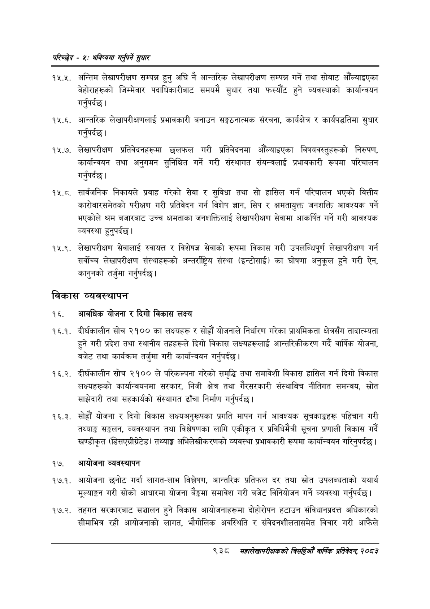

# Page 996 QA

## Rendered page


## Extracted text

```text
परिच्छेद -४: भविष्यसा गनुपर्ने सुधार
१२५.२. अन्तिम लेखापरीक्षण सम्पन्न हुनु अघि नै आन्तरिक लेखापरीक्षण सम्पन्न गर्ने तथा सोबाट औँल्याइएका बेहोराहरूको जिम्मेवार पदाधिकारीबाट समयमै सुधार तथा फस्यौंट हुने व्यवस्थाको कार्यान्वयन गर्नुपर्दछ |
आन्तरिक लेखापरीक्षणलाई प्रभावकारी बनाउन सङ्गठनात्मक संरचना, कार्यक्षेत्र र कार्यपद्धतिमा सुधार गर्नुपर्दछ |
४.६, लेखापरीक्षण प्रतिवेदनहरूमा छलफल गरी प्रतिवेदनमा औंल्याइएका विषयवस्तुहरूको निरुपण, कार्यान्वयन तथा अनुगमन सुनिश्चित गर्ने गरी संस्थागत संयन्त्रलाई प्रभावकारी रूपमा परिचालन गर्नुपर्दछ |
१५.८. सार्वजनिक निकायले प्रवाह गरेको सेवा र सुविधा तथा सो हासिल गर्न परिचालन भएको वित्तीय कारोबारसमेतको परीक्षण गरी प्रतिवेदन गर्न विशेष ज्ञान, सिप र क्षमतायुक्त जनशक्ति आवश्यक पर्ने भएकोले श्रम बजारबाट उच्च क्षमताका जनशक्तिलाई लेखापरीक्षण सेवामा आकर्षित गर्ने गरी आवश्यक व्यवस्था हुनुपर्दछ |
१४५.९. लेखापरीक्षण सेवालाई स्वायत्त र विशेषज्ञ सेवाको रूपमा विकास गरी उपलब्धिपूर्ण लेखापरीक्षण गर्न सर्वोच्च लेखापरीक्षण संस्थाहरूको अन्तर्राष्ट्रिय संस्था (इन्टोसाई) का घोषणा अनुकूल हुने गरी ऐन, कानुनको तर्जुमा गर्नुपर्दछ |
विकास व्यवस्थापन
१६. आवधिक योजना र दिगो विकास लक्ष्य
. दीर्घकालीन सोच २१०० का लक्ष्यहरू र सोह्रौं योजनाले निर्धारण गरेका प्राथमिकता क्षेत्रसँग तादात्म्यता हुने गरी प्रदेश तथा स्थानीय तहहरूले दिगो विकास लक्ष्यहरूलाई आन्तरिकीकरण गर्दै वार्षिक योजना, बजेट तथा कार्यक्रम तर्जुमा गरी कार्यान्वयन गर्नुपर्दछ |
. दीर्घकालीन सोच २१०० ले परिकल्पना गरेको समृद्धि तथा समावेशी विकास हासिल गर्न दिगो विकास लक्ष्यहरूको कार्यान्वयनमा सरकार, निजी क्षेत्र तथा गैरसरकारी संस्थाबिच नीतिगत समन्वय, स्रोत साझेदारी तथा सहकार्यको संस्थागत ढाँचा निर्माण गर्नुपर्दछ |
. सोह्रौं योजना र दिगो विकास लक्ष्यअनुरूपका प्रगति मापन गर्न आवश्यक सूचकाङ्गहरू पहिचान गरी तथ्याङ्क सङ्कलन, व्यवस्थापन तथा विश्लेषणका लागि एकीकृत र प्रविधिमैत्री सूचना प्रणाली विकास गर्दै खण्डीकृत (डिसएग्रीग्रेटड) तथ्याङ्क अभिलेखीकरणको व्यवस्था प्रभावकारी रूपमा कार्यान्वयन गरिनुपर्दछ |
१७. आयोजना व्यवस्थापन
१७.१. आयोजना छनोट गर्दा लागत-लाभ विश्लेषण, आन्तरिक प्रतिफल दर तथा स्रोत उपलब्धताको यथार्थ मूल्याङ्ग गरी सोको आधारमा योजना बेङ्कमा समावेश गरी बजेट विनियोजन गर्ने व्यवस्था गर्नुपर्दछ |
१७.२. तहगत सरकारबाट सञ्चालन हुने विकास आयोजनाहरूमा दोहोरोपन हटाउन संविधानप्रदत्त अधिकारको सीमाभित्र रही आयोजनाको लागत, भौगोलिक अवस्थिति र संवेदनशीलतासमेत विचार गरी आफैंले
९३८ मंहालेखापरीक्षकको बित्यो वार्षिक प्रतिवेदन; २०८२
```

## Flags
- None
