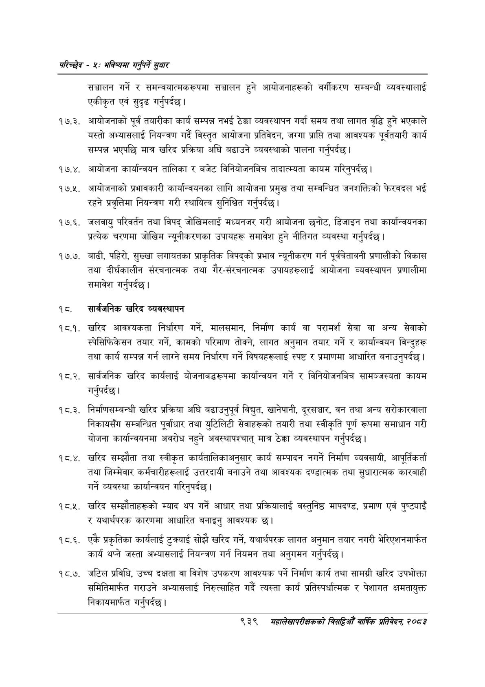

# Page 997 QA

## Rendered page


## Extracted text

```text
परिच्छेद -४: भविष्यसा गनुपर्ने सुधार
सञ्चालन गर्ने र समन्वयात्मकरूपमा सञ्चालन हुने आयोजनाहरूको वर्गीकरण सम्बन्धी व्यवस्थालाई एकीकृत एवं सुदृढ गर्नुपर्दछ |
१७.३. आयोजनाको पूर्व तयारीका कार्य सम्पन्न नभई ठेक्का व्यवस्थापन गर्दा समय तथा लागत वृद्धि हुने भएकाले यस्तो अभ्यासलाई नियन्त्रण गर्दै विस्तृत आयोजना प्रतिवेदन, जग्गा प्राप्ति तथा आवश्यक पूर्वतयारी कार्य सम्पन्न भएपछि मात्र खरिद प्रक्रिया अघि बढाउने व्यवस्थाको पालना गर्नुपर्दछ |
४. आयोजना कार्यान्वयन तालिका र बजेट विनियोजनबिच तादात्म्यता कायम गरिनुपर्दछ |
१७.५. आयोजनाको प्रभावकारी कार्यान्वयनका लागि आयोजना प्रमुख तथा सम्बन्धित जनशक्तिको फेरबदल भई रहने प्रवृत्तिमा नियन्त्रण गरी स्थायित्व सुनिश्चित गर्नुपर्दछ |
१७.६. जलवायु परिवर्तन तथा विपद्‌ जोखिमलाई मध्यनजर गरी आयोजना छनोट, डिजाइन तथा कार्यान्वयनका प्रत्यक चरणमा जोखिम न्यूनीकरणका उपायहरू समावेश हुने नीतिगत व्यवस्था गर्नुपर्दछ |
१७.७. बाढी, पहिरो, सुख्खा लगायतका प्राकृतिक विपद्को प्रभाव न्यूनीकरण गर्न पूर्वचेतावनी प्रणालीको विकास तथा दीर्घकालीन संरचनात्मक तथा गैर-संरचनात्मक उपायहरूलाई आयोजना व्यवस्थापन प्रणालीमा समावेश गर्नुपर्दछ |
१८. सार्वजनिक खरिद व्यवस्थापन
१८.१. खरिद आवश्यकता निर्धारण गर्ने, मालसमान, निर्माण कार्य वा परामर्श सेवा वा अन्य सेवाको स्पेसिफिकेसन तयार गर्ने, कामको परिमाण तोक्ने, लागत अनुमान तयार गर्ने र कार्यान्वयन विन्दुहरू तथा कार्य सम्पन्न गर्न लाग्ने समय निर्धारण गर्ने विषयहरूलाई स्पष्ट र प्रमाणमा आधारित बनाउनुपर्दछ |
१८.२. सार्वजनिक खरिद कार्यलाई योजनाबद्धरूपमा कार्यान्वयन गर्ने र विनियोजनबिच सामञ्जस्यता कायम गर्नुपर्दछ |
१८.३. निर्माणसम्बन्धी खरिद प्रक्रिया अघि बढाउनुपूर्व विद्युत, खानेपानी, दूरसञ्चार, वन तथा अन्य सरोकारवाला निकायसँग सम्बन्धित पूर्वाधार तथा युटिलिटी सेवाहरूको तयारी तथा स्वीकृति पूर्ण रूपमा समाधान गरी योजना कार्यान्वयनमा अवरोध नहुने अवस्थापश्चात्‌ मात्र ठेक्का व्यवस्थापन गर्नुपर्दछ |
१ ८.४. खरिद सम्झौता तथा स्वीकृत कार्यतालिकाअनुसार कार्य सम्पादन नगर्ने निर्माण व्यवसायी, आपूर्तिकर्ता तथा जिम्मेवार कर्मचारीहरूलाई उत्तरदायी बनाउने तथा आवश्यक दण्डात्मक तथा सुधारात्मक कारबाही गर्ने व्यवस्था कार्यान्वयन गरिनुपर्दछ |
१८.५. खरिद सम्झौताहरूको म्याद थप गर्ने आधार तथा प्रक्रियालाई वस्तुनिष्ठ मापदण्ड, प्रमाण एवं पुष्टयाइँ र यथार्थपरक कारणमा आधारित बनाइनु आवश्यक छ।
१८.६. एकै प्रकृतिका कार्यलाई टुक्र्याई सोझै खरिद गर्ने, यथार्थपरक लागत अनुमान तयार नगरी भेरिएशनमार्फत कार्य थप्ने जस्ता अभ्यासलाई नियन्त्रण गर्न नियमन तथा अनुगमन गर्नुपर्दछ |
१८.७. जटिल प्रविधि, उच्च दक्षता वा विशेष उपकरण आवश्यक पर्ने निर्माण कार्य तथा सामग्री खरिद उपभोक्ता समितिमार्फत गराउने अभ्यासलाई निरुत्साहित गर्दै त्यस्ता कार्य प्रतिस्पर्धात्मक र पेशागत क्षमतायुक्त निकायमार्फत गर्नुपर्दछ |
९३९
समंहालेखापरीक्षकको वार्षिक प्रतिवेदन; २०८२
```

## Flags
- None
