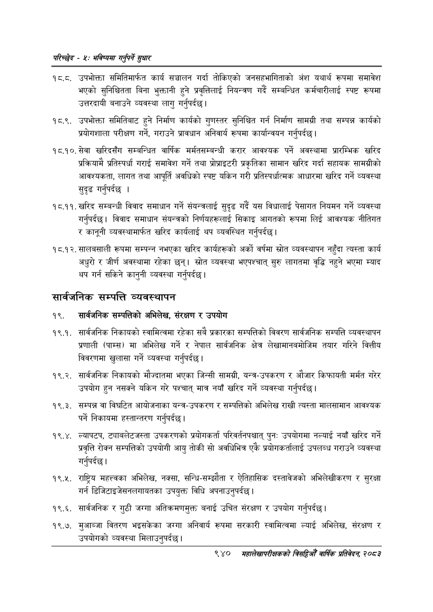

# Page 998 QA

## Rendered page


## Extracted text

```text
परिच्छेद -: भविष्यमा गर्नुपर्ने ठुधार
१ ८.८. उपभोक्ता समितिमार्फत कार्य सञ्चालन गर्दा तोकिएको जनसहभागिताको अंश यथार्थ रूपमा समावेश भएको सुनिश्चितता बिना भुक्तानी हुने प्रवृत्तिलाई नियन्त्रण गर्दै सम्बन्धित कर्मचारीलाई स्पष्ट रूपमा उत्तरदायी बनाउने व्यवस्था लागु गर्नुपर्दछ |
१८.९. उपभोक्ता समितिबाट हुने निर्माण कार्यको गुणस्तर सुनिश्चित गर्न निर्माण सामग्री तथा सम्पन्न कार्यको प्रयोगशाला परीक्षण गर्ने, गराउने प्रावधान अनिवार्य रूपमा कार्यान्वयन गर्नुपर्दछ |
१८.१०. सेवा खरिदसँग सम्बन्धित वार्षिक मर्मतसम्बन्धी करार आवश्यक पर्ने अवस्थामा प्रारम्भिक खरिद प्रक्रियामै प्रतिस्पर्धा गराई समावेश गर्ने तथा प्रोप्राइटरी प्रकृतिका सामान खरिद गर्दा सहायक सामग्रीको आवश्यकता, लागत तथा आपूर्ति अवधिको स्पष्ट यकिन गरी प्रतिस्पर्धात्मक आधारमा खरिद गर्ने व्यवस्था सुदृढ गर्नुपर्दछ।
१८.११. खरिद सम्बन्धी विवाद समाधान गर्ने संयन्त्रलाई सुदृढ गर्दै यस विधालाई पेसागत नियमन गर्ने व्यवस्था गर्नुपर्दछ। विवाद समाधान संयन्त्रको निर्णयहरूलाई सिकाइ आगतको रूपमा लिई आवश्यक नीतिगत र कानूनी व्यवस्थामार्फत खरिद कार्यलाई थप व्यवस्थित गर्नुपर्दछ |
१८.१२. सालबसाली रूपमा सम्पन्न नभएका खरिद कार्यहरूको अर्को वर्षमा स्रोत व्यवस्थापन नहुँदा त्यस्ता कार्य अधुरो र जीर्ण अवस्थामा रहेका छन्‌। स्रोत व्यवस्था भएपश्चात्‌ सुरु लागतमा वृद्धि नहुने भएमा म्याद थप गर्न सकिने कानुनी व्यवस्था गर्नुपर्दछ |
सार्वजनिक सम्पत्ति व्यवस्थापन
१९. सार्वजनिक सम्पत्तिको अभिलेख, संरक्षण र उपयोग
१९.१. सार्वजनिक निकायको स्वामित्वमा रहेका सबै प्रकारका सम्पत्तिको विवरण सार्वजनिक सम्पत्ति व्यवस्थापन प्रणाली (पाम्स) मा अभिलेख गर्ने र नेपाल सार्वजनिक क्षेत्र लेखामानबमोजिम तयार गरिने वित्तीय विवरणमा खुलासा गर्ने व्यवस्था गर्नुपर्दछ |
१९.२. सार्वजनिक निकायको मौज्दातमा भएका जिन्सी सामग्री, यन्त्र-उपकरण र औजार किफायती मर्मत गरेर उपयोग हुन नसक्ने यकिन गरे पश्चात्‌ मात्र नयाँ खरिद गर्ने व्यवस्था गर्नुपर्दछ।
१९.३. सम्पन्न वा विघटित आयोजनाका यन्त्र-उपकरण र सम्पत्तिको अभिलेख राखी त्यस्ता मालसामान आवश्यक पर्ने निकायमा हस्तान्तरण गर्नुपर्दछ |
१९.४. ल्यापटप, ट्याबलेटजस्ता उपकरणको प्रयोगकर्ता परिवर्तनपश्चात्‌ पुनः उपयोगमा नल्याई नयाँ खरिद गर्ने प्रवृत्ति रोक्न सम्पत्तिको उपयोगी आयु तोकी सो अवधिभित्र एकै प्रयोगकर्तालाई उपलब्ध गराउने व्यवस्था गर्नुपर्दछ |
१९.२५. राष्ट्रिय महत्त्वका अभिलेख, नक्सा, सन्धि-सम्झौता र ऐतिहासिक दस्तावेजको अभिलेखीकरण र सुरक्षा गर्न डिजिटाइजेसनलगायतका उपयुक्त विधि अपनाउनुपर्दछ।
१९.६. सार्वजनिक र गुठी जग्गा अतिक्रमणमुक्त बनाई उचित संरक्षण र उपयोग गर्नुपर्दछ।
१९.७. मुआब्जा वितरण भइसकेका जग्गा अनिवार्य रूपमा सरकारी स्वामित्वमा ल्याई अभिलेख, संरक्षण र उपयोगको व्यवस्था मिलाउनुपर्दछ।
९४०
मंहालेखापरीक्षकको वार्षिक प्रतिवेदन; २०८२
```

## Flags
- None
