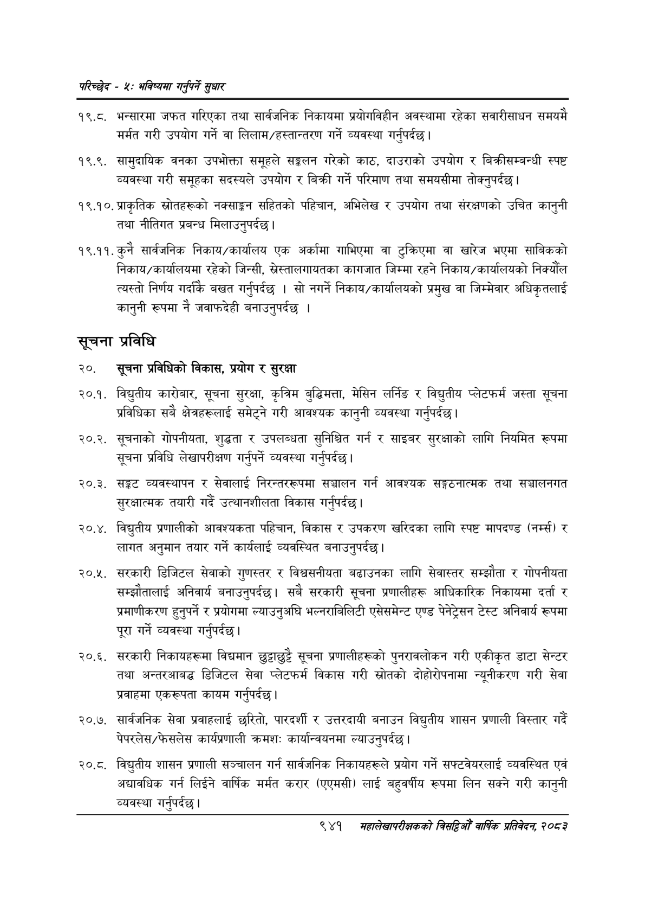

# Page 999 QA

## Rendered page


## Extracted text

```text
परिच्छेष -४: भविष्यमा गर्नुपर्ने सुधार
१९.८. भन्सारमा जफत गरिएका तथा सार्वजनिक निकायमा प्रयोगविषीन अवस्थामा रहेका सवारीसाधन समयमै मर्मत गरी उपयोग गर्ने वा लिलाम/हस्तान्तरण गर्ने व्यवस्था गर्नुपर्दछ |
१९.९. सामुदायिक वनका उपभोक्ता समूहले सङ्कलन गरेको काठ, दाउराको उपयोग र बिक्रीसम्बन्धी स्पष्ट व्यवस्था गरी समूहका सदस्यले उपयोग र बिक्री गर्ने परिमाण तथा समयसीमा तोक्नुपर्दछ।
१९.१०, प्राकृतिक स्रोतहरूको नक्साङ्कन सहितको पहिचान, अभिलेख र उपयोग तथा संरक्षणको उचित कानुनी तथा नीतिगत प्रबन्ध मिलाउनुपर्दछ।
१९.११. कुनै सार्वजनिक निकाय/कार्यालय एक अर्कामा गाभिएमा वा टुक्रिएमा वा खारेज भएमा साबिकको निकाय/कार्यालयमा रहेको जिन्सी, स्ेस्तालगायतका कागजात जिम्मा रहने निकाय/कार्यालयको निर्क्यौल त्यस्तो निर्णय बखत गर्नुपर्दछ। सो नगर्ने निकाय/कार्यालयको प्रमुख वा जिम्मेवार अधिकृतलाई कानुनी रूपमा नै जवाफदेही बनाउनुपर्दछ।
सूचना प्रविधि
२०. सूचना प्रविधिको विकास, प्रयोग र सुरक्षा
२०.१. विद्युतीय कारोबार, सूचना सुरक्षा, कृत्रिम बुद्धिमत्ता, मेसिन लर्निङ र विद्युतीय प्लेटफर्म जस्ता सूचना प्रविधिका सबै क्षेत्रहरूलाई समेट्ने गरी आवश्यक कानुनी व्यवस्था |
२०.२. सूचनाको गोपनीयता, शुद्धता र उपलब्धता सुनिश्चित गर्न र साइबर सुरक्षाको लागि नियमित रूपमा सूचना प्रविधि लेखापरीक्षण गर्नुपर्ने व्यवस्था गर्नुपर्दछ |
२०.३. सङ्कट व्यवस्थापन र सेवालाई निरन्तररूपमा सञ्चालन गर्न आवश्यक सङ्गठनात्मक तथा सञ्चालनगत सुरक्षात्मक तयारी गर्दै उत्थानशीलता विकास गर्नुपर्दछु।
२०.४. विद्युतीय प्रणालीको आवश्यकता पहिचान, विकास र उपकरण खरिदका लागि स्पष्ट मापदण्ड (नर्स) र लागत अनुमान तयार गर्ने कार्यलाई व्यवस्थित बनाउनुपर्दछ |
२०, सरकारी डिजिटल सेवाको गुणस्तर र विश्वसनीयता बढाउनका लागि सेवास्तर सम्झौता र गोपनीयता सम्झौतालाई अनिवार्य बनाउनुपर्दछ। सबै सरकारी सूचना प्रणालीहरू आधिकारिक निकायमा दर्ता र प्रमाणीकरण हुनुपर्ने र प्रयोगमा ल्याउनुअघि भल्नराबिलिटी एसेसमेन्ट एण्ड पेनेट्रेसन टेस्ट अनिवार्य रूपमा पूरा गर्ने व्यवस्था गर्नुपर्दछ |
२०.६. सरकारी निकायहरूमा विद्यमान छुट्टाछुट्टै सूचना प्रणालीहरूको पुनरावलोकन गरी एकीकृत डाटा सेन्टर तथा अन्तरआबद्ध डिजिटल सेवा प्लेटफर्म विकास गरी स्रोतको दोहोरोपनामा न्यूनीकरण गरी सेवा प्रवाहमा एकरूपता कायम गर्नुपर्दछ |
२०.७. सार्वजनिक सेवा प्रवाहलाई छरितो, पारदर्शी र उत्तरदायी बनाउन विद्युतीय शासन प्रणाली विस्तार गर्दै पेपरलेस/फेसलेस कार्यप्रणाली क्रमशः कार्यान्वयनमा ल्याउनुपर्दछ।
२०.८. विद्युतीय शासन प्रणाली सञ्चालन गर्न सार्वजनिक निकायहरूले प्रयोग गर्ने सफ्टवेयरलाई व्यवस्थित एवं अद्यावधिक गर्न लिईने वार्षिक मर्मत करार (एएमसी) लाई बहुवर्षीय रूपमा लिन सक्ने गरी कानुनी व्यवस्था गर्नुपर्दछ।
९४१
मंहालेखापरीक्षकको बितदिमो वार्षिक प्रतिवेदन; २०८२
```

## Flags
- None
