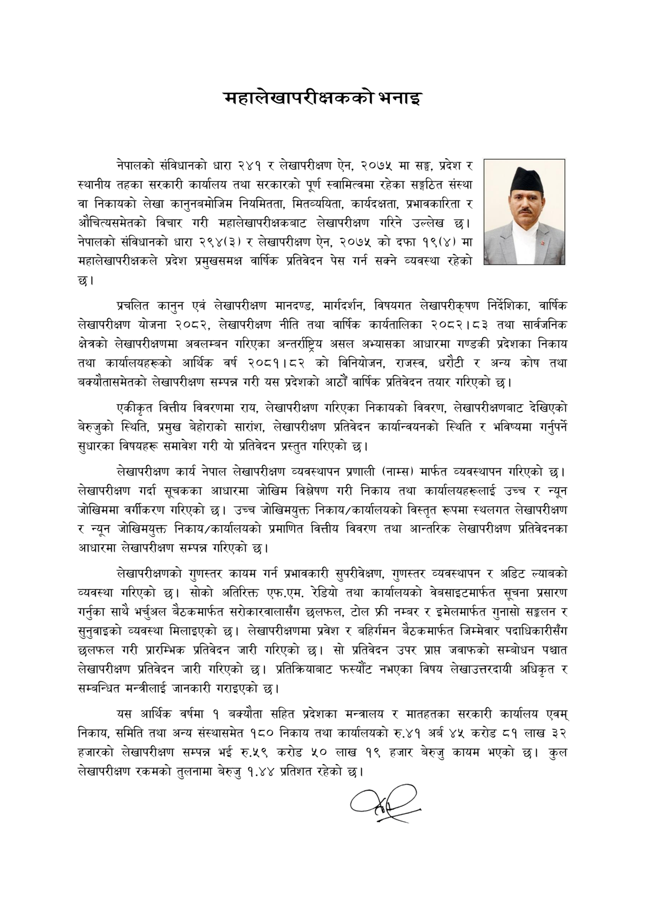

# Page 9 QA

## Rendered page


## Extracted text

```text
महालेखापरीक्षकको भनाइ
नेपालको संविधानको धारा २४१ र लेखापरीक्षण ऐन, २०७५ मा सङ्घ, प्रदेश र स्थानीय तहका सरकारी कार्यालय तथा सरकारको पूर्ण स्वामित्वमा रहेका सङ्गठित संस्था वा निकायको लेखा कानुनबमोजिम नियमितता, मितव्ययिता, कार्यदक्षता, प्रभावकारिता र औचित्यसमेतको विचार गरी महालेखापरीक्षकबाट लेखापरीक्षण गरिने उल्लेख नेपालको संविधानको धारा २९४(३) र लेखापरीक्षण ऐन, २०७४ को दफा १९(४) मा महालेखापरीक्षकले प्रदेश प्रमुखसमक्ष वार्षिक प्रतिवेदन पेस गर्न सक्ने व्यवस्था रहेको छ।
प्रचलित कानुन एवं लेखापरीक्षण मानदण्ड, मार्गदर्शन, विषयगत लेखापरीकृषण निर्देशिका, वार्षिक लेखापरीक्षण योजना २०८२, लेखापरीक्षण नीति तथा वार्षिक कार्यतालिका २०८२।८३ तथा सार्वजनिक क्षेत्रको लेखापरीक्षणमा अवलम्बन गरिएका अन्तर्राष्ट्रिय असल अभ्यासका आधारमा गण्डकी प्रदेशका निकाय तथा कार्यालयहरूको आर्थिक वर्ष २०८१।८२ को विनियोजन, राजस्व, धरौटी र अन्य कोष तथा बक्यौतासमेतको लेखापरीक्षण सम्पन्न गरी यस प्रदेशको आठौं वार्षिक प्रतिवेदन तयार गरिएको |
एकीकृत वित्तीय विवरणमा राय, लेखापरीक्षण गरिएका निकायको विवरण, लेखापरीक्षणबाट देखिएको बेरुजुको स्थिति, प्रमुख बेहोराको सारांश, लेखापरीक्षण प्रतिवेदन कार्यान्वयनको स्थिति र भविष्यमा गर्नुपर्ने सुधारका विषयहरू समावेश गरी यो प्रतिवेदन प्रस्तुत गरिएको छ।
लेखापरीक्षण कार्य नेपाल लेखापरीक्षण व्यवस्थापन प्रणाली (नाम्स) मार्फत व्यवस्थापन गरिएको छ। लेखापरीक्षण गर्दा सूचकका आधारमा जोखिम विश्लेषण गरी निकाय तथा कार्यालयहरूलाई उच्च र न्यून जोखिममा वर्गीकरण गरिएको छ। उच्च जोखिमयुक्त निकाय/कार्यालयको विस्तृत रूपमा स्थलगत लेखापरीक्षण र न्यून जोखिमयुक्त निकाय/कार्यालयको प्रमाणित वित्तीय विवरण तथा आन्तरिक लेखापरीक्षण प्रतिवेदनका आधारमा लेखापरीक्षण सम्पन्न गरिएको |
लेखापरीक्षणको गुणस्तर कायम गर्न प्रभावकारी सुपरीवेक्षण, गुणस्तर व्यवस्थापन र अडिट ल्याबको व्यवस्था गरिएको छ। सोको अतिरिक्त एफ.एम. रेडियो तथा कार्यालयको वेबसाइटमार्फत सूचना प्रसारण गर्नुका साथै भर्चुअल बैठकमार्फत सरोकारवालासँग छलफल, टोल फ्री नम्बर र इमेलमार्फत गुनासो सङ्गलन र सुनुवाइको व्यवस्था मिलाइएको छ। लेखापरीक्षणमा प्रवेश र बहिर्गमन बैठकमार्फत जिम्मेवार पदाधिकारीसँग छलफल गरी प्रारम्भिक प्रतिवेदन जारी गरिएको छ। सो प्रतिवेदन उपर प्राप्त जवाफको सम्बोधन पश्चात लेखापरीक्षण प्रतिवेदन जारी गरिएको छ। प्रतिक्रियाबाट फस्यौट नभएका विषय लेखाउत्तरदायी अधिकृत र सम्बन्धित मन्त्रीलाई जानकारी गराइएको छ।
यस आर्थिक वर्षमा १ बक्यौता सहित प्रदेशका मन्त्रालय र मातहतका सरकारी कार्यालय एवम्‌ निकाय, समिति तथा अन्य संस्थासमेत १८० निकाय तथा कार्यालयको रु.४१ अर्ब ४५ करोड ८१ लाख ३२ हजारको लेखापरीक्षण सम्पन्न भई रु.५९ करोड ५० लाख १९ हजार बेरुजु कायम भएको छ। कुल लेखापरीक्षण रकमको तुलनामा बेरुजु १.४४ प्रतिशत रहेको छ।
```

## Flags
- None
