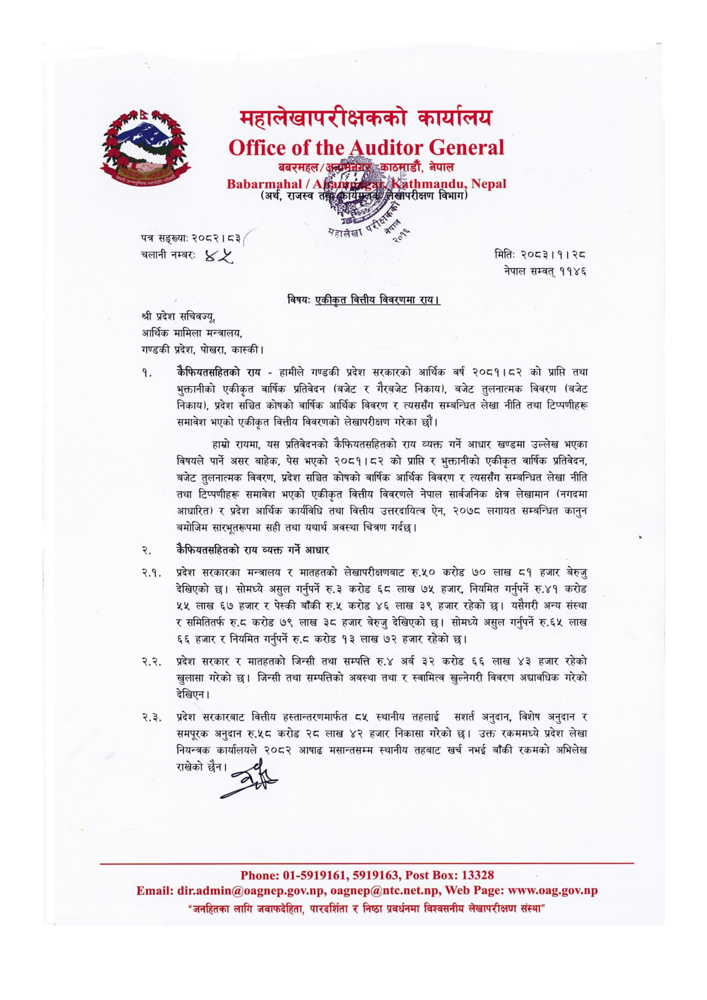

# Page 13 QA

## Rendered page


## Extracted text

```text
महालेखापरीक्षकको कार्यालय
३
ठमाडौं, नेपाल
(अर्थ,
राजस्व
तस
छ
क्षण
विभाग
महालेखा
र
पत्र सङ्ख्या:
२०८२। ८३”
चलानी नम्बरः
श्री प्रदेश सचिवज्यू, आर्थिक मामिला मन्त्रालय, गण्डकी प्रदेश, पोखरा, कास्की |
विषय: एकीकृत वित्तीय विवरणमा राय।
क्ैफियतसहितको राय -हामीले गण्डकी प्रदेश सरकारको आर्थिक वर्ष २०८१।८२ को प्राप्ति तथा भुक्तानीको एकीकृत वार्षिक प्रतिवेदन (बजेट र गैरबजेट निकाय), बजेट तुलनात्मक विवरण (बजेट निकाय), प्रदेश सञ्चित कोषको वार्षिक आर्थिक विवरण र त्यससँग सम्बन्धित लेखा नीति तथा टिप्पणीहरू समावेश भएको एकीकृत वित्तीय विवरणको लेखापरीक्षण गरेका छौं।
हाम्रो रायमा, यस प्रतिवेदनको कैफियतसहितको राय व्यक्त गर्ने आधार खण्डमा उल्लेख भएका विषयले पार्ने असर बाहेक, पेस भएको २०८१।८२ को प्राप्ति र भुक्तानीको एकीकृत वार्षिक प्रतिवेदन, बजेट तुलनात्मक विवरण, प्रदेश सञ्चित कोषको वार्षिक आर्थिक विवरण र त्यससँग सम्बन्धित लेखा नीति तथा टिप्पणीहरू समावेश भएको एकीकृत वित्तीय विवरणले नेपाल सार्वजनिक क्षेत्र लेखामान (नगदमा आधारित) र प्रदेश आर्थिक कार्यविधि तथा वित्तीय उत्तरदायित्व ऐन, २०७८ लगायत सम्बन्धित कानुन बमोजिम सारभूतरूपमा सही तथा यथार्थ अवस्था चित्रण गर्दछ।
छै क्ैफियतसहितको राय व्यक्त गर्ने आधार
२.१. प्रदेश सरकारका मन्त्रालय र मातहतको लेखापरीक्षणबाट रु.१० करोड ७० लाख ८१ हजार बेरुजु देखिएको छ। सोमध्ये असुल गर्नुपर्ने रु.३ करोड ६८ लाख ७५ हजार, नियमित गर्नुपर्ने रु.४१ करोड ५५ लाख ६७ हजार र पेस्की बाँकी रु.५ करोड ४६ लाख ३९ हजार रहेको छ। यसैगरी अन्य संस्था र समितितर्फ रु.८ करोड ७९ लाख ३८ हजार बेरुजु देखिएको छ। सोमध्ये असुल गर्नुपर्ने रु.६५ लाख ६६ हजार र नियमित गर्नुपर्ने रु.८ करोड ९३ लाख ७२ हजार रहेको छ।
२.२. प्रदेश सरकार र मातहतको जिन्सी तथा सम्पत्ति रु.४ अर्ब ३२ करोड ६६ लाख ४३ हजार रहेको खुलासा गरेको छ। जिन्सी तथा सम्पत्तिको अबस्था तथा र स्वामित्व खुल्नेगरी विवरण अद्यावधिक गरेको देखिएन।
२.३. प्रदेश सरकारबाट वित्तीय हस्तान्तरणमार्फत ८५ स्थानीय तहलाई सशार्त अनुदान, विशेष अनुदान र समपूरक अनुदान रु.५८ करोड २८ लाख ४२ हजार निकासा गरेको छ। उक्त रकममध्ये प्रदेश लेखा नियन्त्रक कार्यालयले २०८२ आषाढ मसान्तसम्म स्थानीय तहबाट खर्च नभई बाँकी रकमको अभिलेख राखेको छैन छ
: ०१-५९१९१६१, ५९१९१६३, : १३३२८
मिति:
२०८३।१। २८
नेपाल सम्वत्‌ ११४६
"जनहितका लागि जवाफदेहिता, पारदर्शिता र निष्ठा प्रवर्धनमा विश्वसनीय लेखापरीक्षण संस्था"
```

## Flags
- None
