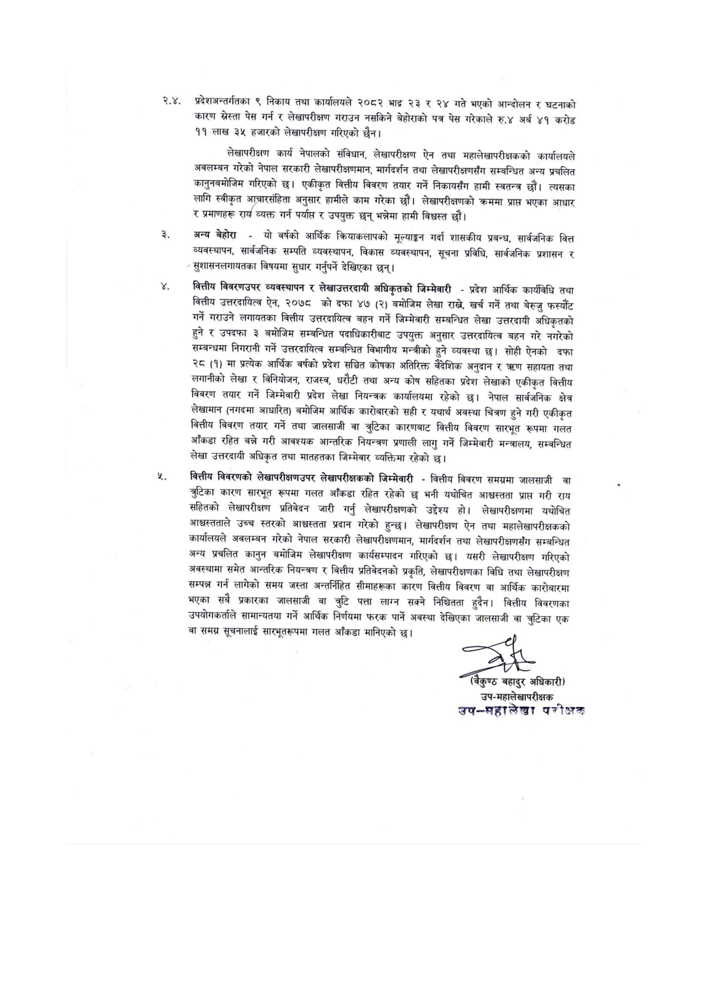

# Page 14 QA

## Rendered page


## Extracted text

```text
२.४. प्रदेशअन्तर्गतका ९ निकाय तथा कार्यालयले २०८२ भाद्र २३ र २४ गते भएको आन्दोलन र घटनाको कारण सस्ता पेस गर्न र लेखापरीक्षण गराउन नसकिने बेहोराको पत्र पेस गरेकाले रु.४ अर्ब ४१ करोड ११ लाख ३५ हजारको लेखापरीक्षण गरिएको छैन।
लेखापरीक्षण कार्य नेपालको संविधान, लेखापरीक्षण ऐन तथा महालेखापरीक्षकको कार्यालयले अवलम्बन गरेको नेपाल सरकारी लेखापरीक्षणमान, मार्गदिशन तथा लेखापरीक्षणसँग सम्बन्धित अन्य प्रचलित कानुनबमोजिम गरिएको छ। एकीकृत वित्तीय विवरण तयार गर्ने निकायसँग हामी स्वतन्त्र छौं। त्यसका लागि स्वीकृत आचारसंहिता अनुसार हामीले काम गरेका छौं। लेखापरीक्षणको क्रममा प्राप्त भएका आधार र प्रमाणहरू राय व्यक्त गर्न पर्याप्त र उपयुक्त छन्‌ भन्नेमा हामी विश्वस्त छौं।
अन्य बेहोरा -यो वर्षको आर्थिक क्रियाकलापको मूल्याङ्कन गर्दा शासकीय प्रबन्ध, सार्वजनिक वित्त व्यवस्थापन, सार्वजनिक सम्पति व्यवस्थापन, विकास व्यवस्थापन, सूचना प्रविधि, सार्वजनिक प्रशासन र सुशासनलगायतका विषयमा सुधार गर्नुपर्ने देखिएका छन्‌।
बित्तीय विवरणउपर व्यवस्थापन र लेखाउत्तरदायी अधिकृतको जिम्मेवारी -प्रदेश आर्थिक कार्यविधि तथा वित्तीय उत्तरदायित्व ऐन, २०७८ को दफा ४७ (२) बमोजिम लेखा राखने, खर्च गर्ने तथा बेरुजु फस्यौट गर्ने गराउने लगायतका वित्तीय उत्तरदायित्व बहन गर्ने जिम्मेवारी सम्बन्धित लेखा उत्तरदायी अधिकृतको हुने र उपदफा ३ बमोजिम सम्बन्धित पदाधिकारीबाट उपयुक्त अनुसार उत्तरदायित्व बहन गरे नगरेको सम्बन्धमा निगरानी गर्ने उत्तरदायित्व सम्बन्धित विभागीय मन्त्रीको हुने व्यवस्था छ। सोही ऐनको दफा २८ (१) मा प्रत्येक आर्थिक वर्षको प्रदेश सञ्चित कोषका अतिरिक्त वैदेशिक अनुदान र त्रण सहायता तथा लगानीको लेखा र विनियोजन, राजस्व, धरौटी तथा अन्य कोष सहितका प्रदेश लेखाको एकीकृत वित्तीय विवरण तयार गर्ने जिम्मेवारी प्रदेश लेखा नियन्त्रक कार्यालयमा रहेको छ। नेपाल सार्वजनिक क्षेत्र लेखामान (नगदमा आधारित) बमोजिम आर्थिक कारोबारको सही र यथार्थ अवस्था चित्रण हुने गरी एकीकृत वित्तीय बिवरण तयार गर्ने तथा जालसाजी वा त्रुटिका कारणबाट वित्तीय विवरण सारभूत रूपमा गलत आँकडा रहित बन्ने गरी आवश्यक आन्तरिक नियन्त्रण प्रणाली लागु गर्ने जिम्मेवारी मन्त्रालय, सम्वन्धित लेखा उत्तरदायी अधिकृत तथा मातहतका जिम्मेवार व्यक्तिमा रहेको छ।
वित्तीय विवरणको लेखापरीक्षणउपर लेखापरीक्षकको जिम्मेवारी -वित्तीय विवरण समग्रमा जालसाजी वा च्रुटिका कारण सारभूत रूपमा गलत आँकडा रहित रहेको छ भनी यथोचित आध्चस्तता प्राप्त गरी राय सहितको लेखापरीक्षण प्रतिवेदन जारी गर्नु लेखापरीक्षणको उद्देश्य हो। लेखापरीक्षणमा यथोचित आशध्चस्तताले उच्च स्तरको आध्यस्तता प्रदान गरेको हुन्छ। लेखापरीक्षण ऐन तथा महालेखापरीक्षकको कार्यालयले अवलम्बन गरेको नेपाल सरकारी लेखापरीक्षणमान, मार्गदर्शन तथा लेखापरीक्षणसँग सम्बन्धित अन्य प्रचलित कानुन बमोजिम लेखापरीक्षण कार्यसम्पादन गरिएको छ। यसरी लेखापरीक्षण गरिएको अवस्थामा समेत आन्तरिक नियन्त्रण र वित्तीय प्रतिवेदनको प्रकृति, लेखापरीक्षणका विधि तथा लेखापरीक्षण सम्पन्न गर्न लागेको समय जस्ता अन्तर्निहित सीमाहरूका कारण वित्तीय विवरण वा आर्थिक कारोबारमा भएका सबै प्रकारका जालसाजी वा त्रुटि पत्ता लाग्न सक्ने निश्चितता हुदैन। वित्तीय विवरणका उपयोगकर्ताले सामान्यतया गर्ने आर्थिक निर्णयमा फरक पार्ने अवस्था देखिएका जालसाजी वा च्रुटिका एक बा समग्र सूचनालाई सारभूतरूपमा गलत आँकडा मानिएको छ।
बिकुण्ठ बहादुर अधिकारी) उप-महालेखापरीक्षक क्प्-सहालेखा परीक्षक
```

## Flags
- None
