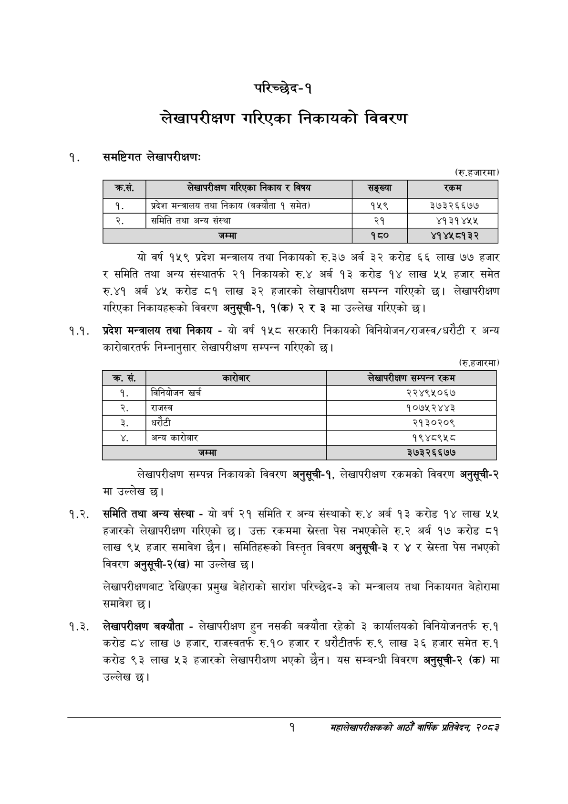

# Page 17 QA

## Rendered page


## Extracted text

```text
परिच्छेद-१
लेखापरीक्षण गरिएका निकायको विवरण
समष्टिगत लेखापरीक्षण:
(रु.हजारमा)
यो वर्ष १५९ प्रदेश मन्त्रालय तथा निकायको रु.३७ अर्ब ३२ करोड ६६ लाख ७७ हजार र समिति तथा अन्य संस्थातर्फ २१ निकायको रु.४ अर्ब १३ करोड १४ लाख ५५ हजार समेत रु.४१ अर्ब ४५ करोड ८१ लाख ३२ हजारको लेखापरीक्षण सम्पन्न गरिएको छ। लेखापरीक्षण गरिएका निकायहरूको विवरण अनुसूची-१, १(क) २ र ३ मा उल्लेख गरिएको
१.१. प्रदेश मन्त्रालय तथा निकाय -यो वर्ष १५८ सरकारी निकायको विनियोजन/राजस्व/धरौटी र अन्य कारोबारतर्फ निम्नानुसार लेखापरीक्षण सम्पन्न गरिएको छ।
(रु.हजारमा)
लेखापरीक्षण सम्पन्न निकायको विवरण अनुसूची-१, लेखापरीक्षण रकमको विवरण अनुसूची-२ मा उल्लेख छ।
१.२. समिति तथा अन्य संस्था -यो वर्ष २१ समिति र अन्य संस्थाको रु.४ अर्ब १३ करोड १४ लाख ५५ हजारको लेखापरीक्षण गरिएको छ। उक्त रकममा स्रेस्ता पेस नभएकोले रु.२ अर्ब १७ करोड ८१ लाख ९५ हजार समावेश छैन। समितिहरूको विस्तृत विवरण अनुसूची-३ र ४ र स्रेस्ता पेस नभएको विवरण अनुसूची-२(ख) मा उल्लेख छ।
लेखापरीक्षणबाट देखिएका प्रमुख बेहोराको सारांश परिच्छेद-३ को मन्त्रालय तथा निकायगत बेहोरामा समावेश छ।
१.३. लेखापरीक्षण बक्यौता -लेखापरीक्षण हुन नसकी बक्यौता रहेको ३ कार्यालयको विनियोजनतर्फ रु.१ करोड ८४ लाख ७ हजार, राजस्वतर्फ रु.१० हजार र धरौटीतर्फ रु.९ लाख ३६ हजार समेत रु.१ करोड ९३ लाख ५३ हजारको लेखापरीक्षण भएको | यस सम्बन्धी विवरण अनुसूची-२ (क) मा उल्लेख छ।
१
महालेखापरीक्षकको आठौ वाषिकि प्रतिवेदन २०८२

| क्रस. | लेखापरीक्षण भरिएका निकाय र विषय | 'सङ्ख्या | रकम |
| --- | --- | --- | --- |
| १. | प्रदेश मन्त्रालय तथा निकाय (बक्यौता १ समेत) | १५९ | ३७३२६६७७ |
| २. | समिति तथा अन्य संस्था | २१ | ४१३१४५४५ |
|  | जम्मा | १८० | ४१४५८१३२ |

| क्र. सं. | कारेबार | लेखापरीक्षण सम्पन्न रकम |
| --- | --- | --- |
| १. | विनिवोजन खर्च | २२४९५०६७ |
| २. | राजस्व | १०७५२४४३ |
| ३. | धरौटी | २१३०२०९ |
|  | अन्य कारोबार | १९४८९५८ |
|  | जम्मा | ३७३२६६७७ |
```

## Flags
- table_page
- medium_quality_table
