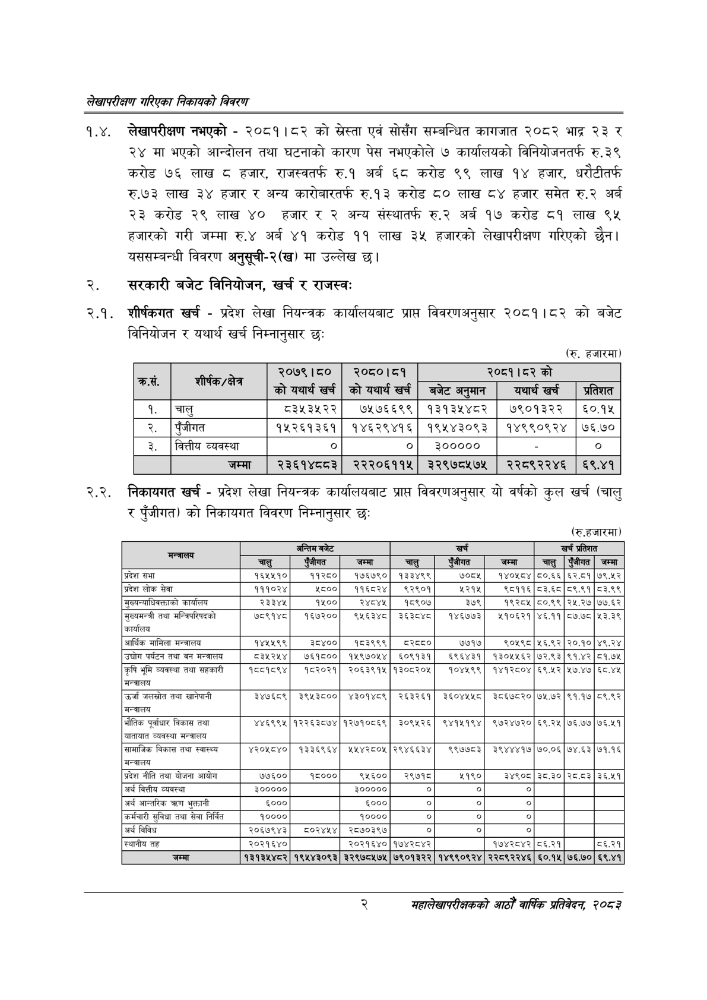

# Page 18 QA

## Rendered page


## Extracted text

```text
लेखापरीक्षण गरिएका निकायको विवरण
१.४. लेखापरीक्षण नभएको -२०८१।८२ को एवं सोसँग सम्बन्धित कागजात २०८२ भाद्र २३ र २४ मा भएको आन्दोलन तथा घटनाको कारण पेस नभएकोले ७ कार्यालयको विनियोजनतर्फ रु.३९ करोड ७६ लाख ८ हजार, राजस्वतर्फ रु.१ अर्ब ६८ करोड ९९ लाख १४ हजार, धरौटीतर्फ रु.७३ लाख ३४ हजार र अन्य कारोबारतर्फ रु.१३ करोड ८० लाख ८४ हजार समेत रु.२ अर्ब २३ करोड २९ लाख ४० हजार र २ अन्य संस्थातर्फ रु.२ अर्ब १७ करोड ८१ लाख ९४ हजारको गरी जम्मा रु.४ अर्ब ४१ करोड ११ लाख ३५ हजारको लेखापरीक्षण गरिएको छैन। यससम्बन्धी विवरण अनुसूची-२(ख) मा उल्लेख छ।
सरकारी बजेट विनियोजन, खर्च र राजस्व:
शीर्षकगत खर्च -प्रदेश लेखा नियन्त्रक कार्यालयबाट प्राप्त विवरणअनुसार २०८१।८२ को बजेट विनियोजन र यथार्थ खर्च निम्नानुसार छः
२.२. निकायगत खर्च -प्रदेश लेखा नियन्त्रक कार्यालयबाट प्राप्त विवरणअनुसार यो वर्षको कुल खर्च (चालु र पुँजीगत) को निकायगत विवरण निम्नानुसार छः
(रु. हजारमा)
(रु.हजारमा)
२
महालेखापरीक्षकको आठौ वाषिकि प्रतिवेदन २०८२

| री | शीर्षक/क्षेत | २०७९।५० | २०६०।५१ |  | २०८१। व्र्को |  |
| --- | --- | --- | --- | --- | --- | --- |
|  |  | कोयथार्श |  | बजेट अन्मान | यथार्थ खर्च | - प्र |
| १. | चालु | ८३५३५२२ | ७५७६६९९ | १३१३५४८२ | ७९०१३२२ | ६०.१५ |
| २. | पुँजीगत | १५२६१३६१ | १४६२९४१६ | १९५४३०९३ | १४९९०९२४ | ७६.७० |
| ३. | वित्तीय व्यवस्था |  |  | ३००००० |  | ० |
|  | जम्मा | २३६१४८०३ | २२२०६११५ | २२९७८५७५ | २२८९२२४६ | ६९.४१ |

| अन्तालय |  | अन्तिम बजेट |  |  | खर्च |  |  | खर्च प्रतिशत |
| --- | --- | --- | --- | --- | --- | --- | --- | --- |
|  | चालु | र जीगत | जम्मा | चालु | ए जीगत | जम्मा | चालु | एंजीगत |
| प्रदेश सभा | १६४५४५१० | ११२८० | १७६७९० | १३३४९९ | ७०८५ | १४०५८४ | ८०.६६ | ६२.८१ |
| प्रदेश लोक सेवा | १११०२४ | ५८०० | ११६८२४ | ९२९०१ | ४२१५ | ९८११६ | ८३.६८ | ८९.९१ |
| मुल्यन्याधिवत्ताको कार्यालय | २३३४५ | १५०० | र४८४५ | १८९०७ | ३७९ | १९२८५ | ८०.९९ | २५.२७ |
| मुख्यमन्त्री तथा भन्जिचरिषदको कार्यालय | ९१४८ | १६७२०० | ९५६३४८ | ३६३८४ङट | १४६७७३ | ४१०६२१ | ४६.११ | ८७.७८ |
| आर्थिक मामिला मन्त्रालय | १४५५९९ | ३८४०० | १८३९९९ | ५२८८६८० | ७७१७ | ९६०५९८ | २५६.९२ | २०.१० |
| 'उच्योग पर्यटन तथा वन मन्त्रालय | ८३५२४५४ | ७६१८०० | १५९७०५४ | ६०९१३१ | ६९६४३१ | १३०४५५६२ | ७२.९३ | ९१.४२ |
| कृषि भूमि व्यवस्था तया सहकारी ४ १ १ २ १० ० ७ २५६ ८३६ १४ -१ ५ १ १ २ १० १ ७ २५६ २५ १४ ८२.२७४१६२ उर्जा ५ १ १ २ १० २ ३८ २५६ ४१ १३ ९५.७३४००९ जलस्रोत ५ १ १ २ १० ३ ८४ २६० २१ ९ ९६.७८८२६९ तथा ५ १ १ २ १० ४ १११ २५६ ४४ १३ ९५.६९६१४४ खानेपानी ५ १ १ २ १० ५ २२७ २५९ ५४ ११ ८१.६०२५०१ ३४७६८९ ५ १ १ २ १० ६ ३०२ २५९ ६३ ११ ८१.०३३८२१ ३९५३८०० ५ १ १ २ १० ७ ३८५ २५९ ६४ ११ ८८.४७७२७२ ४३०१४८९ ५ १ १ २ १० ८ ४७० २५९ ५३ ११ ८८.४७७२७२ २६३२६१ ५ १ १ २ १० ९ ५४५ २५९ ६३ ११ १६.७०९१३७ ३६०४५४५८ ५ १ १ २ १० १० ६२९ २५९ ६३ ११ ८८.००७१३३ ३८६७८२० ५ १ १ २ १० ११ ७०३ २५९ ३९ ११ ८८.२०२९८० ७५.७२ ५ १ १ २ १० १२ ७५४ २५९ ४० ११ ८६.१८८६४४ ९१.१७ ५ १ १ २ १० १३ ८०४ २५९ ३९ ११ ८३.७६८३७९ ८९.९२ ४ १ १ २ ११ ० ७ २८२ ४५ ९ -१ ५ १ १ २ ११ १ ७ २८२ ४५ ९ ८४.९२३३९३ मन्त्रालय ४ १ १ २ १२ ० ८ ३०० ८३५ १८ -१ ५ १ १ २ १२ १ ८ ३०० ३३ १४ २६.५९९५८८ भतिक ५ १ १ २ १२ २ ४७ ३०१ ३७ १७ ९५.१८०८४० पूर्वाधार ५ १ १ २ १२ ३ ९५ २९६ ३२ २८ ९६.७८३७९८ विकास ५ १ १ २ १२ ४ १३१ २९६ २४ २८ ९६.७८३७९८ तथा ५ १ १ २ १२ ५ २२६ ३०४ ५५ ११ ७२.४०२१९९ ४४६९९५ ५ १ १ २ १२ ६ २९३ ३०४ ७३ ११ ७२.४०२१९९ १२२६३८७४ ५ १ १ २ १२ ७ ३७७ ३०४ ७२ ११ ७३.७६७०५२ १२७१०८६९ ५ १ १ २ १२ ८ ४७० ३०४ ५३ ११ ७३.५६०७७६ ३०९५२६ ५ १ १ २ १२ ९ ५४५ ३०४ ६४ ११ ५४.६३१९२७ ९४१५१९४ ५ १ १ २ १२ १० ६२९ ३०४ ६३ ११ ६९.१५००४० ९७२४७२० ५ १ १ २ १२ ११ ७०४ ३०४ ३९ ११ ८३.१७९८७८ ६९.२५ ५ १ १ २ १२ १२ ७५४ ३०४ ४० ११ ९१.३२४२४९ ७६.७७ ५ १ १ २ १२ १३ ८०४ ३०४ ३९ ११ ०.०००००० ७६,४५१ ४ १ १ २ १३ ० ७ ३२६ १३९ १० -१ ५ १ १ २ १३ १ ७ ३२६ ४३ १० ४०.५७९२६९ यातायात ५ १ १ २ १३ २ ५५ ३२६ ४१ १० ९४.८०४३०६ व्यवस्था ५ १ १ २ १३ ३ १०२ ३२६ ४४ १० ९३.५००६५६ मन्त्रालय ४ १ १ २ १४ ० ७ ३४५ ८३६ १५ -१ ५ १ १ २ १४ १ ७ ३४५ ४८ १३ ७१.२२१९७७ सामाजिक ५ १ १ २ १४ २ ६१ ३४५ ३४ १३ ९६.७५१९४५ विकास ५ १ १ २ १४ ३ १०१ ३४९ २० ९ ९६.५१३५५७ तथा ५ १ १ २ १४ ४ १२७ ३४९ ३८ ९ ९५.८१२८१३ स्वास्थ्य ५ १ १ २ १४ ५ २१७ ३४८ ६४ ११ ४९.२१०९३८ ४२०४५८४० ५ १ १ २ १४ ६ ३०२ ३४८ ६४ ११ ८२.७९९६२९ १३३६९६४ ५ १ १ २ १४ ७ ३८६ ३४८ ६३ ११ ५७.२५४१८५ ५५४२८०५ ५ १ १ २ १४ ८ ४६१ ३४८ ६४ १२ ५६.३९७०७९ २९४६६३४ ५ १ १ २ १४ ९ ५५४ ३४८ ५४ १२ ५६.३९७०७९ ९९७७८३ ५ १ १ २ १४ १० ६३० ३४८ 
```

## Flags
- table_page
- medium_quality_table
