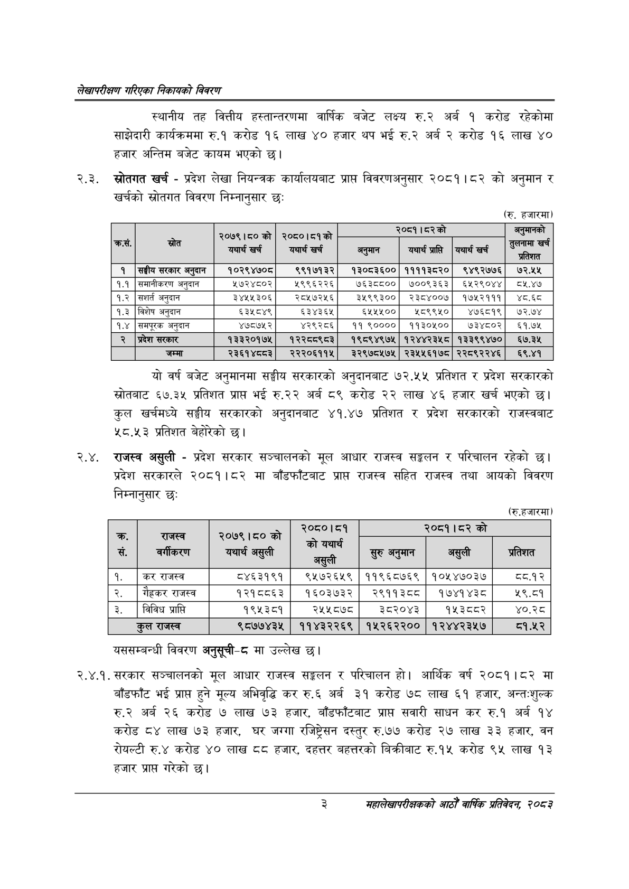

# Page 19 QA

## Rendered page


## Extracted text

```text
लेखापरीक्षण गरिएका निकायको विवरण
स्थानीय तह वित्तीय हस्तान्तरणमा वार्षिक बजेट लक्ष्य रु.२ अर्ब १ करोड रहेकोमा साझेदारी कार्यक्रममा रु.१ करोड १६ लाख ४० हजार थप भई रु.२ अर्ब २ करोड १६ लाख ४० हजार अन्तिम बजेट कायम भएको छ।
२.३. स्रोतगत खर्च -प्रदेश लेखा नियन्त्रक कार्यालयबाट प्राप्त विवरणअनुसार २०८१।८२ को अनुमान र खर्चको स्रोतगत विवरण निम्नानुसार छः
(रु. हजारमा)
यो वर्ष बजेट अनुमानमा सङ्घीय सरकारको अनुदानबाट ७२.५५ प्रतिशत र प्रदेश सरकारको स्रोतबाट ६७.३५ प्रतिशत प्राप्त भई रु.२२ अर्ब ८९ करोड २२ लाख ४६ हजार खर्च भएको छ। कुल खर्चमध्ये सङ्घीय सरकारको अनुदानबाट ४१.४७ प्रतिशत र प्रदेश सरकारको राजस्वबाट ५८.५३ प्रतिशत बेहोरेको छ।
२.४. राजस्व असुली -प्रदेश सरकार सञ्चालनको मूल आधार राजस्व सङ्कलन र परिचालन रहेको | प्रदेश सरकारले २०८१।८२ मा बाँडफाँटबाट प्राप्त राजस्व सहित राजस्व तथा आयको विवरण निम्नानुसार छः
(रु.हजारमा)
यससम्बन्धी विवरण अनुसूची-८ मा उल्लेख
२.४.१. सरकार सञ्चालनको मूल आधार राजस्व सङ्कलन र परिचालन हो। आर्थिक वर्ष २०८१।८२ मा बाँडफाँट भई प्राप्त हुने मूल्य अभिवृद्धि कर रु.६ अर्ब ३१ करोड ७८ लाख ६१ हजार, अन्तःशुल्क अर्ब २६ करोड ७ लाख ७३ हजार, बाँडफाँटबाट प्राप्त सवारी साधन कर रु.१ अर्ब १४ करोड ८४ लाख ७३ हजार, घर जग्गा रजिष्ट्रेसन दस्तुर रु.७७ करोड २७ लाख ३३ हजार, वन रोयल्टी रु.४ करोड ४० लाख ८८ हजार, दहत्तर बहत्तरको बिक्रीबाट रु.१५ करोड ९५ लाख ९३ हजार प्राप्त गरेको छ।
३
महालेखापरीक्षकको आठौ वाषिकि प्रतिवेदन २०८२

|  |  | २०७९।८०को | २०८०।८१को |  |  |  |  |
| --- | --- | --- | --- | --- | --- | --- | --- |
| . [न | सछा | यथार्थ खर्च | यथार्थ खर्च | अनुमान | यथार्थ प्राप्ति | यथार्थ खर्च | गामा खर्च लि |
| १ | सङ्घीय सरकार अनुदान | १०२९४७०८ | ९९१७१३२ | १३०८३६०० | ११११३८२० | ९४९२७७६ | ७२.५५ |
| १.१ | समाचीकरण अनुदान | ५७२४८०२ | २९९६२२६ | ७६३८८०० | ७००९३६३ | ६५२९०४४ | ८५.४७ |
| १.२ | सशर्त अनुदान | ३४५५३०६ | २८१५७२५६ | ३े५९९३०० | २३८४००७ | १७५२१११ | ४८.६८ |
| १.३ | विशेष अनुदान | ६३५८४९ | ६३४३६५ | ६५२५५०० | २८९९५० | ४७६८१९ | ७२.७४ |
| १.४ | समपूरक अनुदान | ४७८७५२ | ४२९२८६ | ११ ९०००० | ११३०५०० | ७३४८०२ | ६१.७५ |
| २ | प्रदेश सरकार | १३३२०१७५ | १२२८८९८३ | १९८९४९७५ | १२४४२३५८ | १३३९९४७० | ६७.३५ |
|  | जम्मा | २३६१४८८३ | २२२०६११५ | ३२९७८५७५ | २३५५६१७८ | २२८९२२४६ | ६९.४१ |

|  |  | को | ०८० |  | को |  |
| --- | --- | --- | --- | --- | --- | --- |
| क्र.. सं. | राजस्व - बर्षा करण | २०७९।८० यथाद यथार्थ असुली | को यथार्थ असुली | हरु अनमान | अस्ली | प्रतिशत |
| १. | कर राजस्व | ८४६३१९१ | ९५७२६५९ | ११९६८७६९ | १०५४७०३७ | ८्य.१२ |
| २. | गैहकर राजस्व | १२१८८६३ | १६०३७३२ | २९११३८८ | १७४१४३८ | ५९.८१ |
| ३. | विविध प्राप्ति | १९५३८१ | २५५८७८ | ३८२०४३ | १५३८०२ | ४०.२८ |
|  | कुल राजस्व | ९८७७४३५ | ११४३२२६९ | १५२६२२०० | १२४४२३५७ | ८१.५२ |
```

## Flags
- table_page
- medium_quality_table
