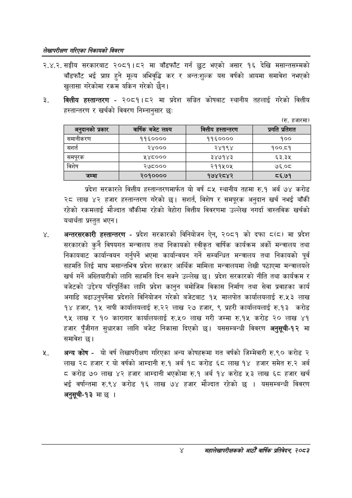

# Page 20 QA

## Rendered page


## Extracted text

```text
लेखापरीक्षण गरिएका निकायको विवरण
२.४.२. सङ्घीय सरकारबाट २०८१।८२ मा बाँडफाँट गर्न छुट भएको असार १६ देखि मसान्तसम्मको बाँडफाँट भई प्राप्त हुने मूल्य अभिवृद्धि कर र अन्तःशुल्क यस वर्षको आयमा समावेश नभएको खुलासा गरेकोमा रकम यकिन गरेको छैन।
वित्तीय हस्तान्तरण -२०८१।८२ मा प्रदेश सञ्चित कोषबाट स्थानीय तहलाई गरेको वित्तीय हस्तान्तरण र खर्चको विवरण निम्नानुसार छः
(रु. हजारमा)
प्रदेश सरकारले वित्तीय हस्तान्तरणमार्फत यो वर्ष ८५ स्थानीय तहमा रु.१ अर्ब ७४ करोड २८ लाख ४२ हजार हस्तान्तरण गरेको सशर्त, विशेष र समपूरक अनुदान खर्च नभई बाँकी रहेको रकमलाई मौज्दात बाँकीमा रहेको बेहोरा वित्तीय विवरणमा उल्लेख नगर्दा वास्तविक खर्चको यथार्थता प्रस्तुत भएन |
अन्तरसरकारी हस्तान्तरण -प्रदेश सरकारको विनियोजन ऐन, २०८१ को दफा ८८८) मा प्रदेश सरकारको कुनै विषयगत मन्त्रालय तथा निकायको स्वीकृत वार्षिक कार्यक्रम अर्को मन्त्रालय तथा निकायबाट कार्यान्वयन गर्नुपर्ने भएमा कार्यान्वयन गर्ने सम्बन्धित मन्त्रालय तथा निकायको पूर्व सहमति लिई माघ मसान्तभित्र प्रदेश सरकार आर्थिक मामिला मन्त्रालयमा लेखी पठाएमा मन्त्रालयले खर्च गर्ने अख्तियारीको लागि सहमति दिन सक्ने उल्लेख छ। प्रदेश सरकारको नीति तथा कार्यक्रम र बजेटको उद्देश्य परिपूर्तिका लागि प्रदेश कानुन बमोजिम विकास निर्माण तथा सेवा प्रवाहका कार्य अगाडि बढाउनुपर्नेमा प्रदेशले विनियोजन गरेको बजेटबाट १५ मालपोत कार्यालयलाई रु.५३ लाख १४ हजार, १५ नापी कार्यालयलाई रु.२२ लाख २७ हजार, ९ प्रहरी कार्यालयलाई रु.१३ करोड ९५ लाख र १० कारागार कार्यालयलाई रु.५० लाख गरी जम्मा रु.१५ करोड २० लाख ४१ हजार पुँजीगत सुधारका लागि बजेट निकासा दिएको छ। यससम्बन्धी विवरण अनुसूची-१२ मा समावेश छ।
अन्य कोष -यो वर्ष लेखापरीक्षण गरिएका अन्य कोषहरूमा गत वर्षको जिम्मेवारी रु.९० करोड २ लाख २८ हजार र यो वर्षको आम्दानी रु.१ अर्ब १८ करोड ६८ लाख १४ हजार समेत रु.२ अर्ब ८ करोड ७० लाख ४२ हजार आम्दानी भएकोमा रु.१ अर्ब १४ करोड ३ लाख ६८ हजार खर्च भई वर्षान्तमा रु.९४ करोड १६ लाख ७४ हजार मौज्दात रहेको छ। यससम्बन्धी विवरण अनुसूची-१३ मा छ |
महालेखापरीक्षकको आठौ वाषिकि प्रतिवेदन २०८२

| अनुदानको प्रकार | वार्षिक बजेट लक्ष्य | वित्तीय हस्तान्तरण | प्रगति प्रतिशत |
| --- | --- | --- | --- |
| समानीकरण | ११६०००० | ११६०००० | १०० |
| सशर्त | २४००० | २४१९४ | १००.८१ |
| समपूरक | २ ४८००० | ३४७१४३ | ३.३% |
| विशेष | २७८००० | २११५०४ | ७६.०८ |
| जम्मा | २०१०००० | १७४२८४२ | ८६.७१ |
```

## Flags
- table_page
- medium_quality_table
