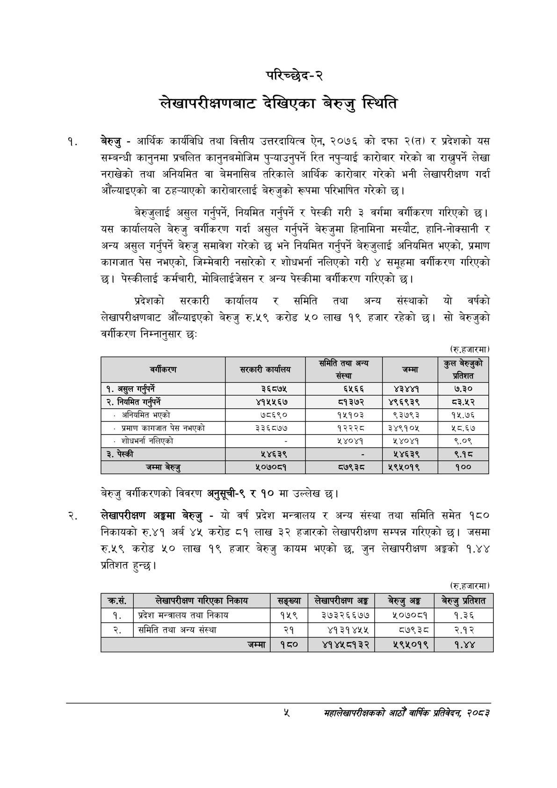

# Page 23 QA

## Rendered page


## Extracted text

```text
परिच्छेद-२
लेखापरीक्षणबाट देखिएका बेरुजु स्थिति
बेरुजु -आर्थिक कार्यविधि तथा वित्तीय उत्तरदायित्व ऐन, २०७६ को दफा २(त) र प्रदेशको यस सम्बन्धी कानुनमा प्रचलित कानुनबमोजिम पुन्याउनुपर्ने रित नपुन्याई कारोबार गरेको वा राख्नुपर्ने लेखा नराखेको तथा अनियमित वा बेमनासिब तरिकाले आर्थिक कारोबार गरेको भनी लेखापरीक्षण गर्दा औंल्याइएको वा ठह-्याएको कारोबारलाई बेरुजुको रूपमा परिभाषित गरेको छ।
बेरुजुलाई असुल गर्नुपर्ने, नियमित गर्नुपर्ने र पेस्की गरी ३ वर्गमा वर्गीकरण गरिएको छ। यस कार्यालयले बेरुजु वर्गीकरण गर्दा असुल गर्नुपर्ने बेरुजुमा हिनामिना मस्यौट, हानि-नोक्सानी र अन्य असुल गर्नुपर्ने बेरुजु समावेश गरेको छ भने नियमित गर्नुपर्ने बेरुजुलाई अनियमित भएको, प्रमाण कागजात पेस नभएको, जिम्मेवारी नसारेको र शोधभर्ना नलिएको गरी ४ समूहमा वर्गीकरण गरिएको छ। पेस्कीलाई कर्मचारी, मोबिलाईजेसन र अन्य पेस्कीमा वर्गीकरण गरिएको छ।
प्रदेशको सरकारी कार्यालय र समिति तथा अन्य संस्थाको यो वर्षको लेखापरीक्षणबाट औँल्याइएको बेरुजु रु.५९ करोड ५० लाख १९ हजार रहेको सो बेरुजुको वर्गीकरण निम्नानुसार छः
(रु.हजारमा)
बेरुजु वर्गीकरणको विवरण अनुसूची-९ र १० मा उल्लेख छ।
लेखापरीक्षण अङ्गमा बेरुजु -यो वर्ष प्रदेश मन्त्रालय र अन्य संस्था तथा समिति समेत १८० निकायको रु.४१ अर्ब ४५ करोड ८१ लाख ३२ हजारको लेखापरीक्षण सम्पन्न गरिएको | जसमा रु.५९ करोड ५२० लाख १९ हजार बेरुजु कायम भएको छ, जुन लेखापरीक्षण अङ्गको १.४४ प्रतिशत हुन्छ।
(रु.हजारमा)
महालेखापरीक्षकको आठौ वाषिकि प्रतिवेदन २०८२

| बर्षाकएण | सरकारी कार्यालय | हुनका जन्त संस्था | जम्मा | कुल बेरुनुको प्रतिशत |
| --- | --- | --- | --- | --- |
| १. असुल गर्नुपर्ने | ३६८७५ | ६५६६ | ४३४४१ | ७.३० |
| २. नियमित गर्नुपर्ने | ४१५५६७ | ८१३७२ | ४९६९३९ | ८३.५२ |
| - अनिवमित भएको | ७८६९० | १५१०३ | ९३७९३ | १५.७६ |
| - प्रमाण कागजात पेस नभएको | ३३६८७७ | १२२२८ | ३४९१०५ | ५८.६७ |
| शोधभर्ना नलिएको |  | ५ ४०४१ | ५ ४०४१ | ९.०९ |
| ३. पेस्की | ५४६३९ | ५ | ५४६३९ | ९१८ |
| जम्मा बेरुजु | ५०७०८१ | ८७९३८ | ५९५०१९ | १०० |

| क्रस. | लखापरीक्षण गरेएका निकाय | सङ्ख्या | लेखापरीकण अङ्ग | बेरुउ अङ्ग |
| --- | --- | --- | --- | --- |
| १. | प्रदेश तथा निकाय | १५९ | ३७३२६६७७ | ५०७०८१ |
| २. | समिति तथा अन्य संस्था | २१ | ४१३१४५४५ | ७९३८ |
|  | जम्मा | १८० | ४१४५८१३२ | ५९५०१९ |
```

## Flags
- table_page
- medium_quality_table
