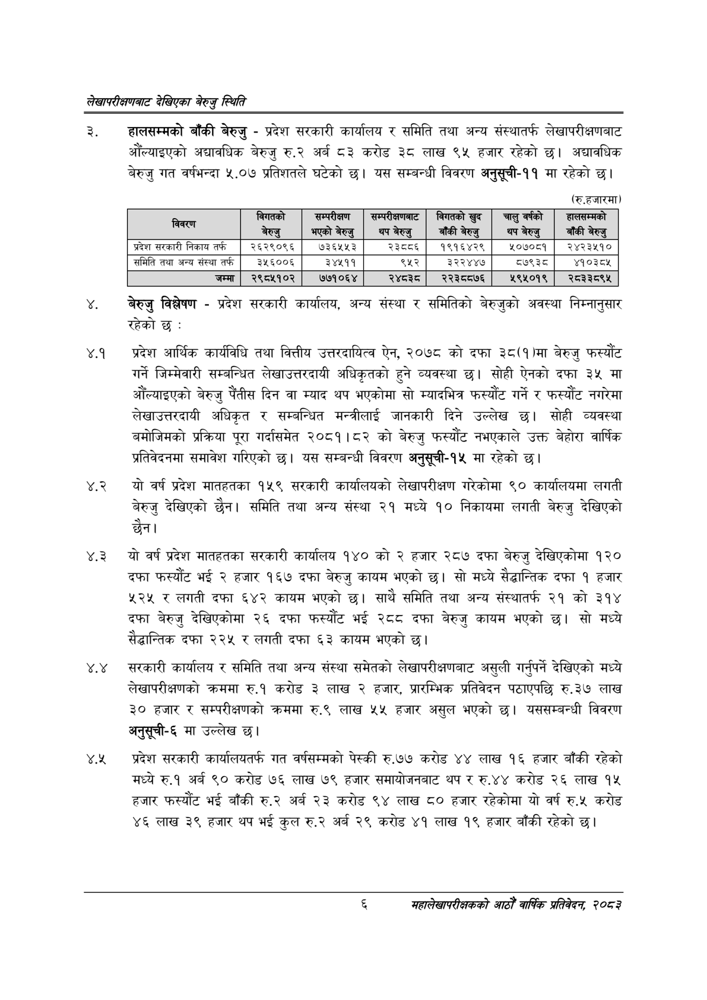

# Page 24 QA

## Rendered page


## Extracted text

```text
लेखापरीक्षणबाट देखिएका बेरुजु स्थिति
हालसम्मको बाँकी बेरुजु -प्रदेश सरकारी कार्यालय र समिति तथा अन्य संस्थातर्फ लेखापरीक्षणबाट औंल्याइएको अद्यावधिक बेरुजु रु.२ अर्ब ८३ करोड ३८ लाख ९५ हजार रहेको छ। अद्यावधिक बेरुजु गत वर्षभन्दा ५.०७ प्रतिशतले घटेको छ। यस सम्बन्धी विवरण अनुसूची-११ मा रहेको छ।
(रु.हजारमा)
बेरुजु विश्लेषण -प्रदेश सरकारी कार्यालय, अन्य संस्था र समितिको बेरुजुको अवस्था निम्नानुसार रहेको छ:
४.१ प्रदेश आर्थिक कार्यविधि तथा वित्तीय उत्तरदायित्व ऐन, २०७८ को दफा ३८(१)मा बेरुजु फस्यौट गर्ने जिम्मेवारी सम्बन्धित लेखाउत्तरदायी अधिकृतको हुने व्यवस्था छ। सोही ऐनको दफा ३५ मा औंल्याइएको बेरुजु दिन वा म्याद थप भएकोमा सो म्यादभित्र फस्यौट गर्ने र फस्यौट नगरेमा लेखाउत्तरदायी अधिकृत र सम्बन्धित मन्त्रीलाई जानकारी दिने उल्लेख छ। सोही व्यवस्था बमोजिमको प्रक्रिया पूरा गर्दासमेत २०८१।८२ को बेरुजु फस्यौट नभएकाले उक्त बेहोरा वार्षिक प्रतिवेदनमा समावेश गरिएको छ। यस सम्बन्धी विवरण अनुसूची-१५ मा रहेको छ।
४.२ यो वर्ष प्रदेश मातहतका १५९ सरकारी कार्यालयको लेखापरीक्षण गरेकोमा ९० कार्यालयमा लगती बेरुजु देखिएको छैन। समिति तथा अन्य संस्था २१ मध्ये १० निकायमा लगती बेरुजु देखिएको छैन।
४.३ यो वर्ष प्रदेश मातहतका सरकारी कार्यालय १४० को २ हजार २८७ दफा बेरुजु देखिएकोमा १२० दफा फस्यौट भई २ हजार १६७ दफा बेरुजु कायम भएको छ। सो मध्ये सैद्धान्तिक दफा १ हजार ५२५ र लगती दफा ६४२ कायम भएको | साथै समिति तथा अन्य संस्थातर्फ २१ को ३१४ दफा बेरुजु देखिएकोमा २६ दफा फस्यौट भई २८८ दफा बेरुजु कायम भएको छ। सो मध्ये सैद्धान्तिक दफा २२५ र लगती दफा ३ कायम भएको छ।
. सरकारी कार्यालय र समिति तथा अन्य संस्था समेतको लेखापरीक्षणबाट असुली गर्नुपर्ने देखिएको मध्ये लेखापरीक्षणको क्रममा रु.१ करोड ३ लाख २ हजार, प्रारम्भिक प्रतिवेदन पठाएपछि रु.३७ लाख ३० हजार र सम्परीक्षणको क्रममा रु.९ लाख ५५ हजार असुल भएको छ। यससम्बन्धी विवरण अनुसूची-६ मा उल्लेख छ।
४.२ प्रदेश सरकारी कार्यालयतर्फ गत वर्षसम्मको पेस्की रु.७७ करोड ४४ लाख १६ हजार बाँकी रहेको मध्ये रु.१ अर्ब ९० करोड ७६ लाख हजार समायोजनबाट थप र रु.४४ करोड २६ लाख १४ हजार फस्यौट भई बाँकी रु.२ अर्ब २३ करोड ९४ लाख ८० हजार रहेकोमा यो वर्ष रु.५ करोड ४६ लाख ३९ हजार थप भई कुल रु.२ अर्ब २९ करोड ४१ लाख १९ हजार बाँकी रहेको छ।
६
महालेखापरीक्षकको आठौ वाषिकि प्रतिवेदन २०८२

| विवरण | विगतको बेरुजु | सम्पर्क भएको बेरुजु | सन्परक्गननाट थप बेरुजु | विगतको खुद बाँकी बेरुजु | चालुवर्षको थप बेरुजु | हालचन्तको बाँकी बेरुजु |
| --- | --- | --- | --- | --- | --- | --- |
| प्रदेश सरकारी निकाय तर्फ | २६२९०९६ | ७३६५४५३ | २३८८६ | १९१६४२९ | ५०७०८१ | २४२३५१० |
| समिति तथा अन्य संस्थातरफ | ३५६००६ | ३४५११ | ९५२ | ३२२४४७ | ५७९३ | ४१०३८५ |
| जम्मा | २९८५१०२ | ७७१०६४ | २४८३८० | २२३८०७६ | २९५०१९ | २८३३०८९५ |
```

## Flags
- table_page
- medium_quality_table
