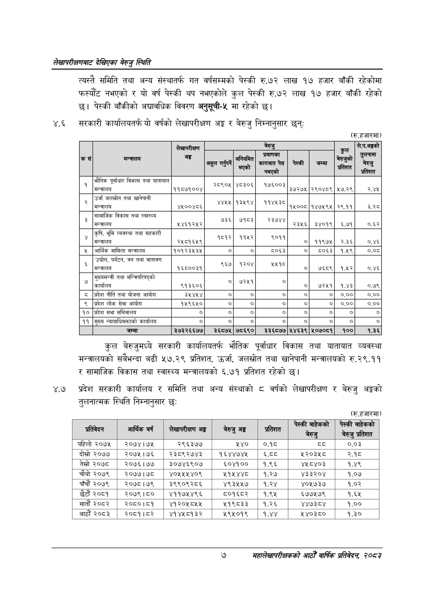

# Page 25 QA

## Rendered page


## Extracted text

```text
लेखापरीक्षणबाट देखिएका बेरुजु स्थिति
त्यस्तै समिति तथा अन्य संस्थातर्फ गत वर्षसम्मको पेस्की रु.७२ लाख १७ हजार बाँकी रहेकोमा फस्यौट नभएको र यो वर्ष पेस्की थप नभएकोले कुल पेस्की रु.७२ लाख १७ हजार बाँकी रहेको छु। पेस्की बाँकीको अद्यावधिक विवरण अनुसूची-५ मा रहेको
४.६ सरकारी कार्यालयतर्फ यो वर्षको लेखापरीक्षण अङ्ग र बेरुजु निम्नानुसार छन्‌ः
(रु.हजारमा)
कुल बेरुजुमध्ये सरकारी कार्यालयतर्फ भौतिक पूर्वाधार विकास तथा यातायात व्यवस्था मन्त्रालयको सबैभन्दा बढी ५७.२९ प्रतिशत, उर्जा, जलस्रोत तथा खानेपानी मन्त्रालयको रु.२९.११ र सामाजिक विकास तथा स्वास्थ्य मन्त्रालयको ६.७१ प्रतिशत रहेको छ।
४.७ प्रदेश सरकारी कार्यालय र समिति तथा अन्य संस्थाको ८ वर्षको लेखापरीक्षण र बेरुजु अङ्गको तुलनात्मक स्थिति निम्नानुसार छ:
(रु.हजारमा)
७
महालेखापरीक्षकको आठौ वाषिकि प्रतिवेदन २०८२

|  |  |  |  |  | बेरुजु |  |  |  | ले.प.अङ्कको |
| --- | --- | --- | --- | --- | --- | --- | --- | --- | --- |
| कस | मन्त्रालय | अङ्ग | असुल | अनियमित है - | प्रमाणका चेस नभएको | पेस्की | जम्मा | = बेरुजुको | तुलनामा बेरुजु प्रतिशत |
| १ | भौतिक विकास तथा यातायात भौतिक पूर्वाधार था यातायात मन्त्रालय | ११८७१००४ | २८९०४५ | ४८३०६ | १७६००३ | ३७२७५ | . २९०४८९ | ५७.२९ | २,४४५ |
| २ | उर्जा जलस्रोत तथा खानेपानी उर्जा जलस्रोत तथा खानेपानी मन्त्रालय | ४५००४८६ | ४४५५ | १३५९४ | ११४५३८ | १५००८ | १४७५९५ | २९११ | ३३५ |
|  | सामाजिक विकास तथा स्वास्थ्य मन्त्रालय | २४६१२५२ | ७३६ | ७१८३ | २३७४४ | २३५६ | ३४०१९ | ६.७१ | ०.६२ |
| ४ | कृषि, भूमि व्यवस्था तथा सहकारी कि, भूमि व्यवस्था तथा सहत मन्त्रालय | २५८१६५९ | १८१२ | ११५२ | ९०११ | ० | ११९७५ | २.३६ | ०.४६ |
| ५ | आर्थिक मामिला मन्त्रालय | १०१२३१५३५ | ० | ० | ५०६३ | ० | ८०६३ | १.१९ | ०.०८ |
| ५ | उद्योग, पर्यटन, वन तथा वातावण मन्त्रालय | १६८००३१ | छ | २ उे२०४ | तर | ० | ७६८९ | १.५२ | ०.४६ |
|  | तथा कार्यालय | ९१३६०६ | ० | ७२८१ |  | ० | ७२५१ | १.४३ | ०.७९ |
| ८ | प्रदेश नीति तथा योजना आयोग | ३५४५४ | ० | ० | ० | ० | ० | ०.०० | ०.०० |
| ९ | प्रदेश लोक सेवा आयोग | १५९६५० | ० | ० | ० | ० |  | ०.०० | ०.०० |
| १० | प्रदेश सभा सचिवालय | ० | ० | ० | ० | ० | ० | ० | ० |
| ११ | मुख्य न्याबाविकक्ताको कार्यालय | ० | ० | ० | ० | ० | ० | ० | ० |
|  | जम्मा | ३७३२६६७७ | ३६०८७५ | ७८६९० | ३३६८७७ | ५४६३९ | ५०७०८१ | १०० | १.३६ |

| प्रतिवेदन | आर्थिक वर्ष | सेषापरीकण भङ्ग | बेरुजु अङ्क | प्रतिशत | हु | छ |
| --- | --- | --- | --- | --- | --- | --- |
| पहिलो २०७५ | २०७४।७५ | २९६३७७ | १२४० | ०.१८ | ५३ | ०.०३ |
| दोस्रो ०७७ | २०७५।७६ | २३८९२७४३ | १६४४७४४५ | .५५ | ५२०३५८ | २.१८ |
| तेस्रो २०७८ | २०७६।७७ | र३०७४६९०७ | ६५०४१०० | १.९६ | ४४५८४०३ | १.४९ |
| चौथो २०७९ | २०७७।७४८ | ४०५१५४०९ | २१५४४८ | १.२७ | ४३३२०४ | १.०७ |
| पाँचौं २०७९ | २०७८।७९ | ३९९०९२८६ | ४९३५५७ | १.२४ | ४०५७३७ | १.०२ |
| छैटौं २०८१ | २०७९।८० | ४११७५४९६ | ८०१६८२ | १.९५ | ६७७५७९ | १.६४५ |
| सातौं २०८२ | २०८०।८१ | ४१२०५८५४५ | २१९८३३ | १.२६ | ४४७३८४ | १.०० |
| आठौं २०८३ | २०८१।८२ | ४१४४५८१३२ | ४५९४५०१९ | १.४४ | ४ ४०३८० | १.३० |
```

## Flags
- table_page
- medium_quality_table
