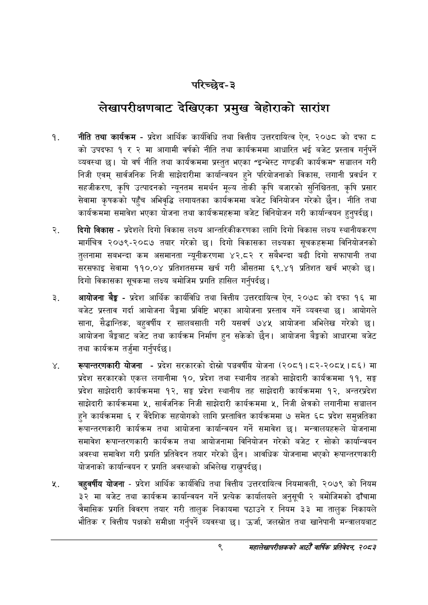

# Page 29 QA

## Rendered page


## Extracted text

```text
परिच्छेद-३
लेखापरीक्षणबाट देखिएका प्रमुख बेहोराको
सारांश
नीति तथा कार्यक्रम -प्रदेश आर्थिक कार्यविधि तथा वित्तीय उत्तरदायित्व ऐन, २०७८ को दफा ८ को उपदफा १ र २ मा आगामी वर्षको नीति तथा कार्यक्रममा आधारित भई बजेट प्रस्ताव गर्नुपर्ने व्यवस्था छ। यो वर्ष नीति तथा कार्यक्रममा प्रस्तुत भएका "इन्भेस्ट गण्डकी कार्यक्रम" सञ्चालन गरी निजी एवम्‌ सार्वजनिक निजी साझेदारीमा कार्यान्वयन हुने परियोजनाको विकास, लगानी प्रवर्धन र सहजीकरण, कृषि उत्पादनको न्यूनतम समर्थन मूल्य तोकी कृषि बजारको सुनिश्चितता, कृषि प्रसार सेवामा कृषकको पहुँच अभिवृद्धि लगायतका कार्यक्रममा बजेट विनियोजन गरेको छैन। नीति तथा कार्यक्रममा समावेश भएका योजना तथा कार्यक्रमहरूमा बजेट विनियोजन गरी कार्यान्वयन हुनुपर्दछ |
दिगो विकास -प्रदेशले दिगो विकास लक्ष्य आन्तरिकीकरणका लागि दिगो विकास लक्ष्य स्थानीयकरण मार्गचित्र २०७९-२०८७ तयार गरेको छ। दिगो विकासका लक्ष्यका सूचकहरूमा विनियोजनको तुलनामा सबभन्दा कम असमानता न्यूनीकरणमा ४२.८२ र सबैभन्दा बढी दिगो सफापानी तथा सरसफाइ सेवामा ११०.०४ प्रतिशतसम्म खर्च गरी औसतमा ६९.४१ प्रतिशत खर्च भएको छ। दिगो विकासका सूचकमा लक्ष्य बमोजिम प्रगति हासिल गर्नुपर्दछ |
आयोजना बैङ्क -प्रदेश आर्थिक कार्यविधि तथा वित्तीय उत्तरदायित्व ऐन, २०७८ को दफा १६ मा बजेट प्रस्ताव गर्दा आयोजना बेङ्गमा प्रविष्टि भएका आयोजना प्रस्ताव गर्ने व्यवस्था छ। आयोगले साना, सैद्धान्तिक, बहुवर्षीय र सालबसाली गरी यसवर्ष ७४५ आयोजना अभिलेख गरेको छ। आयोजना बैङ्कबाट बजेट तथा कार्यक्रम निर्माण हुन सकेको छैन। आयोजना बेङ्गको आधारमा बजेट तथा कार्यक्रम तर्जुमा गर्नुपर्दछ।
रूपान्तरणकारी योजना -प्रदेश सरकारको दोस्रो पञ्चवर्षीय योजना (०५९ | ८२-२०८५।८६) मा प्रदेश सरकारको एकल लगानीमा १०, प्रदेश तथा स्थानीय तहको साझेदारी कार्यक्रममा ११, सङ्घ प्रदेश साझेदारी कार्यक्रममा १२, सङ्ग प्रदेश स्थानीय तह साझेदारी कार्यक्रममा १२, अन्तरप्रदेश साझेदारी कार्यक्रममा ५, सार्वजनिक निजी साझेदारी कार्यक्रममा ५, निजी क्षेत्रको लगानीमा सञ्चालन हुने कार्यक्रममा ६ र वैदेशिक सहयोगको लागि प्रस्तावित कार्यक्रममा ७ समेत ६८ प्रदेश समुन्नतिका रूपान्तरणकारी कार्यक्रम तथा आयोजना कार्यान्वयन गर्ने समावेश छ। मन्त्रालयहरूले योजनामा समावेश रूपान्तरणकारी कार्यक्रम तथा आयोजनामा विनियोजन गरेको बजेट र सोको कार्यान्वयन अवस्था समावेश गरी प्रगति प्रतिवेदन तयार गरेको छैन। आवधिक योजनामा भएको रूपान्तरणकारी योजनाको कार्यान्वयन र प्रगति अवस्थाको अभिलेख राख्नुपर्दछ।
बहुवर्षीय योजना -प्रदेश आर्थिक कार्यविधि तथा वित्तीय उत्तरदायित्व नियमावली, २०७९ को नियम ३ मा बजेट तथा कार्यक्रम कार्यान्वयन गर्ने प्रत्येक कार्यालयले अनुसूची २ बमोजिमको ढाँचामा चैमासिक प्रगति विवरण तयार गरी तालुक निकायमा पठाउने र नियम ३३ मा तालुक निकायले भौतिक र वित्तीय पक्षको समीक्षा गर्नुपर्ने व्यवस्था छ। उर्जा, जलस्रोत तथा खानेपानी मन्त्रालयबाट
९
महालेखापरीक्षकको आठौ वाषिकि प्रतिवेदन २०८२
```

## Flags
- None
