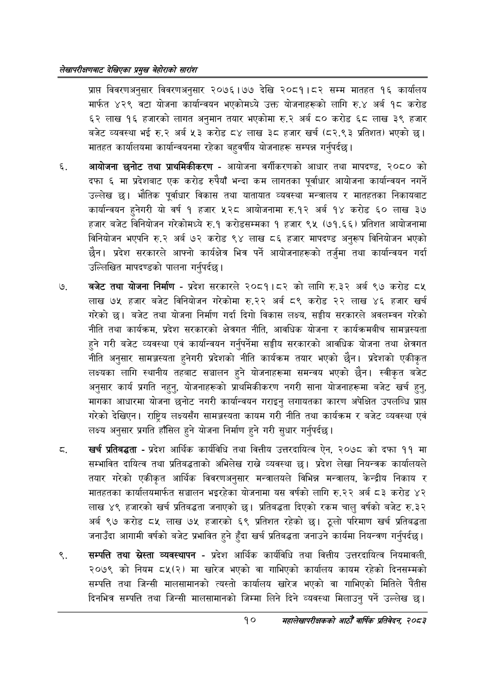

# Page 30 QA

## Rendered page


## Extracted text

```text
लेखापरीक्षणबाट देखिएका प्रमुख बेहोराको सारांश
प्राप विवरणअनुसार विवरणअनुसार २०७६।७७ देखि २०८१।८२ सम्म मातहत १६ कार्यालय मार्फत ४२९ वटा योजना कार्यान्वयन भएकोमध्ये उक्त योजनाहरूको लागि रु.४ अर्ब १८ करोड ६२ लाख १६ हजारको लागत अनुमान तयार भएकोमा रु.२ अर्ब ८० करोड ६८ लाख ३९ हजार बजेट व्यवस्था भई रु.२ अर्ब ५३ करोड ८४ लाख ३८ हजार खर्च (८२.९३ प्रतिशत) भएको छ। मातहत कार्यालयमा कार्यान्वयनमा रहेका बहुवर्षीय योजनाहरू सम्पन्न गर्नुपर्दछ |
आयोजना छनोट तथा प्राथमिकीकरण -आयोजना वर्गीकरणको आधार तथा मापदण्ड, २०८० को दफा ६ मा प्रदेशबाट एक करोड रुपैयाँ भन्दा कम लागतका पूर्वाधार आयोजना कार्यान्वयन नगर्ने उल्लेख छ। भौतिक पूर्वाधार विकास तथा यातायात व्यवस्था मन्त्रालय र मातहतका निकायबाट कार्यान्वयन हुनेगरी यो वर्ष १ हजार ५२८ आयोजनामा रु.१२ अर्ब १४ करोड ६० लाख ३७ हजार बजेट विनियोजन गरेकोमध्ये रु.१ करोडसम्मका १ हजार ९५ (७१.६६) प्रतिशत आयोजनामा विनियोजन भएपनि रु.२ अर्ब ७२ करोड ९४ लाख ८६ हजार मापदण्ड अनुरूप विनियोजन भएको छैन। प्रदेश सरकारले आफ्नो कार्यक्षेत्र भित्र पर्ने आयोजनाहरूको तर्जुमा तथा कार्यान्वयन गर्दा उल्लिखित मापदण्डको पालना गर्नुपर्दछ |
बजेट तथा योजना निर्माण -प्रदेश सरकारले २०८१।८२ को लागि रु.३२ अर्ब ९७ करोड लाख ७५ हजार बजेट विनियोजन गरेकोमा रु.२२ अर्ब ८९ करोड २२ लाख ४६ हजार खर्च गरेको | बजेट तथा योजना निर्माण गर्दा दिगो विकास लक्ष्य, सङ्घीय सरकारले अवलम्वन गरेको नीति तथा कार्यक्रम, प्रदेश सरकारको क्षेत्रगत नीति, आवधिक योजना र कार्यक्रमबीच सामञ्जस्यता हुने गरी बजेट व्यवस्था एवं कार्यान्वयन गर्नुपर्नेमा सङ्घीय सरकारको आवधिक योजना तथा क्षेत्रगत नीति अनुसार सामञ्जस्यता हुनेगरी प्रदेशको नीति कार्यक्रम तयार भएको छैन। प्रदेशको एकीकृत लक्ष्यका लागि स्थानीय तहबाट सञ्चालन हुने योजनाहरूमा समन्वय भएको छैन। स्वीकृत बजेट अनुसार कार्य प्रगति नहुनु, योजनाहरूको प्राथमिकीकरण नगरी साना योजनाहरूमा बजेट खर्च हुन्‌, मागका आधारमा योजना छनोट नगरी कार्यान्वयन गराइनु लगायतका कारण अपेक्षित उपलब्धि प्राप्त गरेको देखिएन। राष्ट्रिय लक्ष्यसँग सामञ्जस्यता कायम गरी नीति तथा कार्यक्रम र बजेट व्यवस्था एवं लक्ष्य अनुसार प्रगति हाँसिल हुने योजना निर्माण हुने गरी सुधार गर्नुपर्दछ |
खर्च प्रतिबद्धता -प्रदेश आर्थिक कार्यविधि तथा वित्तीय उत्तरदायित्व ऐन, २०७८ को दफा ११ मा सम्भावित दायित्व तथा प्रतिबद्धताको अभिलेख राख्ने व्यवस्था छ। प्रदेश लेखा नियन्त्रक कार्यालयले तयार गरेको एकीकृत आर्थिक विवरणअनुसार मन्त्रालयले विभिन्न मन्त्रालय, केन्द्रीय निकाय र मातहतका कार्यालयमार्फत सञ्चालन भइरहेका योजनामा यस वर्षको लागि रु.२२ अर्ब ८३ करोड ४२ लाख ४९ हजारको खर्च प्रतिबद्धता जनाएको छ। प्रतिबद्धता दिएको रकम चालु वर्षको बजेट रु.३२ अर्ब ९७ करोड ८५ लाख ७५ हजारको ६९ प्रतिशत रहेको छ। ठूलो परिमाण खर्च प्रतिबद्धता जनाउँदा आगामी वर्षको बजेट प्रभावित हुने हुँदा खर्च प्रतिबद्धता जनाउने कार्यमा नियन्त्रण गर्नुपर्दछ |
सम्पत्ति तथा स्रेस्ता व्यवस्थापन -प्रदेश आर्थिक कार्यविधि तथा वित्तीय उत्तरदायित्व नियमावली, २०७९ को नियम ८५(२) मा खारेज भएको वा गाभिएको कार्यालय कायम रहेको दिनसम्मको सम्पत्ति तथा जिन्सी मालसामानको त्यस्तो कार्यालय खारेज भएको वा गाभिएको मितिले पैंतीस दिनभित्र सम्पत्ति तथा जिन्सी मालसामानको जिम्मा लिने दिने व्यवस्था मिलाउनु पर्ने उल्लेख छ।
१०
महालेखापरीक्षकको आठौ वाषिकि प्रतिवेदन २०८२
```

## Flags
- None
