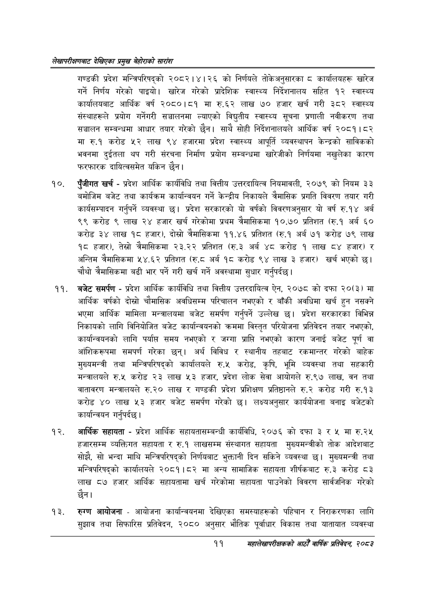

# Page 31 QA

## Rendered page


## Extracted text

```text
लेखापरीक्षणबाट देखिएका प्रमुख बेहोराको सारांश
गण्डकी प्रदेश मन्त्रिपरिषद्को २०८२।४।२६ को निर्णयले तोकेअनुसारका ८ कार्यालयहरू खारेज गर्ने निर्णय गरेको पाइयो। खारेज गरेको प्रादेशिक स्वास्थ्य निर्देशनालय सहित १२ स्वास्थ्य कार्यालयबाट आर्थिक वर्ष २०८०।८१ मा रु.६२ लाख ७० हजार खर्च गरी ३८२ स्वास्थ्य संस्थाहरूले प्रयोग गर्नेगरी सञ्चालनमा ल्याएको विद्युतीय स्वास्थ्य सूचना प्रणाली नवीकरण तथा सञ्चालन सम्बन्धमा आधार तयार गरेको छैन। साथै सोही निर्देशनालयले आर्थिक वर्ष २०८१।८२ मा रु.१ करोड लाख ९४ हजारमा प्रदेश स्वास्थ्य आपूर्ति व्यवस्थापन केन्द्रको साविकको भवनमा दुईतला थप गरी संरचना निर्माण प्रयोग सम्बन्धमा खारेजीको निर्णयमा नखुलेका कारण फरफारक दायित्वसमेत यकिन छैन।
पुँजीगत खर्च -प्रदेश आर्थिक कार्यविधि तथा वित्तीय उत्तरदायित्व नियमावली, २०७९ को नियम ३३ बमोजिम बजेट तथा कार्यक्रम कार्यान्वयन गर्ने केन्द्रीय निकायले त्रैमासिक प्रगति विवरण तयार गरी कार्यसम्पादन गर्नुपर्ने व्यवस्था छ। प्रदेश सरकारको यो वर्षको विवरणअनुसार यो वर्ष रु.१४ अर्ब ९९ करोड ९ लाख २४ हजार खर्च गरेकोमा प्रथम त्रैमासिकमा १०.७० प्रतिशत (रु.१ अर्ब ६० करोड ३४ लाख १८ हजार), दोस्रो त्रैमासिकमा ११.४६ प्रतिशत (रु.१ अर्ब ७१ करोड ७९ लाख १८ हजार), तेस्रो त्रैमासिकमा २३.२२ प्रतिशत (रु.३ अर्ब ४८ करोड १ लाख ८४ हजार) र अन्तिम त्रैमासिकमा ५४.६२ प्रतिशत (रु.८ अर्ब १८ करोड ९४ लाख ३ हजार) खर्च भएको छ। चौथो त्रैमासिकमा बढी भार पर्ने गरी खर्च गर्ने अवस्थामा
सुधार गर्नुपर्दछ।
बजेट समर्पण -प्रदेश आर्थिक कार्यविधि तथा वित्तीय उत्तरदायित्व ऐन, २०७८ को दफा २०(३) मा आर्थिक वर्षको दोस्रो चौमासिक अवधिसम्म परिचालन नभएको र बाँकी अवधिमा खर्च हुन नसक्ने भएमा आर्थिक मामिला मन्त्रालयमा बजेट समर्पण गर्नुपर्ने उल्लेख छ। प्रदेश सरकारका विभिन्न निकायको लागि विनियोजित बजेट कार्यान्वयनको क्रममा विस्तृत परियोजना प्रतिवेदन तयार नभएको, कार्यान्वयनको लागि पर्यास समय नभएको र जग्गा प्राप्ति नभएको कारण जनाई बजेट पूर्ण वा आंशिकरूपमा समपर्ण गरेका छन्‌। अर्थ विविध र स्थानीय तहबाट रकमान्तर गरेको बाहेक मुख्यमन्त्री तथा मन्त्रिपरिषद्को कार्यालयले रु.५ करोड, कृषि, भूमि व्यवस्था तथा सहकारी मन्त्रालयले रु.५ करोड २३ लाख ३ हजार, प्रदेश लोक सेवा आयोगले रु.९७ लाख, वन तथा वातावरण मन्त्रालयले रु.२० लाख र गण्डकी प्रदेश प्रशिक्षण प्रतिष्ठानले रु.२ करोड गरी रु.१३ करोड ४० लाख ५३ हजार बजेट समर्पण गरेको छ। लक्ष्यअनुसार कार्ययोजना बनाइ बजेटको कार्यान्वयन गर्नुपर्दछ |
आर्थिक सहायता -प्रदेश आर्थिक सहायतासम्बन्धी कार्यविधि, २०७६ को दफा ३ र ५ मा रु.२५ हजारसम्म व्यक्तिगत सहायता र रु.१ लाखसम्म संस्थागत सहायता मुख्यमन्त्रीको तोक आदेशबाट सोझै, सो भन्दा माथि मन्त्रिपरिषद्को निर्णयबाट भुक्तानी दिन सकिने व्यवस्था छ। मुख्यमन्त्री तथा मन्त्रिपरिषद्को कार्यालयले २०८१।८२ मा अन्य सामाजिक सहायता शीर्षकबाट रु.३ करोड ८३ लाख ८७ हजार आर्थिक सहायतामा खर्च गरेकोमा सहायता पाउनेको विवरण सार्वजनिक गरेको छैन।
रुग्ण आयोजना -आयोजना कार्यान्वयनमा देखिएका समस्याहरूको पहिचान र निराकरणका लागि सुझाव तथा सिफारिस प्रतिवेदन, २०८० अनुसार भौतिक पूर्वाधार विकास तथा यातायात व्यवस्था
११
महालेखापरीक्षकको आठौ वाषिकि प्रतिवेदन २०८२
```

## Flags
- None
