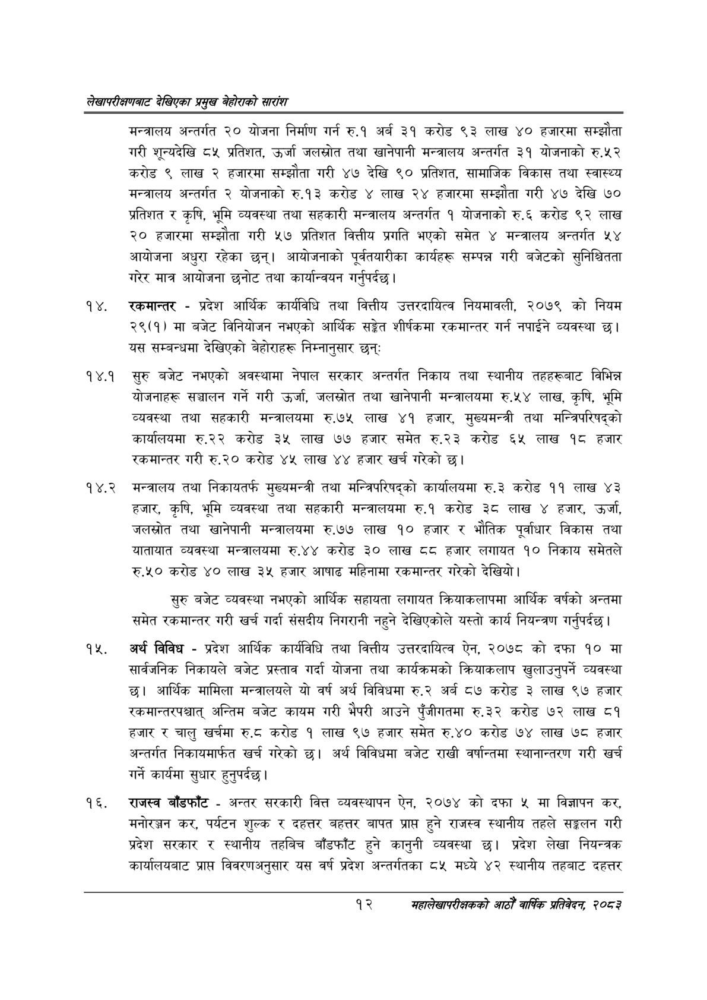

# Page 32 QA

## Rendered page


## Extracted text

```text
लेखापरीक्षणबाट देखिएका प्रमुख बेहोराको सारांश
मन्त्रालय अन्तर्गत २० योजना निर्माण गर्न रु.१ अर्ब ३१ करोड ९३ लाख ४० हजारमा सम्झौता गरी शून्यदेखि ८५ प्रतिशत, उर्जा जलस्रोत तथा खानेपानी मन्त्रालय अन्तर्गत ३१ योजनाको रु.५२ करोड ९ लाख २ हजारमा सम्झौता गरी ४७ देखि ९० प्रतिशत, सामाजिक विकास तथा स्वास्थ्य मन्त्रालय अन्तर्गत २ योजनाको रु.१३ करोड ४ लाख २४ हजारमा सम्झौता गरी ४७ देखि ७० प्रतिशत र कृषि, भूमि व्यवस्था तथा सहकारी मन्त्रालय अन्तर्गत १ योजनाको रु.६ करोड ९२ लाख २० हजारमा सम्झौता गरी ५७ प्रतिशत वित्तीय प्रगति भएको समेत ४ मन्त्रालय अन्तर्गत ५४ आयोजना अधुरा रहेका छन्‌। आयोजनाको पूर्वतयारीका कार्यहरू सम्पन्न गरी बजेटको सुनिश्चितता गरेर मात्र आयोजना छनोट तथा कार्यान्वयन गर्नुपर्दछ |
रकमान्तर -प्रदेश आर्थिक कार्यविधि तथा वित्तीय उत्तरदायित्व नियमावली, २०७९ को नियम २९(१) मा बजेट विनियोजन नभएको आर्थिक सङ्ेत शीर्षकमा रकमान्तर गर्न नपाईने व्यवस्था छ। यस सम्बन्धमा देखिएको बेहोराहरू निम्नानुसार छन्‌
१४.१ सुरु बजेट नभएको अवस्थामा नेपाल सरकार अन्तर्गत निकाय तथा स्थानीय तहहरूबाट विभिन्न योजनाहरू सञ्चालन गर्ने गरी उर्जा, जलस्रोत तथा खानेपानी मन्त्रालयमा रु.५४ लाख, कृषि, भूमि व्यवस्था तथा सहकारी मन्त्रालयमा रु.७५ लाख ४१ हजार, मुख्यमन्त्री तथा मन्त्रिपरिषद्को कार्यालयमा रु.२२ करोड ३५ लाख ७७ हजार समेत रु.२३ करोड ६५ लाख १८ हजार रकमान्तर गरी रु.२० करोड ४५ लाख ४४ हजार खर्च गरेको छ।
१४.२ मन्त्रालय तथा निकायतर्फ मुख्यमन्त्री तथा मन्त्रिपरिषद्को कार्यालयमा रु.३ करोड ११ लाख ४३ हजार, कृषि, भूमि व्यवस्था तथा सहकारी मन्त्रालयमा रु.१ करोड ३८ लाख ४ हजार, उर्जा, जलस्रोत तथा खानेपानी मन्त्रालयमा रु.७७ लाख १० हजार र भौतिक पूर्वाधार विकास तथा यातायात व्यवस्था मन्त्रालयमा रु.४४ करोड ३० लाख ६ हजार लगायत १० निकाय समेतले रु.५० करोड ४० लाख ३५ हजार आषाढ महिनामा रकमान्तर गरेको देखियो।
सुरु बजेट व्यवस्था नभएको आर्थिक सहायता लगायत क्रियाकलापमा आर्थिक वर्षको अन्तमा समेत रकमान्तर गरी खर्च गर्दा संसदीय निगरानी नहुने देखिएकोले यस्तो कार्य नियन्त्रण गर्नुपर्दछ |
अर्थ विविध -प्रदेश आर्थिक कार्यविधि तथा वित्तीय उत्तरदायित्व ऐन, २०७८ को दफा १० मा सार्वजनिक निकायले बजेट प्रस्ताव गर्दा योजना तथा कार्यक्रमको क्रियाकलाप खुलाउनुपर्ने व्यवस्था छ। आर्थिक मामिला मन्त्रालयले यो वर्ष अर्थ विविधमा रु.२ अर्ब ८७ करोड ३ लाख ९७ हजार रकमान्तरपश्चात्‌ अन्तिम बजेट कायम गरी भैपरी आउने पुँजीगतमा रु.३२ करोड ७२ लाख ८१ हजार र चालु खर्चमा रु.ट करोड १ लाख ९७ हजार समेत रु.४० करोड ७४ लाख ७८ हजार अन्तर्गत निकायमार्फत खर्च गरेको छ। अर्थ विविधमा बजेट राखी वर्षान्तमा स्थानान्तरण गरी खर्च गर्ने कार्यमा सुधार हुनुपर्दछ |
राजस्व बाँडफाँट -अन्तर सरकारी वित्त व्यवस्थापन ऐन, २०७४ को दफा ५ मा विज्ञापन कर, मनोरञ्जन कर, पर्यटन शुल्क र दहत्तर बहत्तर बापत प्राप्त हुने राजस्व स्थानीय तहले सङ्कलन गरी प्रदेश सरकार र स्थानीय तहबिच बाँडफाँट हुने कानुनी व्यवस्था छ। प्रदेश लेखा नियन्त्रक कार्यालयबाट प्राप्त विवरणअनुसार यस वर्ष प्रदेश अन्तर्गतका ८५ मध्ये ४२ स्थानीय तहबाट दहत्तर
१२
महालेखापरीक्षकको आठौ वाषिकि प्रतिवेदन २०८२
```

## Flags
- None
