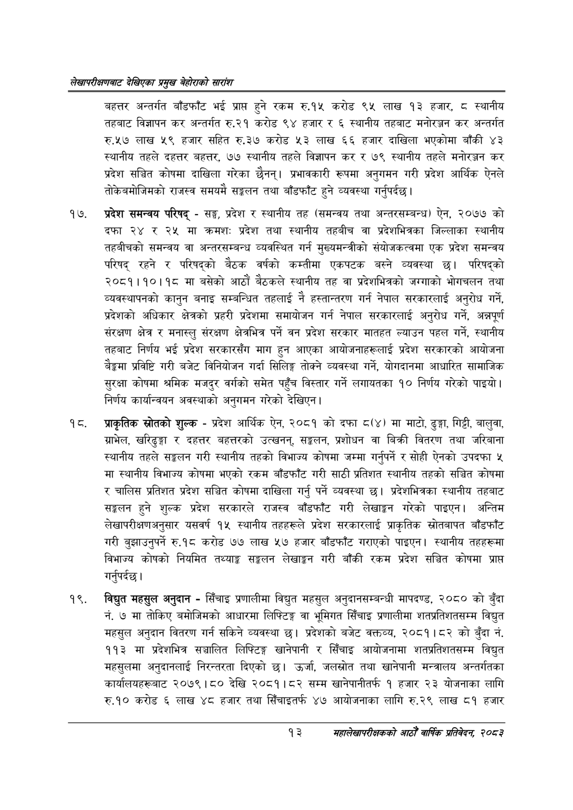

# Page 33 QA

## Rendered page


## Extracted text

```text
लेखापरीक्षणबाट देखिएका प्रमुख बेहोराको सारांश
बहत्तर अन्तर्गत बाँडफाँट भई प्राप्त हुने रकम रु.१५ करोड ९५ लाख १३ हजार, ८ स्थानीय तहबाट विज्ञापन कर अन्तर्गत रु.२१ करोड ९४ हजार र ६ स्थानीय तहबाट मनोरञ्जन कर अन्तर्गत रु.«२७ लाख ५९ हजार सहित रु.३७ करोड ३ लाख ६६ हजार दाखिला भएकोमा बाँकी ४३ स्थानीय तहले दहत्तर बहत्तर, ७७ स्थानीय तहले विज्ञापन कर र ७९ स्थानीय तहले मनोरञ्जन कर प्रदेश सञ्चित कोषमा दाखिला गरेका छैनन्‌। प्रभावकारी रूपमा अनुगमन गरी प्रदेश आर्थिक ऐनले तोकेबमोजिमको राजस्व समयमै सङ्कलन तथा बाँडफाँट हुने व्यवस्था गर्नुपर्दछ |
प्रदेश समन्वय परिषद्‌ -सङ्घ, प्रदेश र स्थानीय तह (समन्वय तथा अन्तरसम्बन्ध) ऐन, २०७७ को दफा २४ र २५ मा क्रमशः: प्रदेश तथा स्थानीय तहबीच वा प्रदेशभित्रका जिल्लाका स्थानीय तहबीचको समन्वय वा अन्तरसम्बन्ध व्यवस्थित गर्न मुख्यमन्त्रीको संयोजकत्वमा एक प्रदेश समन्वय परिषद्‌ रहने र परिषद्को बैठक वर्षको कम्तीमा एकपटक बस्ने व्यवस्था छ। परिषद्को २०८१।१०।१८ मा बसेको आठौं बैठकले स्थानीय तह वा प्रदेशभित्रको जग्गाको भोगचलन तथा व्यवस्थापनको कानुन बनाइ सम्बन्धित तहलाई नै हस्तान्तरण गर्न नेपाल सरकारलाई अनुरोध गर्ने, प्रदेशको अधिकार क्षेत्रको प्रहरी प्रदेशमा समायोजन गर्न नेपाल सरकारलाई अनुरोध गर्ने, अन्नपूर्ण संरक्षण क्षेत्र र मनास्लु संरक्षण क्षेत्रभित्र पर्ने वन प्रदेश सरकार मातहत ल्याउन पहल गर्ने, स्थानीय तहबाट निर्णय भई प्रदेश सरकारसँग माग हुन आएका आयोजनाहरूलाई प्रदेश सरकारको आयोजना बैङ्कमा प्रविष्टि गरी बजेट विनियोजन गर्दा सिलिङ्ग तोक्ने व्यवस्था गर्ने, योगदानमा आधारित सामाजिक सुरक्षा कोषमा श्रमिक मजदुर वर्गको समेत पहुँच विस्तार गर्ने लगायतका १० निर्णय गरेको पाइयो। निर्णय कार्यान्वयन अवस्थाको अनुगमन गरेको देखिएन |
प्राकृतिक स्रोतको शुल्क -प्रदेश आर्थिक ऐन, २०८१ को दफा () मा माटो, ढुङ्गा, गिट्टी, बालुवा, ग्राभेल, खरिढुङ्गा र दहत्तर बहत्तरको उत्खनन्‌, सङ्कलन, प्रशोधन वा बिक्री वितरण तथा जरिबाना स्थानीय तहले सङ्कलन गरी स्थानीय तहको विभाज्य कोषमा जम्मा गर्नुपर्ने र सोही ऐनको उपदफा ५ मा स्थानीय विभाज्य कोषमा भएको रकम बाँडफाँट गरी साठी प्रतिशत स्थानीय तहको सञ्चित कोषमा र चालिस प्रतिशत प्रदेश सञ्चित कोषमा दाखिला गर्नु पर्ने व्यवस्था छ। प्रदेशभित्रका स्थानीय तहबाट सङ्कलन हुने शुल्क प्रदेश सरकारले राजस्व बाँडफाँट गरी लेखाङ्गन गरेको पाइएन। अन्तिम लेखापरीक्षणअनुसार यसवर्ष १५ स्थानीय तहहरूले प्रदेश सरकारलाई प्राकृतिक स्रोतबापत बाँडफाँट गरी बुझाउनुपर्ने रु.१८ करोड ७७ लाख ५७ हजार बाँडफाँट गराएको पाइएन। स्थानीय तहहरूमा विभाज्य कोषको नियमित तथ्याङ्क सङ्कलन लेखाङ्गन गरी बाँकी रकम प्रदेश सञ्चित कोषमा प्राप्त गर्नुपर्दछ |
विद्युत महसुल अनुदान -सिँचाइ प्रणालीमा विद्युत महसुल अनुदानसम्बन्धी मापदण्ड, २०८० को बुँदा नं. ७ मा तोकिए बमोजिमको आधारमा लिफ्टिङ्ग वा भूमिगत सिँचाइ प्रणालीमा शतप्रतिशतसम्म विद्युत महसुल अनुदान वितरण गर्न सकिने व्यवस्था छ। प्रदेशको बजेट वक्तव्य, २०८१।८२ को बुँदा नं. ११३ मा प्रदेशभित्र सञ्चालित लिफ्टिङ्ग खानेपानी र सिँचाइ आयोजनामा शतप्रतिशतसम्म विद्युत महसुलमा अनुदानलाई निरन्तरता दिएको छ। उर्जा, जलस्रोत तथा खानेपानी मन्त्रालय अन्तर्गतका कार्यालयहरूबाट २०७९।८० देखि २०८१।८२ सम्म खानेपानीतर्फ १ हजार २३ योजनाका लागि रु.१० करोड ६ लाख ४८ हजार तथा सिँचाइतर्फ ४७ आयोजनाका लागि रु.२९ लाख ८१ हजार
१३ महालेखापरीक्षकको आठौ वाषिकि प्रतिवेदन २०८२
```

## Flags
- None
