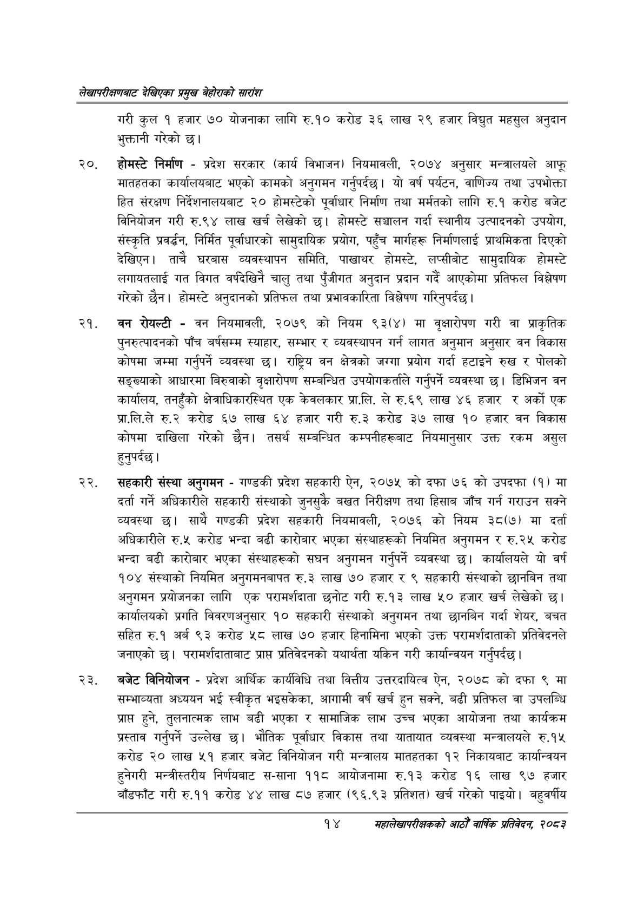

# Page 34 QA

## Rendered page


## Extracted text

```text
लेखापरीक्षणबाट देखिएका प्रमुख बेहोराको सारांश
गरी कुल १ हजार ७० योजनाका लागि रु.१० करोड ३६ लाख २९ हजार विद्युत महसुल अनुदान भुक्तानी गरेको छ।
२०, होमस्टे निर्माण -प्रदेश सरकार (कार्य विभाजन) नियमावली, २०७४ अनुसार मन्त्रालयले आफू मातहतका कार्यालयबाट भएको कामको अनुगमन गर्नुपर्दछ। यो वर्ष पर्यटन, वाणिज्य तथा उपभोक्ता हित संरक्षण निर्देशनालयबाट २० होमस्टेको पूर्वाधार निर्माण तथा मर्मतको लागि रु.१ करोड बजेट विनियोजन गरी रु.९४ लाख खर्च लेखेको छ। होमस्टे सञ्चालन गर्दा स्थानीय उत्पादनको उपयोग, संस्कृति प्रवर्धन, निर्मित पूर्वाधारको सामुदायिक प्रयोग, पहुँच मार्गहरू निर्माणलाई प्राथमिकता दिएको देखिएन। ताचै घरबास व्यवस्थापन समिति, पाखाथर होमस्टे, लप्सीबोट सामुदायिक होमस्टे लगायतलाई गत विगत वर्षदेखिनै चालु तथा पुँजीगत अनुदान प्रदान गर्दै आएकोमा प्रतिफल विश्लेषण गरेको छैन। होमस्टे अनुदानको प्रतिफल तथा प्रभावकारिता विश्लेषण गरिनुपर्दछ |
वन रोयल्टी -वन नियमावली, २०७९ को नियम ९३(४) मा वृक्षारोपण गरी वा प्राकृतिक पुनरुत्पादनको पाँच बर्षसम्म स्याहार, सम्भार र व्यवस्थापन गर्न लागत अनुमान अनुसार वन विकास कोषमा जम्मा गर्नुपर्ने व्यवस्था छ। राष्ट्रिय वन क्षेत्रको जग्गा प्रयोग गर्दा हटाइने रुख र पोलको सङ्ख्याको आधारमा बिरुवाको वृक्षारोपण सम्बन्धित उपयोगकर्ताले गर्नुपर्ने व्यवस्था | डिभिजन वन कार्यालय, तनहुँको क्षेत्राधिकारस्थित एक केवलकार प्रा.लि. ले रु.६९ लाख ४६ हजार र अर्को एक प्रा.लि.ले रु.२ करोड ६७ लाख ६४ हजार गरी रु.३ करोड ३७ लाख ४० हजार वन विकास कोषमा दाखिला गरेको छैन। तसर्थ सम्बन्धित कम्पनीहरूबाट नियमानुसार उक्त रकम असुल हुनुपर्दछ।
सहकारी संस्था अनुगमन -गण्डकी प्रदेश सहकारी ऐन, २०७५ को दफा ७६ को उपदफा (१) मा दर्ता गर्ने अधिकारीले सहकारी संस्थाको जुनसुकै बखत निरीक्षण तथा हिसाब जाँच गर्न गराउन सक्ने व्यवस्था | साथै गण्डकी प्रदेश सहकारी नियमावली, २०७६ को नियम ३८(७) मा दर्ता अधिकारीले रु.५ करोड भन्दा बढी कारोबार भएका संस्थाहरूको नियमित अनुगमन र रु.२५ करोड भन्दा बढी कारोबार भएका संस्थाहरूको सघन अनुगमन गर्नुपर्ने व्यवस्था छ। कार्यालयले यो वर्ष १०४ संस्थाको नियमित अनुगमनबापत रु.३ लाख ७० हजार र ९ सहकारी संस्थाको छानबिन तथा अनुगमन प्रयोजनका लागि एक परामर्शदाता छनोट गरी रु.१३ लाख ५० हजार खर्च लेखेको छ। कार्यालयको प्रगति विवरणअनुसार १० सहकारी संस्थाको अनुगमन तथा छानबिन गर्दा शेयर, बचत सहित रु.१ अर्ब ९३ करोड ५८ लाख ७० हजार हिनामिना भएको उक्त परामर्शदाताको प्रतिवेदनले जनाएको | परामर्शदाताबाट प्राप्त प्रतिवेदनको यथार्थता यकिन गरी कार्यान्वयन गर्नुपर्दछ |
बजेट विनियोजन -प्रदेश आर्थिक कार्यविधि तथा वित्तीय उत्तरदायित्व ऐन, २०७८ को दफा ९ मा सम्भाव्यता अध्ययन भई स्वीकृत भइसकेका, आगामी वर्ष खर्च हुन सक्ने, बढी प्रतिफल वा उपलब्धि प्राप्त हुने, तुलनात्मक लाभ बढी भएका र सामाजिक लाभ उच्च भएका आयोजना तथा कार्यक्रम प्रस्ताव गर्नुपर्ने उल्लेख छ। भौतिक पूर्वाधार विकास तथा यातायात व्यवस्था मन्त्रालयले रु.१५ करोड २० लाख ५१ हजार बजेट विनियोजन गरी मन्त्रालय मातहतका १२ निकायबाट कार्यान्वयन हुनेगरी मन्त्रीस्तरीय निर्णयबाट स-साना ११८ आयोजनामा रु.१३ करोड १६ लाख ९७ हजार बाँडफाँट गरी रु.११ करोड ४४ लाख ८७ हजार (९६.९३ प्रतिशत) खर्च गरेको पाइयो। बहुवर्षीय
१४
महालेखापरीक्षकको आठौ वाषिकि प्रतिवेदन २०८२
```

## Flags
- None
