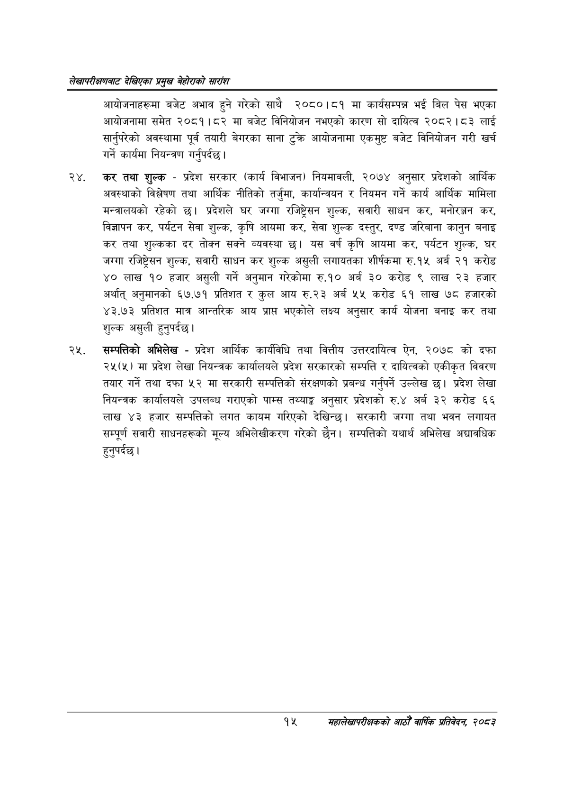

# Page 35 QA

## Rendered page


## Extracted text

```text
लेखापरीक्षणबाट देखिएका प्रमुख बेहोराको सारांश
आयोजनाहरूमा बजेट अभाव हुने गरेको साथै २०८०।८१ मा कार्यसम्पन्न भई बिल पेस भएका आयोजनामा समेत २०८१। ८२ मा बजेट विनियोजन नभएको कारण सो दायित्व २०८२।८३ लाई सार्नुपरेको अवस्थामा पूर्व तयारी बेगरका साना टुक्र आयोजनामा एकमुष्ट बजेट विनियोजन गरी खर्च गर्ने कार्यमा नियन्त्रण गर्नुपर्दछ |
२४, कर तथा शुल्क -प्रदेश सरकार (कार्य विभाजन) नियमावली, २०७४ अनुसार प्रदेशको आर्थिक अवस्थाको विश्लेषण तथा आर्थिक नीतिको तर्जुमा, कार्यान्वयन र नियमन गर्ने कार्य आर्थिक मामिला मन्त्रालयको रहेको छ। प्रदेशले घर जग्गा रजिष्ट्रेसन शुल्क, सवारी साधन कर, मनोरञ्जन कर, विज्ञापन कर, पर्यटन सेवा शुल्क, कृषि आयमा कर, सेवा शुल्क दस्तुर, दण्ड जरिबाना कानुन बनाइ कर तथा शुल्कका दर तोक्न सक्ने व्यवस्था यस वर्ष कृषि आयमा कर, पर्यटन शुल्क, घर जग्गा रजिष्ट्रेसन शुल्क, सवारी साधन कर शुल्क असुली लगायतका शीर्षकमा रु.१५ अर्ब २१ करोड ४० लाख १० हजार असुली गर्ने अनुमान गरेकोमा रु.१० अर्ब ३० करोड ९ लाख २३ हजार अर्थात्‌ अनुमानको ६७.७१ प्रतिशत र कुल आय रु.२३ अर्ब ५५ करोड ६१ लाख ७८ हजारको ४३.७३ प्रतिशत मात्र आन्तरिक आय प्राप्त भएकोले लक्ष्य अनुसार कार्य योजना बनाइ कर तथा शुल्क असुली हुनुपर्दछ |
सम्पत्तिको अभिलेख -प्रदेश आर्थिक कार्यविधि तथा वित्तीय उत्तरदायित्व ऐन, २०७८ को दफा २५(५) मा प्रदेश लेखा नियन्त्रक कार्यालयले प्रदेश सरकारको सम्पत्ति र दायित्वको एकीकृत विवरण तयार गर्ने तथा दफा ५२ मा सरकारी सम्पत्तिको संरक्षणको प्रबन्ध गर्नुपर्ने उल्लेख छ। प्रदेश लेखा नियन्त्रक कार्यालयले उपलब्ध गराएको पाम्स तथ्याङ्क अनुसार प्रदेशको रु.४ अर्ब ३२ करोड ६६ लाख ४३ हजार सम्पत्तिको लगत कायम गरिएको देखिन्छ। सरकारी जग्गा तथा भवन लगायत सम्पूर्ण सवारी साधनहरूको मूल्य अभिलेखीकरण गरेको छैन। सम्पत्तिको यथार्थ अभिलेख अद्यावधिक हुनुपर्दछ |
१५ महालेखापरीक्षकको आठौ वाषिकि प्रतिवेदन २०८२
```

## Flags
- None
