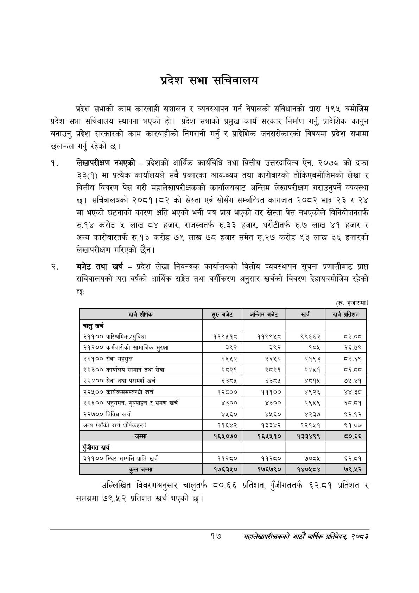

# Page 39 QA

## Rendered page


## Extracted text

```text
प्रदेश सभा सचिवालय
प्रदेश सभाको काम कारबाही सञ्चालन र व्यवस्थापन गर्न नेपालको संविधानको धारा १९५ बमोजिम प्रदेश सभा सचिवालय स्थापना भएको हो। प्रदेश सभाको प्रमुख कार्य सरकार निर्माण गर्नु, प्रादेशिक कानुन बनाउनु, प्रदेश सरकारको काम कारबाहीको निगरानी गर्नु र प्रादेशिक जनसरोकारको विषयमा प्रदेश सभामा छलफल गर्नु रहेको छ।
लेखापरीक्षण नभएको -प्रदेशको आर्थिक कार्यविधि तथा वित्तीय उत्तरदायित्व ऐन, २०७८ को दफा ३३(१) मा प्रत्येक कार्यालयले सबै प्रकारका आय-व्यय तथा कारोबारको तोकिएबमोजिमको लेखा र वित्तीय विवरण पेस गरी महालेखापरीक्षकको कार्यालयबाट अन्तिम लेखापरीक्षण गराउनुपर्ने व्यवस्था छ। सचिवालयको २०८१।८२ को स्रेस्ता एवं सोसँग सम्बन्धित कागजात २०८२ भाद्र २३ र २४ मा भएको घटनाको कारण क्षति भएको भनी पत्र प्राप भएको तर स्रेस्ता पेस नभएकोले विनियोजनतर्फ रु.१४ करोड लाख ८४ हजार, राजस्वतर्फ रु.३३ हजार, धरौटीतर्फ रु.७ लाख ४१ हजार र अन्य कारोबारतर्फ रु.१३ करोड ७९ लाख ७८ हजार समेत रु.२७ करोड ९३ लाख ३६ हजारको लेखापरीक्षण गरिएको छैन।
बजेट तथा खर्च -प्रदेश लेखा नियन्त्रक कार्यालयको वित्तीय व्यवस्थापन सूचना प्रणालीबाट प्राप्त सचिवालयको यस वर्षको आर्थिक सङ्गेत तथा वर्गीकरण अनुसार खर्चको विवरण देहायबमोजिम रहेको छः
(रु. हजारमा)
उल्लिखित विवरणअनुसार चालुतर्फ ८०.६६ प्रतिशत, पुँजीगततर्फ ६२.८१ प्रतिशत र समग्रमा ७९.५२ प्रतिशत खर्च भएको छ।
१७
महालेखापरीक्षकको आठौ वाषिकि प्रतिवेदन २०८२

| खर्च शीर्षक | रुरु बजेट | अन्तिम बजेट | खर्च | खर्च प्रतिशत |
| --- | --- | --- | --- | --- |
| चालु खर्च |  |  |  |  |
| २११०० पारिश्रमिक/सुविधा | ११९५१८ | ११९९५८ | ९९६६२ | ८३.०८ |
| २१२०० कर्मचारीको सामाजिक सुरक्षा | ३९२ | ३९२ | १०४५ | २६.७९ |
| २२१०० सेवा महसुल | २६५२ | २६५२ | २१९३ | ८२.६९ |
| २२३०० कार्यालय सामान तथा सेवा | २८२१ | २८२१ | २४५१ | ८६.व्व |
| २२४०० सेवा तथा परामर्श खर्च | ६३८४ | ६३८५ | ४८१५ | ७५.४१ |
| २२५०० कार्यक्रससम्बन्धी खर्च | १२८०० | १११०० | ४९२६ | ४४.३८ |
| २२६०० अनुगमन, २लाङ्क१ र भ्रमण खर्च | ४३०० | ४३०० | २९५९ | ६८.८१ |
| २२७०० विविध खर्च | ४५६० | ४५६० | ४२३७ | ९२.९२ |
| अन्य (बाँकी खर्च शीर्षकहरू) | ११६४२ | १३३४२ | १२१५१ | ९१.०७ |
| जम्मा | १६५०७० | १६५४५१० | १३३४९९ |  |
| खर्च |  |  |  |  |
| २९९०० स्थिर सम्पत्ति प्राप्ति खर्च | ११२८० | ११२८० | ७०८५ | ६२.८१ |
| कुल जम्मा | १७६३४५० | १७६७९० | १४०४५८४ | ७९.५२ |
```

## Flags
- table_page
- medium_quality_table
