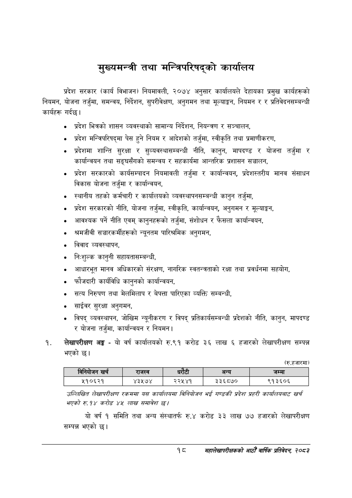

# Page 40 QA

## Rendered page


## Extracted text

```text
मुख्यमन्त्री तथा मन्त्रिपरिषद्को कार्यालय
प्रदेश सरकार (कार्य विभाजन) नियमावली, २०७४ अनुसार कार्यालयले देहायका प्रमुख कार्यहरूको नियमन, योजना तर्जुमा, समन्वय, निर्देशन, सुपरीवेक्षण, अनुगमन तथा मूल्याङ्कन, नियमन र र प्रतिवेदनसम्बन्धी कार्यहरू गर्दछु।
० प्रदेश भित्रको शासन व्यवस्थाको सामान्य निर्देशन, नियन्त्रण र सञ्चालन,
प्रदेश मन्त्रिपरिषद्मा पेस हुने नियम र आदेशको तर्जुमा, स्वीकृति तथा प्रमाणीकरण,
प्रदेशमा शान्ति सुरक्षा र सुव्यवस्थासम्बन्धी नीति, कानुन, मापदण्ड र योजना तर्जुमा र कार्यान्वयन तथा सङ्घसँगको समन्वय र सहकार्यमा आन्तरिक प्रशासन सञ्चालन,
प्रदेश सरकारको कार्यसम्पादन नियमावली तर्जुमा र कार्यान्वयन, प्रदेशस्तरीय मानव संसाधन विकास योजना तर्जुमा र कार्यान्वयन,
स्थानीय तहको कर्मचारी र कार्यालयको व्यवस्थापनसम्बन्धी कानुन तर्जुमा,
«० प्रदेश सरकारको नीति, योजना तर्जुमा, स्वीकृति, कार्यान्वयन, अनुगमन र मूल्याङ्कन,
० आवश्यक पर्ने नीति एवम्‌ कानुनहरूको तर्जुमा, संशोधन र फैसला कार्यान्वयन,
० श्रमजीवी सञ्चारकर्मीहरूको न्यूनतम पारिश्रमिक अनुगमन,
० विवाद व्यवस्थापन,
निःशुल्क कानुनी सहायतासम्बन्धी,
० आधारभूत मानव अधिकारको संरक्षण, नागरिक स्वतन्त्रताको रक्षा तथा प्रवर्धनमा सहयोग,
फौजदारी कार्यविधि कानुनको कार्यान्वयन,
सत्य निरुपण तथा मेलमिलाप र बेपत्ता पारिएका व्यक्ति सम्बन्धी,
० साईवर सुरक्षा अनुगमन,
० विपद्‌ व्यवस्थापन, जोखिम न्यूनीकरण र विपद्‌ प्रतिकार्यसम्बन्धी प्रदेशको नीति, कानुन, मापदण्ड र योजना तर्जुमा, कार्यान्वयन र नियमन |
लेखापरीक्षण अङ्ग -यो वर्ष कार्यालयको रु.९१ करोड ३६ लाख हजारको लेखापरीक्षण सम्पन्न भएको छ।
(रु.हजारमा)
उल्लिखित लेखापरीक्षण रकसमा यस कार्यलियसा विनियोजन ९५ गण्डकी प्रदेश प्रहरी कायलियबाट खर्च भएको रु. १४ करोड ४४ लाख समावेश |
यो वर्ष १ समिति तथा अन्य संस्थातर्फ रु.४ करोड ३३ लाख ७७ हजारको लेखापरीक्षण सम्पन्न भएको |
९
महालेखापरीक्षकको आठौ वाषिकि प्रतिवेदन २०८२

|  |  | निनेबोणन खर्च | राजस्व |  | ५ १ १ १ १ ५ ५३३ २ ३९ ३४ ९६.८५७९७९ अन्य ५ १ १ १ १ ६ ७१० १२ ४१ १४ ८२.२९३०७६ जम्मा ४ १ १ १ २ ० ६४ ४२ ७०२ १६ -१ ५ १ १ १ २ १ ६४ ४२ ७२ १६ ७९.२८१५९३ ५१०६२१ ५ १ १ १ २ २ २३८ ४२ ६३ १५ ८९.६४७५३० ४३५७४ ५ १ १ १ २ ३ ३७४ ४२ ५९ १६ ९१.९७९३८५ २२५४१ ५ १ १ १ २ ४ ५१५ ४२ ७४ १५ ९२.५७३७१५ ३३६८७० ५ १ १ १ २ ५ ६९३ ४२ ७३ १६ ९०.३३५८७६ ९१३६०६ |  |  |
| --- | --- | --- | --- | --- | --- | --- | --- |
|  |  |  |  |  |  |  |  |
```

## Flags
- table_page
- medium_quality_table
