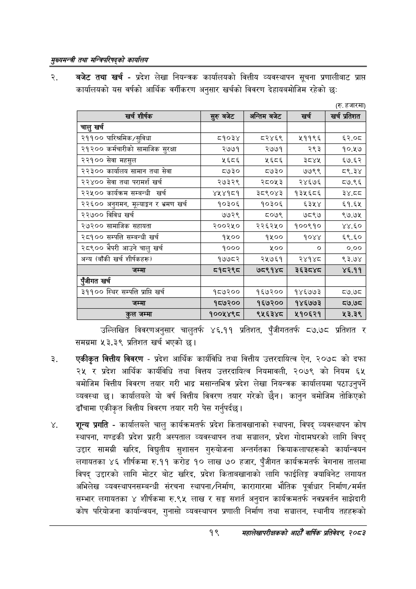

# Page 41 QA

## Rendered page


## Extracted text

```text
सुख्यसन्त्री तथा सन्तिपरिषद्को कायलिय
बजेट तथा खर्च -प्रदेश लेखा नियन्त्रक कार्यालयको वित्तीय व्यवस्थापन सूचना प्रणालीबाट प्राप्त कार्यालयको यस वर्षको आर्थिक वर्गीकरण अनुसार खर्चको विवरण देहायबमोजिम रहेको छः
(रु. हजारमा)
उल्लिखित विवरणअनुसार चालुतर्फ ४६.११ प्रतिशत, पुँजीगततर्फ ८७.७८ प्रतिशत र समग्रमा ३.३% प्रतिशत खर्च भएको |
एकीकृत वित्तीय विवरण -प्रदेश आर्थिक कार्यविधि तथा वित्तीय उत्तरदायित्व ऐन, २०७८ को दफा २५ र प्रदेश आर्थिक कार्यविधि तथा वित्तय उत्तरदायित्व नियमावली, २०७९ को नियम ६५ बमोजिम वित्तीय विवरण तयार गरी भाद्र मसान्तभित्र प्रदेश लेखा नियन्त्रक कार्यालयमा पठाउनुपर्ने व्यवस्था छु। कार्यालयले यो वर्ष वित्तीय विवरण तयार गरेको छैन। कानुन बमोजिम तोकिएको ढाँचामा एकीकृत वित्तीय विवरण तयार गरी पेस गर्नुपर्दछ |
शून्य प्रगति -कार्यालयले चालु कार्यक्रमतर्फ प्रदेश कितावखानाको स्थापना, विपद्‌ व्यवस्थापन कोष स्थापना, गण्डकी प्रदेश प्रहरी अस्पताल व्यवस्थापन तथा सञ्चालन, प्रदेश गोदामघरको लागि विपद्‌ उद्दार सामग्री खरिद, विद्युतीय सुशासन गुरुयोजना अन्तर्गतका क्रियाकलापहरूको कार्यान्वयन लगायतका ४६ शीर्षकमा रु.११ करोड १० लाख ७० हजार, पुँजीगत कार्यक्रमतर्फ वेगनास तालमा विपद्‌ उद्दारको लागि मोटर बोट खरिद, प्रदेश किताबखानाको लागि फाईलिङ्ग क्याबिनेट लगायत अभिलेख व्यवस्थापनसम्बन्धी संरचना स्थापना/निर्माण, कारागारमा भौतिक पूर्वाधार निर्माण/मर्मत सम्भार लगायतका ४ शीर्षकमा रु.९५ लाख र सङ्घ सशर्त अनुदान कार्यक्रमतर्फ नवप्रवर्तन साझेदारी कोष परियोजना कार्यान्वयन, गुनासो व्यवस्थापन प्रणाली निर्माण तथा सञ्चालन, स्थानीय तहहरूको
१९
महालेखापरीक्षकको आठौ वाषिकि प्रतिवेदन २०८२

| = शीष्क | सुरुबबेट | अन्तिम बजेट | खर्च | खर्च प्रतिशत |
| --- | --- | --- | --- | --- |
| चालु खर्च |  |  |  |  |
| २११०० पारिश्रमिक/सुविधा | ८१०३४ | ८२४६९ | २११९६ | ६२.०८ |
| २१२०० कर्मचारीको सामाजिक सुरक्षा | २७७१ | २७७१ | २९३ | १०.१७ |
| २२१०० सेवा महसुल | ५६८६ | ५६८६ | ३८४५ | ६७.६२ |
| २२३०० कार्यालय सामान तथा सेवा | ८७३० | ८७३० | ७७९९ | ८९.३४ |
| २२४०० सेवा तथा परामर्श खर्च | २७३२९ | २८०५३ | २४६७६ | ८७.९६ |
| २२५०० कार्यक्रम सम्बन्धी खर्च | ४५४१८१ | ३८९०४३ | १३५६८६ | ३४. |
| २२६०० अनुगमन, १०४ाङ्१ र भ्रमण खर्च | १०३०६ | १०३०६ | ६३५४ | ६१.६५ |
| २२७०० विविध खर्च | ७७२९ | ८०७९ | ७८९७ | ९७.७५ |
| २७२०० सामाजिक सहायता | २००२५० | २२६२५० | १००९१० | ४४.६० |
| २८१०० सम्पत्ति सम्बन्धी खर्च | १५०० | १५०० | १०४४ | ६९.६० |
| २८९०० भैपरी आउने चालु खर्च | १००० | ५०० |  | ०.०० |
| अन्य (बाँकी खर्च शीर्षकहरू) | १७७८२ | २५७६१ | २४१४८ | ९३.७४ |
| जम्मा | ८१५२९८ | ७८९१४८ | ३६३८४८ | ४६.११ |
| एंजीगत खर्च |  |  |  |  |
| ३११०० स्थिर सम्पत्ति प्राप्ति खर्च | १८७२०० | १६७२०० | १४६७७३ | ८७.७८ |
| जम्मा | १८७२०० | १६७२०० | १४६७७३ | ८५७.७८ |
| तल जम्मा | १००५४९८ | ९५६३४८० | २१०६२१ | २३२.३९ |
```

## Flags
- table_page
- medium_quality_table
