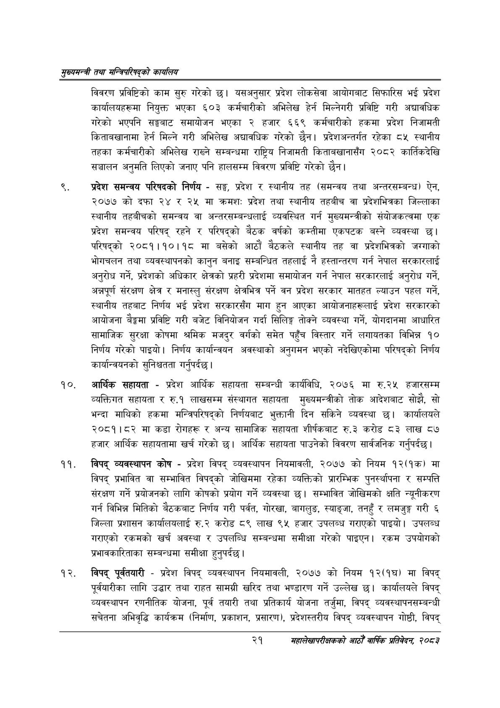

# Page 43 QA

## Rendered page


## Extracted text

```text
सुख्यसन्त्री तथा सन्तिपरिषद्को कायलिय
विवरण प्रविष्टिको काम सुरु गरेको छ। यसअनुसार प्रदेश लोकसेवा आयोगबाट सिफारिस भई प्रदेश कार्यालयहरूमा नियुक्त भएका ६०३ कर्मचारीको अभिलेख हेर्न मिल्नेगरी प्रविष्टि गरी अद्यावधिक गरेको भएपनि सङ्घबाट समायोजन भएका २ हजार ६६९ कर्मचारीको हकमा प्रदेश निजामती किताबखानामा हेर्न मिल्ने गरी अभिलेख अद्यावधिक गरेको छैन। प्रदेशअन्तर्गत रहेका ८५ स्थानीय तहका कर्मचारीको अभिलेख राख्ने सम्बन्धमा राष्ट्रिय निजामती किताबखानासँग २०८२ कार्तिकदेखि सञ्चालन अनुमति लिएको जनाए पनि हालसम्म विवरण प्रविष्टि गरेको छैन।
प्रदेश समन्वय परिषदको निर्णय -सङ्घ, प्रदेश र स्थानीय तह (समन्वय तथा अन्तरसम्बन्ध) ऐन, २०७७ को दफा २४ र २५ मा क्रमशः प्रदेश तथा स्थानीय तहबीच वा प्रदेशभित्रका जिल्लाका स्थानीय तहबीचको समन्वय वा अन्तरसम्बन्धलाई व्यवस्थित गर्न मुख्यमन्त्रीको संयोजकत्वमा एक प्रदेश समन्वय परिषद्‌ रहने र परिषद्को बैठक वर्षको कम्तीमा एकपटक बस्ने व्यवस्था छ। परिषद्को २०८१।१०।१८ मा बसेको आठौं बैठकले स्थानीय तह वा प्रदेशभित्रको जग्गाको भोगचलन तथा व्यवस्थापनको कानुन बनाइ सम्बन्धित तहलाई नै हस्तान्तरण गर्न नेपाल सरकारलाई अनुरोध गर्ने, प्रदेशको अधिकार क्षेत्रको प्रहरी प्रदेशमा समायोजन गर्न नेपाल सरकारलाई अनुरोध गर्ने, अन्नपूर्ण संरक्षण क्षेत्र र मनास्लु संरक्षण क्षेत्रभित्र पर्ने वन प्रदेश सरकार मातहत ल्याउन पहल गर्ने, स्थानीय तहबाट निर्णय भई प्रदेश सरकारसँग माग हुन आएका आयोजनाहरूलाई प्रदेश सरकारको आयोजना बैङ्कमा प्रविष्टि गरी बजेट विनियोजन गर्दा सिलिङ्ग तोक्ने व्यवस्था गर्ने, योगदानमा आधारित सामाजिक सुरक्षा कोषमा श्रमिक मजदुर वर्गको समेत पहुँच विस्तार गर्ने लगायतका विभिन्न १० निर्णय गरेको पाइयो। निर्णय कार्यान्वयन अवस्थाको अनुगमन भएको नदेखिएकोमा परिषद्को निर्णय कार्यान्वयनको सुनिश्चतता गर्नुपर्दछ |
आर्थिक सहायता -प्रदेश आर्थिक सहायता सम्बन्धी कार्यविधि, २०७६ मा रु.२५ हजारसम्म व्यक्तिगत सहायता र रु.१ लाखसम्म संस्थागत सहायता मुख्यमन्त्रीको तोक आदेशबाट सोझै, सो भन्दा माथिको हकमा मन्त्रिपरिषद्को निर्णयबाट भुक्तानी दिन सकिने व्यवस्था छ। कार्यालयले २०८१।८२ मा कडा रोगहरू र अन्य सामाजिक सहायता शीर्षकबाट रु.३ करोड ८३ लाख ८७ हजार आर्थिक सहायतामा खर्च गरेको छ। आर्थिक सहायता पाउनेको विवरण सार्वजनिक गर्नुपर्दछ |
विपद्‌ व्यवस्थापन कोष -प्रदेश विपद्‌ व्यवस्थापन नियमावली, २०७७ को नियम १२(१क) मा विपद्‌ प्रभावित वा सम्भावित विपद्को जोखिममा रहेका व्यक्तिको प्रारम्भिक पुनर्स्थापना र सम्पत्ति संरक्षण गर्ने प्रयोजनको लागि कोषको प्रयोग गर्ने व्यवस्था छ। सम्भावित जोखिमको क्षति न्यूनीकरण गर्न विभिन्न मितिको बैठकबाट निर्णय गरी पर्वत, गोरखा, बागलुङ, स्याङ्जा, तनहुँ र लमजुङ्ग गरी ६ जिल्ला प्रशासन कार्यालयलाई रु.२ करोड ८९ लाख ९५ हजार उपलब्ध गराएको पाइयो। उपलब्ध गराएको रकमको खर्च अवस्था र उपलब्धि सम्बन्धमा समीक्षा गरेको पाइएन। रकम उपयोगको प्रभावकारिताका सम्बन्धमा समीक्षा हुनुपर्दछ |
विपद्‌ पूर्वतयारी -प्रदेश विपद्‌ व्यवस्थापन नियमावली, २०७७ को नियम १२(१घ) मा विपद्‌ पूर्वयारीका लागि उद्धार तथा राहत सामग्री खरिद तथा भण्डारण गर्ने उल्लेख छ। कार्यालयले विपद्‌ व्यवस्थापन रणनीतिक योजना, पूर्व तयारी तथा प्रतिकार्य योजना तर्जुमा, विपद्‌ व्यवस्थापनसम्बन्धी सचेतना अभिवृद्धि कार्यक्रम (निर्माण, प्रकाशन, प्रसारण), प्रदेशस्तरीय विपद्‌ व्यवस्थापन गोष्ठी, विपद्‌
२१
महालेखापरीक्षकको आठौ वाषिकि प्रतिवेदन २०८२
```

## Flags
- None
