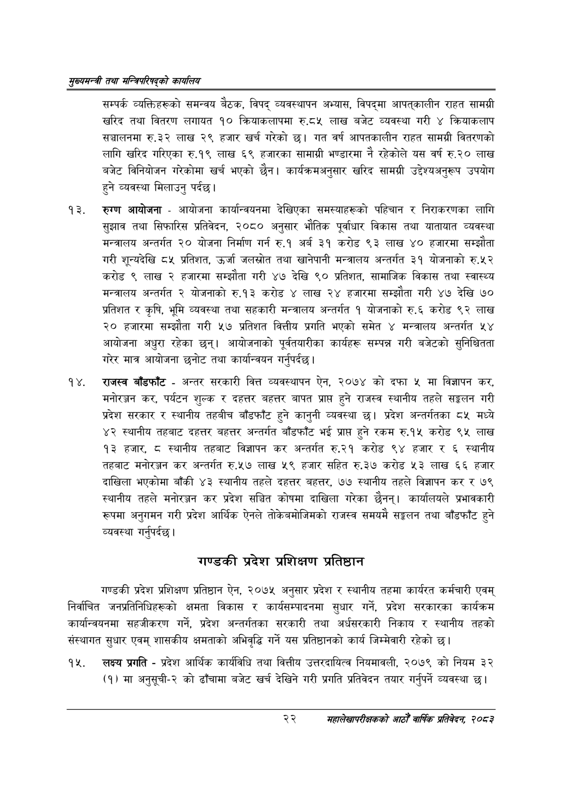

# Page 44 QA

## Rendered page


## Extracted text

```text
सुख्यसन्त्री तथा सन्तिपरिषद्को कायलिय
सम्पर्क व्यक्तिहरूको समन्वय बैठक, विपद्‌ व्यवस्थापन अभ्यास, विपद्मा आपत्‌कालीन राहत सामग्री खरिद तथा वितरण लगायत १० क्रियाकलापमा रु.८५ लाख बजेट व्यवस्था गरी ४ क्रियाकलाप सञ्चालनमा रु.३२ लाख २९ हजार खर्च गरेको | गत वर्ष आपतकालीन राहत सामग्री वितरणको लागि खरिद गरिएका रु.१९ लाख ६९ हजारका सामाग्री भण्डारमा नै रहेकोले यस वर्ष रु.२० लाख बजेट विनियोजन गरेकोमा खर्च भएको छैन। कार्यक्रमअनुसार खरिद सामग्री उद्देश्यअनुरूप उपयोग हुने व्यवस्था मिलाउनु पर्दछ।
रुग्ण आयोजना -आयोजना कार्यान्वयनमा देखिएका समस्याहरूको पहिचान र निराकरणका लागि सुझाव तथा सिफारिस प्रतिवेदन, २०८० अनुसार भौतिक पूर्वाधार विकास तथा यातायात व्यवस्था मन्त्रालय अन्तर्गत २० योजना निर्माण गर्न रु.१ अर्ब ३१ करोड ९३ लाख ४० हजारमा सम्झौता गरी शून्यदेखि ८५ प्रतिशत, उर्जा जलस्रोत तथा खानेपानी मन्त्रालय अन्तर्गत ३१ योजनाको रु.५२ करोड ९ लाख २ हजारमा सम्झौता गरी ४७ देखि ९० प्रतिशत, सामाजिक विकास तथा स्वास्थ्य मन्त्रालय अन्तर्गत २ योजनाको रु.१३ करोड ४ लाख २४ हजारमा सम्झौता गरी ४७ देखि ७० प्रतिशत र कृषि, भूमि व्यवस्था तथा सहकारी मन्त्रालय अन्तर्गत १ योजनाको रु.६ करोड ९२ लाख २० हजारमा सम्झौता गरी ५७ प्रतिशत वित्तीय प्रगति भएको समेत ४ मन्त्रालय अन्तर्गत ५४ आयोजना अधुरा रहेका छन्‌। आयोजनाको पूर्वतयारीका कार्यहरू सम्पन्न गरी बजेटको सुनिश्चितता गरेर मात्र आयोजना छनोट तथा कार्यान्वयन गर्नुपर्दछ |
राजस्व बाँडफाँट -अन्तर सरकारी वित्त व्यवस्थापन ऐन, २०७४ को दफा ५ मा विज्ञापन कर, मनोरञ्जन कर, पर्यटन शुल्क र दहत्तर बहत्तर बापत प्राप्त हुने राजस्व स्थानीय तहले सङ्कलन गरी प्रदेश सरकार र स्थानीय तहबीच बाँडफाँट हुने कानुनी व्यवस्था छ। प्रदेश अन्तर्गतका ८५ मध्ये ४२ स्थानीय तहबाट दहत्तर बहत्तर अन्तर्गत बाँडफाँट भई प्राप्त हुने रकम रु.१५ करोड ९५ लाख ९३ हजार, स्थानीय तहबाट विज्ञापन कर अन्तर्गत रु.२१ करोड ९४ हजार र ६ स्थानीय तहबाट मनोरञ्जन कर अन्तर्गत रु.५७ लाख ५९ हजार सहित रु.२७ करोड ५३ लाख ६६ हजार दाखिला भएकोमा बाँकी ४३ स्थानीय तहले दहत्तर बहत्तर, ७७ स्थानीय तहले विज्ञापन कर र ७९ स्थानीय तहले मनोरञ्जन कर प्रदेश सञ्चित कोषमा दाखिला गरेका छैनन्‌। कार्यालयले प्रभावकारी रूपमा अनुगमन गरी प्रदेश आर्थिक ऐनले तोकेबमोजिमको राजस्व समयमै सङ्कलन तथा बाँडफाँट हुने व्यवस्था गर्नुपर्दछ |
गण्डकी प्रदेश प्रशिक्षण प्रतिष्ठान
गण्डकी प्रदेश प्रशिक्षण प्रतिष्ठान ऐन, २०७५ अनुसार प्रदेश र स्थानीय तहमा कार्यरत कर्मचारी एवम्‌ निर्वाचित जनप्रतिनिधिहरूको क्षमता विकास र कार्यसम्पादनमा सुधार गर्ने, प्रदेश सरकारका कार्यक्रम कार्यान्वयनमा सहजीकरण गर्ने, प्रदेश अन्तर्गतका सरकारी तथा अर्धसरकारी निकाय र स्थानीय तहको संस्थागत सुधार एवम्‌ शासकीय क्षमताको अभिवृद्धि गर्ने यस प्रतिष्ठानको कार्य जिम्मेवारी रहेको छ।
लक्ष्य प्रगति -प्रदेश आर्थिक कार्यविधि तथा वित्तीय उत्तरदायित्व नियमावली, २०७९ को नियम ३२ (१) मा अनुसूची-२ को ढाँचामा बजेट खर्च देखिने गरी प्रगति प्रतिवेदन तयार गर्नुपर्ने व्यवस्था छ।
२२
महालेखापरीक्षकको आठौ वाषिकि प्रतिवेदन २०८२
```

## Flags
- None
