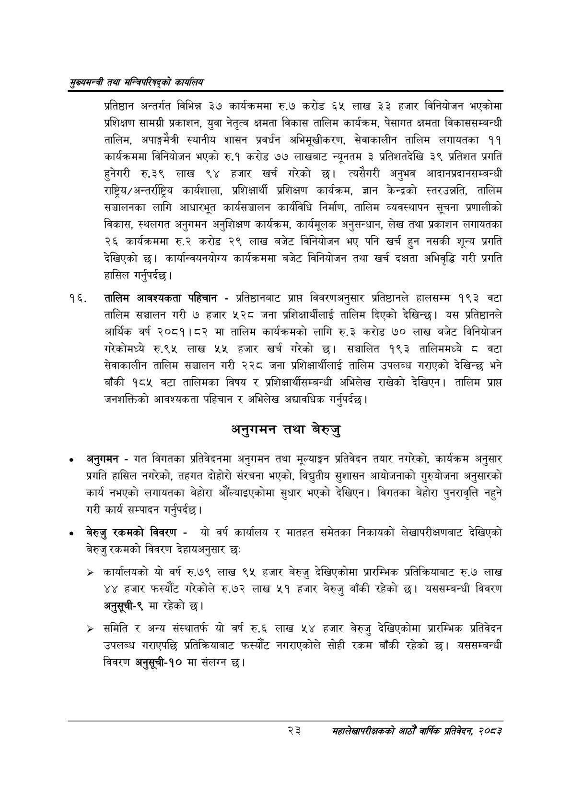

# Page 45 QA

## Rendered page


## Extracted text

```text
सुख्यसन्त्री तथा सन्तिपरिषद्को कायलिय
प्रतिष्ठान अन्तर्गत विभिन्न ३७ कार्यक्रममा रु.७ करोड ६५ लाख ३३ हजार विनियोजन भएकोमा प्रशिक्षण सामग्री प्रकाशन, युवा नेतृत्व क्षमता विकास तालिम कार्यक्रम, पेसागत क्षमता विकाससम्बन्धी तालिम, अपाङ्गमैत्री स्थानीय शासन प्रवर्धन अभिमूखीकरण, सेवाकालीन तालिम लगायतका ११ कार्यक्रममा विनियोजन भएको रु.१ करोड ७७ लाखबाट न्यूनतम ३ प्रतिशतदेखि ३९ प्रतिशत प्रगति हुनेगरी रु.३९ लाख ९४ हजार खर्च गरेको छ। त्यसैगरी अनुभव आदानप्रदानसम्बन्धी राष्ट्रिय/ अन्तर्राष्ट्रिय कार्यशाला, प्रशिक्षार्थी प्रशिक्षण कार्यक्रम, ज्ञान केन्द्रको स्तरउन्नति, तालिम सञ्चालनका लागि आधारभूत कार्यसञ्चालन कार्यविधि निर्माण, तालिम व्यवस्थापन सूचना प्रणालीको विकास, स्थलगत अनुगमन अनुशिक्षण कार्यक्रम, कार्यमूलक अनुसन्धान, लेख तथा प्रकाशन लगायतका २६ कार्यक्रममा करोड २९ लाख बजेट विनियोजन भए पनि खर्च हुन नसकी शून्य प्रगति देखिएको छ। कार्यान्वयनयोग्य कार्यक्रममा बजेट विनियोजन तथा खर्च दक्षता अभिवृद्धि गरी प्रगति हासिल गर्नुपर्दछ |
तालिम आवश्यकता पहिचान -प्रतिष्ठानबाट प्राप्त विवरणअनुसार प्रतिष्ठानले हालसम्म १९३ वटा तालिम सञ्चालन गरी ७ हजार ५२८ जना प्रशिक्षार्थीलाई तालिम दिएको देखिन्छ। यस प्रतिष्ठानले आर्थिक वर्ष २०८१।८२ मा तालिम कार्यक्रमको लागि रु.३ करोड ७० लाख बजेट विनियोजन गरेकोमध्ये रु.९५ लाख ४५५ हजार खर्च गरेको छ। सञ्चालित १९३ तालिममध्ये ८ बटा सेवाकालीन तालिम सञ्चालन गरी २२८ जना प्रशिक्षार्थीलाई तालिम उपलब्ध गराएको देखिन्छ भने बाँकी १८४५ वटा तालिमका विषय र प्रशिक्षार्थीसम्बन्धी अभिलेख राखेको देखिएन। तालिम प्राप्त जनशक्तिको आवश्यकता पहिचान र अभिलेख अद्यावधिक गर्नुपर्दछ।
अनुगमन तथा बेरुजु
अनुगमन -गत विगतका प्रतिवेदनमा अनुगमन तथा मूल्याङ्कन प्रतिवेदन तयार नगरेको, कार्यक्रम अनुसार प्रगति हासिल नगरेको, तहगत दोहोरी संरचना भएको, विद्युतीय सुशासन आयोजनाको गुरुयोजना अनुसारको कार्य नभएको लगायतका बेहोरा औँल्याइएकोमा सुधार भएको देखिएन। विगतका बेहोरा पुनरावृत्ति नहुने गरी कार्य सम्पादन गर्नुपर्दछ |
बेरुजु रकमको विवरण -यो वर्ष कार्यालय र मातहत समेतका निकायको लेखापरीक्षणबाट देखिएको बेरुजु रकमको विवरण देहायअनुसार छः
कार्यालयको यो वर्ष रु.७९ लाख ९५ हजार बेरुजु देखिएकोमा प्रारम्भिक प्रतिक्रियाबाट रु.७ लाख ४४ हजार फस्यौट गरेकोले रु.७२ लाख ५१ हजार बेरुजु बाँकी रहेको छ। यससम्बन्धी विवरण अनुसूची-९ मा रहेको छ।
समिति र अन्य संस्थातर्फ यो वर्ष रु.६ लाख ५४ हजार बेरुजु देखिएकोमा प्रारम्भिक प्रतिवेदन उपलब्ध गराएपछि प्रतिक्रियाबाट फस्यौट नगराएकोले सोही रकम बाँकी रहेको छ। यससम्बन्धी विवरण अनुसूची-१० मा संलग्न
२३
महालेखापरीक्षकको आठौ वाषिकि प्रतिवेदन २०८२
```

## Flags
- None
