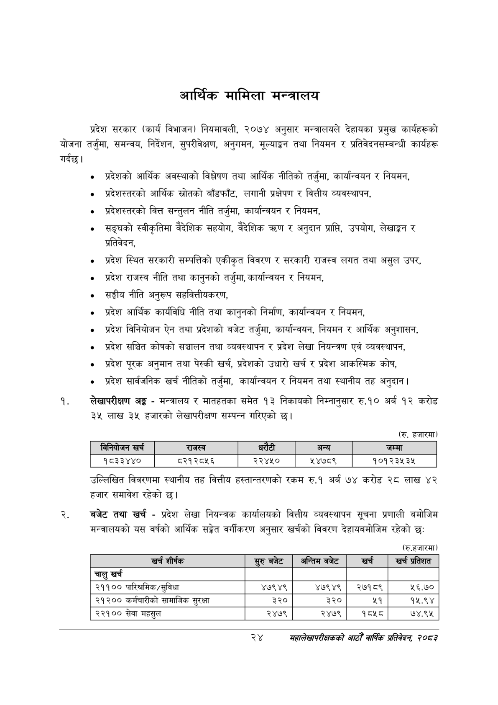

# Page 46 QA

## Rendered page


## Extracted text

```text
आर्थिक मामिला मन्त्रालय
प्रदेश सरकार (कार्य विभाजन) नियमावली, २०७४ अनुसार मन्त्रालयले देहायका प्रमुख कार्यहरूको योजना तर्जुमा, समन्वय, निर्देशन, सुपरीवेक्षण, अनुगमन, मूल्याङ्कन तथा नियमन र प्रतिवेदनसम्बन्धी कार्यहरू गर्दछ।
० प्रदेशको आर्थिक अवस्थाको विश्लेषण तथा आर्थिक नीतिको तर्जुमा, कार्यान्वयन र नियमन,
० प्रदेशस्तरको आर्थिक स्रोतको बाँडफाँट, लगानी प्रक्षेपण र वित्तीय व्यवस्थापन,
० प्रदेशस्तरको वित्त सन्तुलन नीति तर्जुमा, कार्यान्वयन र नियमन,
० सङ्घको स्वीकृतिमा वैदेशिक सहयोग, वैदेशिक त्रण र अनुदान प्राप्ति, उपयोग, लेखाङ्गन र प्रतिवेदन,
० प्रदेश स्थित सरकारी सम्पत्तिको एकीकृत विवरण र सरकारी राजस्व लगत तथा असुल उपर,
० प्रदेश राजस्व नीति तथा कानुनको तर्जुमा, कार्यान्वयन र नियमन,
सङ्घीय नीति अनुरूप सहवित्तीयकरण,
प्रदेश आर्थिक कार्यविधि नीति तथा कानुनको निर्माण, कार्यान्वयन र नियमन,
० प्रदेश विनियोजन ऐन तथा प्रदेशको बजेट तर्जुमा, कार्यान्वयन, नियमन र आर्थिक अनुशासन,
प्रदेश सञ्चित कोषको सञ्चालन तथा व्यवस्थापन र प्रदेश लेखा नियन्त्रण एवं व्यवस्थापन,
० प्रदेश पूरक अनुमान तथा पेस्की खर्च, प्रदेशको उधारी खर्च र प्रदेश आकस्मिक कोष,
प्रदेश सार्वजनिक खर्च नीतिको तर्जुमा, कार्यान्वयन र नियमन तथा स्थानीय तह अनुदान |
लेखापरीक्षण अङ्ग -मन्त्रालय र मातहतका समेत ९३ निकायको निम्नानुसार रु.१० अर्ब १२ करोड ३५ लाख ३५ हजारको लेखापरीक्षण सम्पन्न गरिएको छ।
(रु. हजारमा)
उल्लिखित विवरणमा स्थानीय तह वित्तीय हस्तान्तरणको रकम रु.१ अर्ब ७४ करोड २८ लाख ४२ हजार समावेश रहेको |
बजेट तथा खर्च -प्रदेश लेखा नियन्त्रक कार्यालयको वित्तीय व्यवस्थापन सूचना प्रणाली बमोजिम मन्त्रालयको यस वर्षको आर्थिक सङ्गेत वर्गीकरण अनुसार खर्चको विवरण देहायबमोजिम रहेको छः
(रु.हजारमा)
२४
महालेखापरीक्षकको आठौ वाषिकि प्रतिवेदन २०८२

|  | ननिबोजन खच |  | राजस्व |  |  | अन्य | जम्मा |
| --- | --- | --- | --- | --- | --- | --- | --- |
|  | १८३३४४० |  | ८२१२८५६ | २२४५० |  | ४७८९ | १०१२३५३५ |

| खर्च शीर्षक | स्रुबबेट | अन्तिम बजेट | खर्च | = प्रतेशत |
| --- | --- | --- | --- | --- |
| चालु खर्च |  |  |  |  |
| २११०० पारिश्रमिक/सुविधा | ४७९४९ | ४७९४९ | २७१८९ | ५६.७० |
| २१२०० कर्मचारीको सामाजिक सुरक्षा | ३२० | ३२० | ५१ | १५.९४ |
| २२१०० सेवा महसुल | २४७९ | २४७९ | १८५८ | ७४.९५ |
```

## Flags
- table_page
- medium_quality_table
