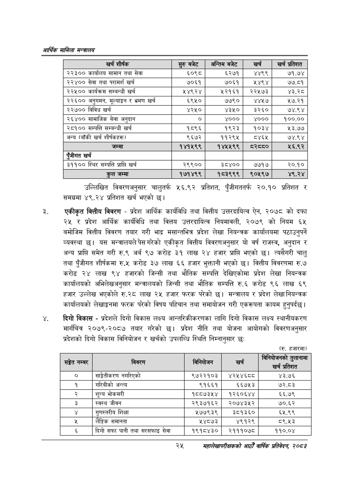

# Page 47 QA

## Rendered page


## Extracted text

```text
आर्थिक मामिला सन्वबालय
उल्लिखित विवरणअनुसार चालुतर्फ ५६.९२ प्रतिशत, पुँजीगततर्फ २०.१० प्रतिशत र समग्रमा ४९.२४ प्रतिशत खर्च भएको छ।
एकीकृत वित्तीय विवरण -प्रदेश आर्थिक कार्यविधि तथा वित्तीय उत्तरदायित्व ऐन, २०७८ को दफा २५ र प्रदेश आर्थिक कार्यविधि तथा वित्तय उत्तरदायित्व नियमावली, २०७९ को नियम ६५ बमोजिम वित्तीय विवरण तयार गरी भाद्र मसान्तभित्र प्रदेश लेखा नियन्त्रक कार्यालयमा पठाउनुपर्ने व्यवस्था छ। यस मन्त्रालयले पेस गरेको एकीकृत वित्तीय विवरणअनुसार यो वर्ष राजस्व, अनुदान र अन्य प्राप्ति समेत गरी रु.९ अर्ब ९७ करोड ३१ लाख २४ हजार प्राप्ति भएको छ। त्यसैगरी चालु तथा पुँजीगत शीर्षकमा रु.५ करोड ३७ लाख ६६ हजार भुक्तानी भएको छ। वित्तीय विवरणमा रु.७ करोड २४ लाख ९४ हजारको जिन्सी तथा भौतिक सम्पत्ति देखिएकोमा प्रदेश लेखा नियन्त्रक कार्यालयको अभिलेखअनुसार मन्त्रालयको जिन्सी तथा भौतिक सम्पत्ति रु.६ करोड ९६ लाख ६९ हजार उल्लेख भएकोले रु.२८ लाख २४ हजार फरक परेको छ। मन्त्रालय र प्रदेश लेखा नियन्त्रक कार्यालयको लेखाङ्गनमा फरक परेको विषय पहिचान तथा समायोजन गरी एकरूपता कायम हुनुपर्दछ।
दिगो विकास -प्रदेशले दिगो विकास लक्ष्य आन्तरिकीकरणका लागि दिगो विकास लक्ष्य स्थानीयकरण मार्गचित्र २०७९-२०८७ तयार गरेको छ। प्रदेश नीति तथा योजना आयोगको विवरणअनुसार प्रदेशको दिगो विकास विनियोजन र खर्चको उपलब्धि स्थिति निम्नानुसार छः
(रु. हजारमा)
२५
महालेखापरीक्षकको आठौ वाषिकि प्रतिवेदन २०८२

| खर्च शीर्षक | र्रुबबेट | अन्तिम बजेट | खर्च |
| --- | --- | --- | --- |
| २२३०० कार्यालष सामान तथा सेवा | ६०९८ | ६२७१ | ४४९९ |
| २२४०० सेवा तथा परामर्श खर्च | ७०६१ | ७०६१ |  |
| २२५०० कार्यकम सम्बन्धी खर्च | ५४९२४ | ५२१६१ | २२५७३ |
| २२६०० अनुगमन, र भ्रमण खर्च | ६९५० | ७७९० | ४४५७ |
| २२७०० विविध खर्च | ४२५० | ४३५० | ३२६० |
| २६४०० चामाजिक सेवा अनुदान | ० | ४००० | ४००० |
| २८१०० सम्पत्ति सम्बन्धी खर्च | १८९६ | १९२३ | १०३४ |
| अन्य (बाँकी खर्च २)र्षकह) | ९६७२ | ११२९५ | ४६५ |
| जम्मा | १४१५९९ | १४४५५९९ | टवर२८० |
| पंजीगत खर्च |  |  |  |
| ३११०० स्थिर सम्पत्ति प्राप्ति खर्च | २९९०० | ३८४०० | ७७१७ |
| कुल जम्मा | १७१४९९ | १८३९९९ | ९०५९७ |

| सङ्गत नम्बर | विवरण | . १वानबाजन | खर्च | ।नानिकोजनको लानामा |
| --- | --- | --- | --- | --- |
| ० | साङ्गेलीकरण नगरिएको | ९७२२१०३ | ४२४५४६८८ | ४३.७६ |
| १ | गरिबीको अन्त्य | ९१६६१ | ६६७५३ | ७२.८३ |
| २ | शून्य भोकमरी | १८८७३५४ | १२६०६४४ | ६६.७९ |
| ३ | स्वस्थ जीवन | २९३७१६२ | २०७४३५२ | ७०.६२ |
|  | शिक्षा | ५७७९३९ | ३८१३६० | ६५.९९ |
| [बि | लैङ्गिक समानता | ५४८७३ | ४९१२९ | ८९.५३ |
| ६ | दिगो सफा पानी तथा सरसफाइ सेवा | १९१८४३० | २१११०७८ | ११०.०४ |
```

## Flags
- table_page
- medium_quality_table
