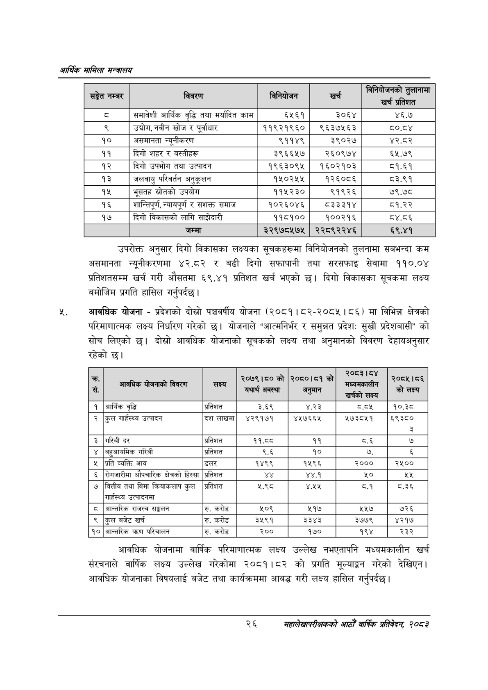

# Page 48 QA

## Rendered page


## Extracted text

```text
आर्थिक मामिला सन्वबालय
उपरोक्त अनुसार दिगो विकासका लक्ष्यका सूचकहरूमा विनियोजनको तुलनामा सबभन्दा कम असमानता न्यूनीकरणमा ४२.८२ र बढी दिगो सफापानी तथा सरसफाइ सेवामा ११०.०४ प्रतिशतसम्म खर्च गरी औसतमा ६९,४१ प्रतिशत खर्च भएको छ। दिगो विकासका सूचकमा लक्ष्य बमोजिम प्रगति हासिल गर्नुपर्दछ |
आवधिक योजना -प्रदेशको दोस्रो पञ्चवर्षीय योजना (२०८१। ८२-२०८५। ८६) मा विभिन्न क्षेत्रको परिमाणात्मक लक्ष्य निर्धारण गरेको छ। योजनाले "आत्मनिर्भर र समुन्नत प्रदेश: सुखी प्रदेशबासी" को सोच लिएको छ। दोस्रो आवधिक योजनाको सूचकको लक्ष्य तथा अनुमानको विवरण देहायअनुसार रहेको छ।
आवधिक योजनामा वार्षिक परिमाणात्मक लक्ष्य उल्लेख नभएतापनि मध्यमकालीन खर्च संरचनाले वार्षिक लक्ष्य उल्लेख गरेकोमा २०८१।८२ को प्रगति मूल्याङ्गन गरेको देखिएन। आवधिक योजनाका विषयलाई बजेट तथा कार्यक्रममा आबद्ध गरी लक्ष्य हासिल गर्नुपर्दछ |
२६
महालेखापरीक्षकको आठौ वाषिकि प्रतिवेदन २०८२

| सङ्गत नम्बर | 'वेवरण | 'ननिबोणन | खर्च | प्रतिशत |
| --- | --- | --- | --- | --- |
| ३ | समावेशी आर्थिक वृद्धि तथा मर्यादित काम | ६५६१ | ३०६४ | ४६.७ |
| ९ | उद्योग, नवीन खोज र पूर्वाधार | ११९२१९६० | ९६३७५६३ | ८०.८४ |
| १० | असमानता न्यूनीकरण | ९११४९ | ३९०२७ | ४२.८२ |
| ११ | दिगो शहर र बह्तीहरू | ३९६६५७ | २६०९७४ | ६५.७९ |
| १२ | दिगो उपभोग तथा उत्पादन | १९६३०९५ | १६०२१०३ | ८१.६१ |
| १३ | जलवायु परिवर्तन अनुकूलन | १५०२५५ | १२६०८६ | ८३.९१ |
| १५ | भूसतह स्रोतको उपयोग | ११५२३० | ९१९२६ | ७९.७८ |
| १६ | शान्तिपूर्ण, न्यावपूर्ण र सशक्त समाज | १०२६०४६ | ८३३३१४ | ८१.२२ |
| १७ | दिगो।नकासको लागि शान्गेदारी | ११८१०० | १००२१६ | ८४.८६ |
|  | जम्मा | ३२९७८५७५ | २२८९२२४६ | ६९.४१ |

| * सं. | आवधिक विवरण | सक्यो | को [०३ ० यथार्थ अवस्था | को रेट को अनुमान | २०८३।८४ \| सि्यनकाबीला खर्चको लक्ष्य | \|\| ००५ १६६ को लक्ष्य |
| --- | --- | --- | --- | --- | --- | --- |
| १ | आर्थिक वृद्धि | प्रतिशत | ३.६९ | ४.२३ |  | १०.३८ |
| २ | कुल गार्हस्थ्य उत्पादन | दश लाखमा | ४२९१७१ | ४५७६६५ | ५७३८५१ | ६९३८० ३ |
| ३ | गरिबी दर | प्रतिशत | ११.८८ | ११ | ८.६ | ७ |
| ४ | बहुआयमिक गरिबी | प्रतिशत | ६.६ | १० | ७. |  |
| ५ | प्रति व्यक्ति आय | डलर | १४९९ | १५९६ | २००० | २५०० |
| ६ | सेगजारीमा ओषचारिक क्षेत्रको हिस्सा | प्रतिशत |  | ४४. | %० | २५ |
| ७ | वित्तीय तथा बिमा न्िवाकलाप कुल गा्हस्थ्य उत्पादनमा | प्रतिशत | ५.९८ | ४.५ | ८.१ | ८.३६ |
| ८ | आन्तरिक राजस्व सङ्खलन | रु. करोड | ५०९ | ५१७ | ५४५७ | ७२६ |
| ९ | कुल बजेट खर्च | रु. करोड | ३५९१ | ३३४३ | ३७७९ | ४२१७ |
| १० | आन्तरिक परिचालन | रु. करोड | २०० | १७० | १९४ | २३२ |
```

## Flags
- table_page
- medium_quality_table
