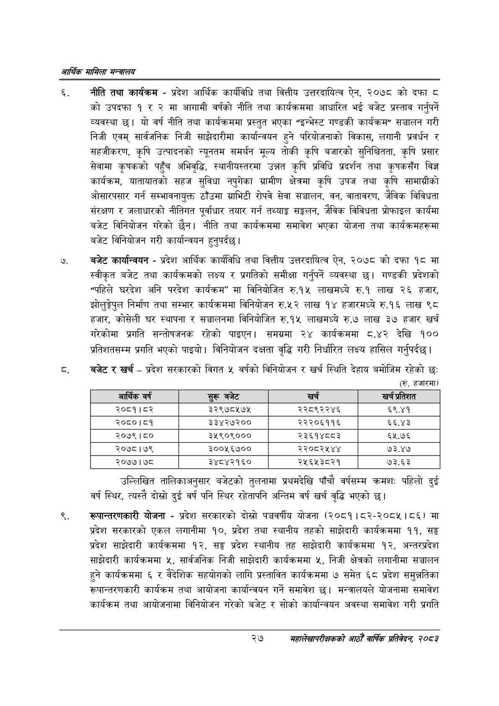

# Page 49 QA

## Rendered page


## Extracted text

```text
आर्थिक मामिला सन्वबालय
नीति तथा कार्यक्रम -प्रदेश आर्थिक कार्यविधि तथा वित्तीय उत्तरदायित्व ऐन, २०७८ को दफा ८ को उपदफा १ र २ मा आगामी वर्षको नीति तथा कार्यक्रममा आधारित भई बजेट प्रस्ताव गर्नुपर्ने व्यवस्था छ। यो वर्ष नीति तथा कार्यक्रममा प्रस्तुत भएका "इन्भेस्ट गण्डकी कार्यक्रम" सञ्चालन गरी निजी एवम्‌ सार्वजनिक निजी साझेदारीमा कार्यान्वयन हुने परियोजनाको विकास, लगानी प्रवर्धन र सहजीकरण, कृषि उत्पादनको न्यूनतम समर्थन मूल्य तोकी कृषि बजारको सुनिश्चितता, कृषि प्रसार सेवामा कृषकको पहुँच अभिवृद्धि, स्थानीयस्तरमा उन्नत कृषि प्रविधि प्रदर्शन तथा कृषकसँग विज्ञ कार्यक्रम, यातायातको सहज सुविधा नपुगेका ग्रामीण क्षेत्रमा कृषि उपज तथा कृषि सामाग्रीको ओसारपसार गर्न सम्भावनायुक्त ठाँउमा ग्राभिटी रोपवे सेवा सञ्चालन, वन, वातावरण, जैविक विविधता संरक्षण र जलाधारको नीतिगत पूर्वाधार तयार गर्न तथ्याङ्क सङ्कलन, जैविक विविधता प्रोफाइल कार्यमा बजेट विनियोजन गरेको छैन। नीति तथा कार्यक्रममा समावेश भएका योजना तथा कार्यक्रमहरूमा बजेट विनियोजन गरी कार्यान्वयन हुनुपर्दछ।
बजेट कार्यान्वयन -प्रदेश आर्थिक कार्यविधि तथा वित्तीय उत्तरदायित्व ऐन, २०७८ को दफा १८ मा स्वीकृत बजेट तथा कार्यक्रमको लक्ष्य र प्रगतिको समीक्षा गर्नुपर्ने व्यवस्था छ। गण्डकी प्रदेशको "पहिले घरदेश अनि परदेश कार्यक्रम" मा विनियोजित रु.१५ लाखमध्ये रु.१ लाख २६ हजार, झोलुङ्गेपुल निर्माण तथा सम्भार कार्यक्रममा विनियोजन रु.५२ लाख १४ हजारमध्ये रु.१६ लाख ९८ हजार, कोसेली घर स्थापना र सञ्चालनमा विनियोजित रु.१५ लाखमध्ये रु.७ लाख ३७ हजार खर्च गरेकोमा प्रगति सन्तोषजनक रहेको पाइएन। समग्रमा २४ कार्यक्रममा ८.४२ देखि १०० प्रतिशतसम्म प्रगति भएको पाइयो। विनियोजन दक्षता वृद्धि गरी निर्धारित लक्ष्य हासिल गर्नुपर्दछ |
बजेट र खर्च -प्रदेश सरकारको विगत ४५ वर्षको विनियोजन र खर्च स्थिति देहाय बमोजिम रहेको छः (रु. हजारमा)
उल्लिखित तालिकाअनुसार बजेटको तुलनामा प्रथमदेखि पाँचौ वर्षसम्म क्रमशः पहिलो दुई वर्ष स्थिर, त्यस्तै दोस्रो दुई वर्ष पनि स्थिर रहेतापनि अन्तिम वर्ष खर्च वृद्धि भएको छ।
रूपान्तरणकारी योजना -प्रदेश सरकारको दोस्रो पञ्चवर्षीय योजना (२०८१। ८२-२०८५।८६) मा प्रदेश सरकारको एकल लगानीमा १०, प्रदेश तथा स्थानीय तहको साझेदारी कार्यक्रममा ९९, सङ्ग प्रदेश साझेदारी कार्यक्रममा १२, सङ्ग प्रदेश स्थानीय तह साझेदारी कार्यक्रममा १२, अन्तरप्रदेश साझेदारी कार्यक्रममा ४५, सार्वजनिक निजी साझेदारी कार्यक्रममा ५, निजी क्षेत्रको लगानीमा सञ्चालन हुने कार्यक्रममा ६ र वैदेशिक सहयोगको लागि प्रस्तावित कार्यक्रममा ७ समेत ६८ प्रदेश समुन्नतिका रूपान्तरणकारी कार्यक्रम तथा आयोजना कार्यान्वयन गर्ने समावेश छ। मन्त्रालयले योजनामा समावेश कार्यक्रम तथा आयोजनामा विनियोजन गरेको बजेट र सोको कार्यान्वयन अवस्था समावेश गरी प्रगति
२७
महालेखापरीक्षकको आठौ वाषिकि प्रतिवेदन २०८२

| आर्थिक वर्ष | सुरू बजेट | खर्च | खच प्रतिशत |
| --- | --- | --- | --- |
| २०८१।८२ | ३२९७८५७५ | २२८९२२४६ | ६९.४१ |
| २०८०।८१ | ३३४२७२०० | २२२०६११६ | ६६.४३ |
| २०७९१८० | ३५९०९००० | २३६१४८८३ | ६५.७६ |
| २०७८।७९ | ३००५६७०० | २२०८२४५४४ | ७३.४७ |
| २०७७।७८ | ३४८४२१६० | २५६५३८२१ | ७३.६३ |
```

## Flags
- table_page
- medium_quality_table
