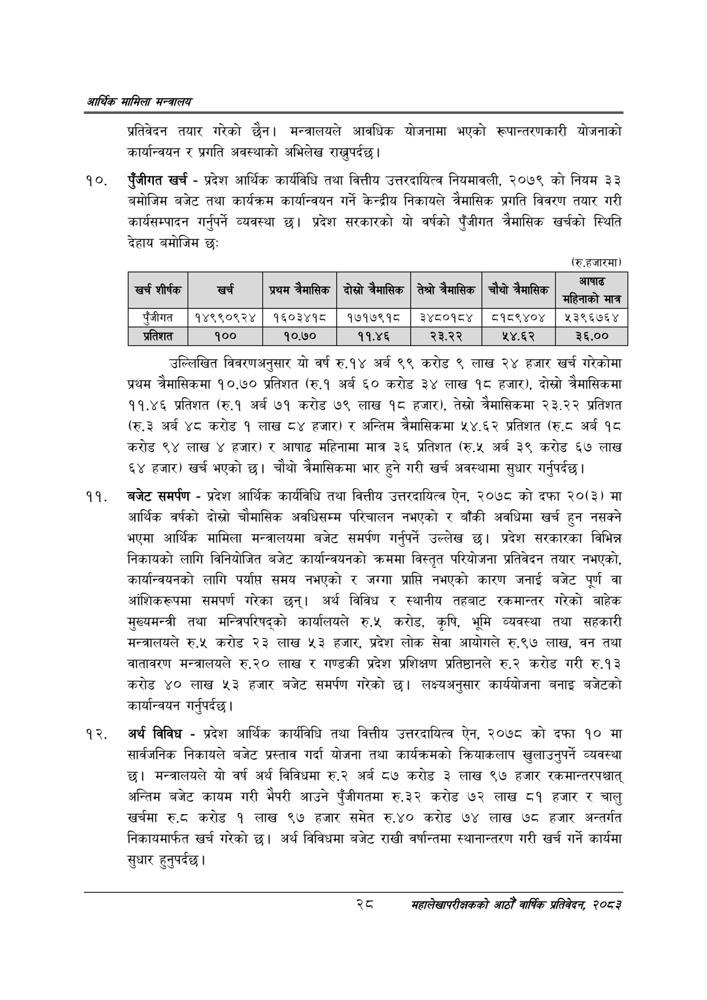

# Page 50 QA

## Rendered page


## Extracted text

```text
आर्थिक मामिला सन्वबालय
प्रतिवेदन तयार गरेको छैन। मन्त्रालयले आवधिक योजनामा भएको रूपान्तरणकारी योजनाको कार्यान्वयन र प्रगति अवस्थाको अभिलेख राख्नुपर्दछ |
पुँजीगत खर्च -प्रदेश आर्थिक कार्यविधि तथा वित्तीय उत्तरदायित्व नियमावली, २०७९ को नियम ३३ बमोजिम बजेट तथा कार्यक्रम कार्यान्वयन गर्ने केन्द्रीय निकायले त्रैमासिक प्रगति विवरण तयार गरी कार्यसम्पादन गर्नुपर्ने व्यवस्था छ। प्रदेश सरकारको यो वर्षको पुँजीगत त्रैमासिक खर्चको स्थिति देहाय बमोजिम छ:
(रु.हजारमा)
उल्लिखित विवरणअनुसार यो वर्ष रु.१४ अर्ब ९९ करोड ९ लाख २४ हजार खर्च गरेकोमा प्रथम त्रैमासिकमा १०.७० प्रतिशत (रु.१ अर्ब ६० करोड ३४ लाख १८ हजार), दोस्रो त्रैमासिकमा ११.४६ प्रतिशत (रु.१ अर्ब ७१ करोड ७९ लाख १८ हजार), तेस्रो त्रैमासिकमा २३.२२ प्रतिशत (रु.३ अर्ब ४८ करोड १ लाख ८४ हजार) र अन्तिम त्रैमासिकमा ५४.६२ प्रतिशत (रु.८ अर्ब १८ करोड ९४ लाख ४ हजार) र आषाढ महिनामा मात्र ३६ प्रतिशत (रु.५ अर्ब ३९ करोड ६७ लाख ६४ हजार) खर्च भएको छ। चौथो त्रैमासिकमा भार हुने गरी खर्च अवस्थामा सुधार गर्नुपर्दछ |
बजेट समर्पण -प्रदेश आर्थिक कार्यविधि तथा वित्तीय उत्तरदायित्व ऐन, २०७८ को दफा २०(३) मा आर्थिक वर्षको दोस्रो चौमासिक अवधिसम्म परिचालन नभएको र बाँकी अवधिमा खर्च हुन नसक्ने भएमा आर्थिक मामिला मन्त्रालयमा बजेट समर्पण गर्नुपर्ने उल्लेख छ। प्रदेश सरकारका विभिन्न निकायको लागि विनियोजित बजेट कार्यान्वयनको क्रममा विस्तृत परियोजना प्रतिवेदन तयार नभएको, कार्यान्वयनको लागि पर्यास समय नभएको र जग्गा प्राप्ति नभएको कारण जनाई बजेट पूर्ण वा आंशिकरूपमा समपर्ण गरेका छन्‌। अर्थ विविध र स्थानीय तहबाट रकमान्तर गरेको बाहेक मुख्यमन्त्री तथा मन्त्रिपरिषद्को कार्यालयले रु.५ करोड, कृषि, भूमि व्यवस्था तथा सहकारी मन्त्रालयले रु.५ करोड २३ लाख ३ हजार, प्रदेश लोक सेवा आयोगले रु.९७ लाख, वन तथा वातावरण मन्त्रालयले रु.२० लाख र गण्डकी प्रदेश प्रशिक्षण प्रतिष्ठानले रु.२ करोड गरी रु.१३ करोड ४० लाख ५३ हजार बजेट समर्पण गरेको छ। लक्ष्यअनुसार कार्ययोजना बनाइ बजेटको कार्यान्वयन गर्नुपर्दछ।
अर्थ विविध -प्रदेश आर्थिक कार्यविधि तथा वित्तीय उत्तरदायित्व ऐन, २०७८ को दफा १० मा सार्वजनिक निकायले बजेट प्रस्ताव गर्दा योजना तथा कार्यक्रमको क्रियाकलाप खुलाउनुपर्ने व्यवस्था मन्त्रालयले यो वर्ष अर्थ विविधमा रु.२ अर्ब ८७ करोड ३ लाख ९७ हजार रकमान्तरपश्चात्‌ अन्तिम बजेट कायम गरी भैपरी आउने पुँजीगतमा रु.३२ करोड ७२ लाख ८१ हजार र चालु खर्चमा रुट करोड १ लाख ९७ हजार समेत रु.४० करोड ७४ लाख ७८ हजार अन्तर्गत निकायमार्फत खर्च गरेको | अर्थ विविधमा बजेट राखी वर्षान्तमा स्थानान्तरण गरी खर्च गर्ने कार्यमा सुधार हुनुपर्दछ |
महालेखापरीक्षकको आठौ वाषिकि प्रतिवेदन २०८२

| खर्च शीर्षक | खर्च | ~ प्रथम «।भासेक | ~ दोस्रो २भासिक | ~ उभासिक | ~ चँँथोर्बासिक | आषाढ - २ मात्र |
| --- | --- | --- | --- | --- | --- | --- |
| पुँजीगत | १४९९०९२४ | १६०३४१८ | १७१७९१८ | ३४८०१८४ | ०५१५९४०४ | १३९६७६४ |
| प्रतिशत | १०० | १०.७० | ११.४६ | २३.२२ | ५४.६२ | ३६.०० |
```

## Flags
- table_page
- medium_quality_table
