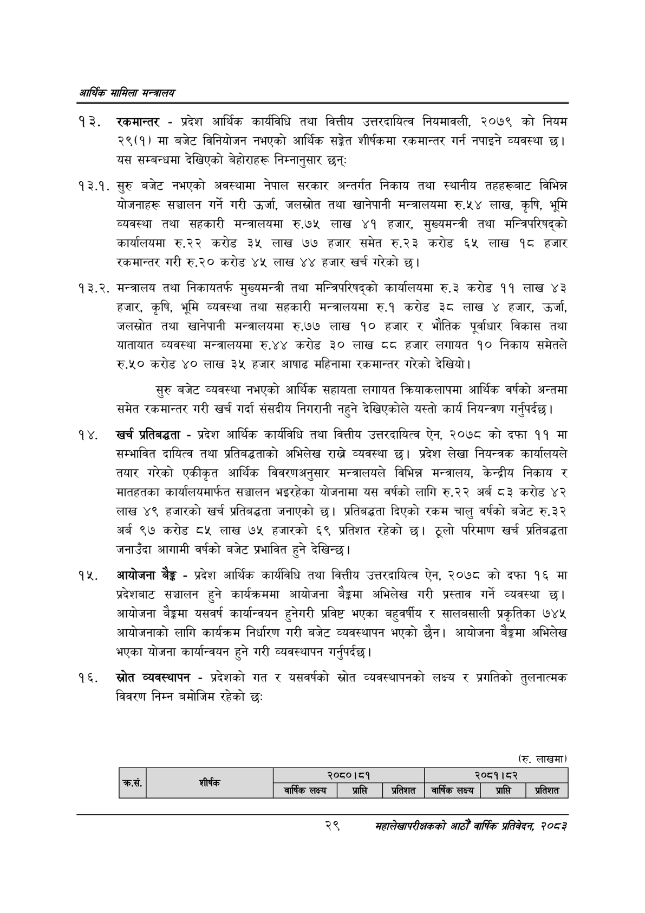

# Page 51 QA

## Rendered page


## Extracted text

```text
आर्थिक मामिला सन्वबालय
रकमान्तर -प्रदेश आर्थिक कार्यविधि तथा वित्तीय उत्तरदायित्व नियमावली, २०७९ को नियम २९(१) मा बजेट विनियोजन नभएको आर्थिक सङ्गेत शीर्षकमा रकमान्तर गर्न नपाइने व्यवस्था छ। यस सम्बन्धमा देखिएको बेहोराहरू निम्नानुसार छन्‌
१३.१. सुरु बजेट नभएको अवस्थामा नेपाल सरकार अन्तर्गत निकाय तथा स्थानीय तहहरूबाट विभिन्न योजनाहरू सञ्चालन गर्ने गरी उर्जा, जलस्रोत तथा खानेपानी मन्त्रालयमा रु.५४ लाख, कृषि, भूमि व्यवस्था तथा सहकारी मन्त्रालयमा रु.७५ लाख ४१ हजार, मुख्यमन्त्री तथा मन्त्रिपरिषद्को कार्यालयमा रु.२२ करोड ३५ लाख ७७ हजार समेत रु.२३ करोड ६५ लाख १८ हजार रकमान्तर गरी रु.२० करोड ४५ लाख ४४ हजार खर्च गरेको छ।
मन्त्रालय तथा निकायतर्फ मुख्यमन्त्री तथा मन्त्रिपरिषद्को कार्यालयमा €.३ करोड ११ लाख ४३ हजार, कृषि, भूमि व्यवस्था तथा सहकारी मन्त्रालयमा रु.१ करोड ३८ लाख ४ हजार, उर्जा, जलस्रोत तथा खानेपानी मन्त्रालयमा रु.७७ लाख ९० हजार र भौतिक पूर्वाधार विकास तथा यातायात व्यवस्था मन्त्रालयमा रु.४४ करोड ३० लाख ६ हजार लगायत १० निकाय समेतले रु.५० करोड ४० लाख ३५ हजार आषाढ महिनामा रकमान्तर गरेको देखियो।
सुरु बजेट व्यवस्था नभएको आर्थिक सहायता लगायत क्रियाकलापमा आर्थिक वर्षको अन्तमा समेत रकमान्तर गरी खर्च गर्दा संसदीय निगरानी नहुने देखिएकोले यस्तो कार्य नियन्त्रण गर्नुपर्दछ |
खर्च प्रतिबद्धता -प्रदेश आर्थिक कार्यविधि तथा वित्तीय उत्तरदायित्व ऐन, २०७८ को दफा ११ मा सम्भावित दायित्व तथा प्रतिबद्धताको अभिलेख राख्ने व्यवस्था छ। प्रदेश लेखा नियन्त्रक कार्यालयले तयार गरेको एकीकृत आर्थिक विवरणअनुसार मन्त्रालयले विभिन्न मन्त्रालय, केन्द्रीय निकाय र मातहतका कार्यालयमार्फत सञ्चालन भइरहेका योजनामा यस वर्षको लागि रु.२२ अर्ब ८३ करोड ४२ लाख ४९ हजारको खर्च प्रतिबद्धता जनाएको छ। प्रतिबद्धता दिएको रकम चालु वर्षको बजेट रु.३२ अर्ब ९७ करोड ८५ लाख ७५ हजारको ६९ प्रतिशत रहेको छ। ठूलो परिमाण खर्च प्रतिबद्धता जनाउँदा आगामी वर्षको बजेट प्रभावित हुने देखिन्छ।
आयोजना बैङ्क -प्रदेश आर्थिक कार्यविधि तथा वित्तीय उत्तरदायित्व ऐन, २०७८ को दफा १६ मा प्रदेशबाट सञ्चालन हुने कार्यक्रममा आयोजना बेङ्गमा अभिलेख गरी प्रस्ताव गर्ने व्यवस्था छ। आयोजना बैङ्कमा यसवर्ष कार्यान्वयन हुनेगरी प्रविष्ट भएका बहुवर्षीय र सालबसाली प्रकृतिका ७४५ आयोजनाको लागि कार्यक्रम निर्धारण गरी बजेट व्यवस्थापन भएको छैन। आयोजना बैङ्कमा अभिलेख भएका योजना कार्यान्वयन हुने गरी व्यवस्थापन गर्नुपर्दछ |
स्रोत व्यवस्थापन -प्रदेशको गत र यसवर्षको स्रोत व्यवस्थापनको लक्ष्य र प्रगतिको तुलनात्मक विवरण निम्न बमोजिम रहेको छ:
(रु. लाखमा)
२९
महालेखापरीक्षकको आठौ वाषिकि प्रतिवेदन २०८२

|  |  |  | २०८०।८१ |  |  | २०८१।८२ |  |
| --- | --- | --- | --- | --- | --- | --- | --- |
|  |  | बार्षिक लक्ष्य | प्राप्ति | प्रतिशत | वार्षिक लक्ष्य | प्राप्ति | प्रतिशत |
```

## Flags
- table_page
- medium_quality_table
