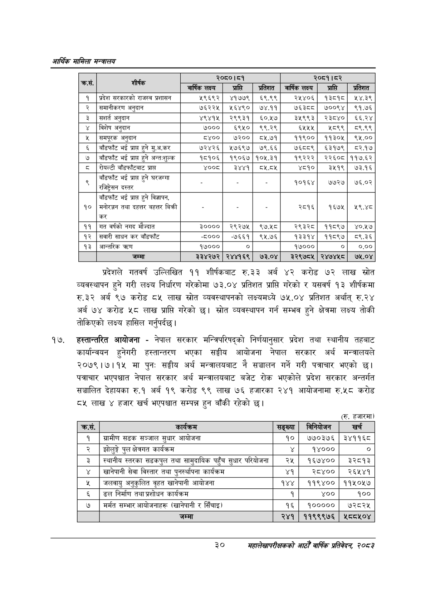

# Page 52 QA

## Rendered page


## Extracted text

```text
आर्थिक मामिला सन्वबालय
प्रदेशले गतवर्ष उल्लिखित ११ शीर्षकबाट रु.३३ अर्ब ४२ करोड ७२ लाख स्रोत व्यवस्थापन हुने गरी लक्ष्य निर्धारण गरेकोमा ७३.०४ प्रतिशत प्राप्ति गरेको र यसवर्ष १३ शीर्षकमा रु.३२ अर्ब ९७ करोड ८५ लाख स्रोत व्यवस्थापनको लक्ष्यमध्ये ७५.०४ प्रतिशत अर्थात्‌ रु.२४ अर्ब ७४ करोड ५८ लाख प्राप्ति गरेको छ। स्रोत व्यवस्थापन गर्न सम्भव हुने क्षेत्रमा लक्ष्य तोकी तोकिएको लक्ष्य हासिल गर्नुपर्दछ |
हस्तान्तरित आयोजना -नेपाल सरकार मन्त्रिपरिषद्को निर्णयानुसार प्रदेश तथा स्थानीय तहबाट कार्यान्वयन हुनेगरी हस्तान्तरण भएका सङ्घीय आयोजना नेपाल सरकार अर्थ मन्त्रालयले २०७९।७।१५ मा पुनः सङ्घीय अर्थ मन्त्रालयबाट नै सञ्चालन गर्ने गरी पत्राचार भएको छ। पत्राचार भएपश्चात नेपाल सरकार अर्थ मन्त्रालयबाट बजेट रोक भएकोले प्रदेश सरकार अन्तर्गत सञ्चालित देहायका रु.१ अर्ब १९ करोड ९९ लाख ७६ हजारका २४१ आयोजनामा रु.५८ करोड ८५ लाख ४ हजार खर्च भएपश्चात सम्पन्न हुन बाँकी रहेको छ।
(रु. हजारमा)
३०
महालेखापरीक्षकको आठौ वाषिकि प्रतिवेदन २०८२

| दङ्ग | सर्तक |  | २०८०।८१ |  |  | २०८१।०२ |  |
| --- | --- | --- | --- | --- | --- | --- | --- |
|  |  | बार्षिक लक्ष्य | प्राप्ति | प्रतिशत | वार्षिक लक्ष्य | प्राप्ति | प्रतिशत |
| १ | प्रदेश स९का९को राजस्व प्रशासन | २९६९२ | ४१७७९ | ६९.९९ | २५४०६ | १३८१८० | २४.३९ |
| २ | समानीकरण अनुदान | ७६२२५ | २१६४९० | ७४.११ | ७६३८८ | ७००९४ | ९१.७६ |
| ३ | सशार्त अनुदान | ४९४१५ | २९९३१ | ६०.१७ | ३५९९३ | २३८४० | ६६.२४ |
| ४ | विशेष अनुदान | ७००० | ६९५० | ९९.२९ | ६५५५ | २८९९ | व८९.९९ |
| ४५ | समपूरक अनुदान | ८४०० | ७२०० | ८५.७१ | ११९०० | ११३०५ | ९५.०० |
| ६ | बाँडफाँट भई प्राप्त हुने मु.अ.कर | ७२४२६ | ५७६९७ | ७९.६६ | ७६८८९ | ६३१७९ | ८२.१७ |
| ७ | बाँडफाँट भई प्राप्त हुने अन्तःशुल्क | १८१०६ | १९०६७ | १०५.३१ | १९२२२ | २२६०८ | ११७.६२ |
| ८ | रोयल्टी बाँडफाँटबाट प्राप्त | ४००८ | ३४४१ | ८५.८५ | ४८१० | ३५१९ | ७३.१६ |
| ९ | बाँडफाँट पर प्रा हुने घरजग्गा रजिषट्रेधण दस्तर |  |  |  | १०१६४ | ७७२७ | ७६.०२ |
| १० | बाँडफाँट भई प्राप्त हुने विज्ञापन, भनोरञ्जन तथा दहत्तर बहत्तर बिकी कर |  |  |  | २८१६ | १६७५ | ५९.४८ |
| ११ | गत वर्षको नगद मौज्दात | ३०००० | २९२७५ | ९७.५८ | २९३२८ | ११८९७ | ४०.५७ |
| १२ | सवारी साधन कर बाँडफाँट | -८००० | -७६६१ | ९५.७६ | १३३१४ | ११८९७ | ८९.३६ |
| १३ | आन्तरिक त्रदण | १७००० | ० |  | १७००० |  | ०.०० |
|  | जम्मा | ३३४२७२ | २४४१६९ | ७३.०४ | २२९७८५ | २४७४५८ | ७५.०४ |

| क्रस. | कार्यक्रम | सङ्ख्या | बानेबोजन | खर्च |
| --- | --- | --- | --- | --- |
| १ | ग्रामीण सडक खभ्जाल सुधार आधोजना | १० | ७७०३७६ | ३४११६८ |
| २ | झोलुङ्गे पुल क्षेत्रगत कार्यक्रस |  | १४००० | ० |
| ३ | स्थानीय स्तरका क्षडकपुल तथा सामुदायिक पहुँच सुधार परियोजना | २५ | १६७४०० | ३२८१३ |
| ४ | खानेपानी सेवा विस्तार तथा पुनर्स्थापना कार्यक्रम | ४१ | २८४०० | २६५४१ |
| ५ | जलवायु अनुवुलित वृहत खानेपानी आयोजना | १४४ | ११९४०० | ११५०१५७ |
| ६ | ढल निर्माण तथा प्रशोधन कार्यक्रम |  | ४०० | १०० |
| ७ | मर्मत सम्भार आधोजनाहरू (खानेपानी र सिँचाइ) | १६ | १००००० | ७२८२५ |
| ८ | जम्मा | २४१ | ११९९९७६ | ५८८५०४ |
```

## Flags
- table_page
- medium_quality_table
