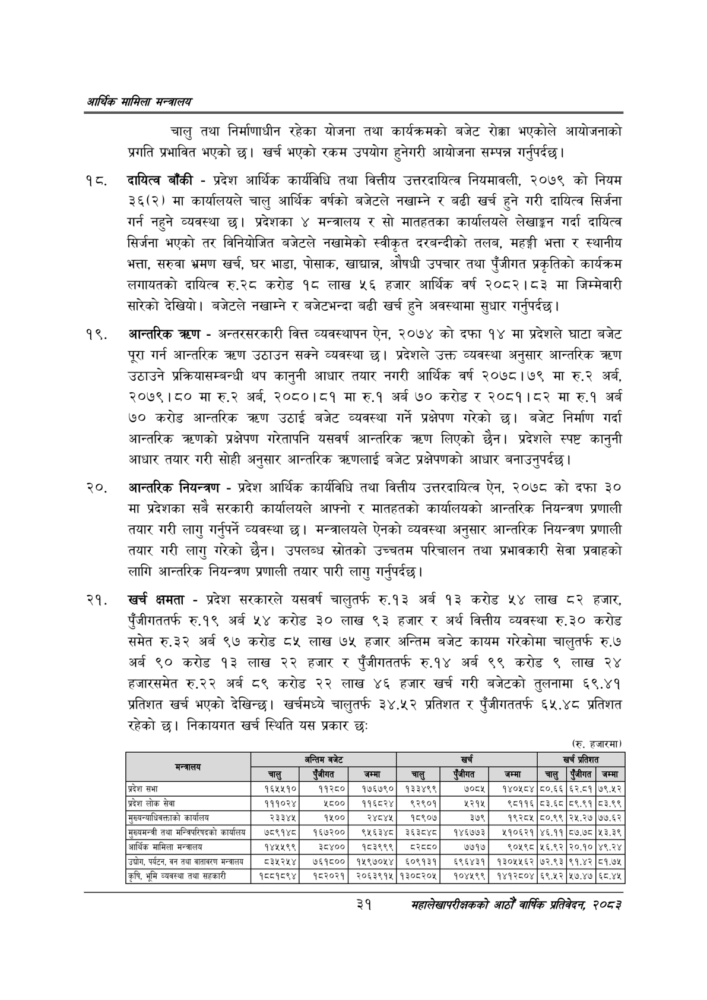

# Page 53 QA

## Rendered page


## Extracted text

```text
आर्थिक मामिला सन्वबालय
चालु तथा निर्माणाधीन रहेका योजना तथा कार्यक्रमको बजेट रोक्का भएकोले आयोजनाको प्रगति प्रभावित भएको छ। खर्च भएको रकम उपयोग हुनेगरी आयोजना सम्पन्न गर्नुपर्दछ |
दायित्व बाँकी -प्रदेश आर्थिक कार्यविधि तथा वित्तीय उत्तरदायित्व नियमावली, २०७९ को नियम ३६(२) मा कार्यालयले चालु आर्थिक वर्षको बजेटले नखाम्ने र बढी खर्च हुने गरी दायित्व सिर्जना गर्न नहुने व्यवस्था छ। प्रदेशका ४ मन्त्रालय र सो मातहतका कार्यालयले लेखाङ्गन गर्दा दायित्व सिर्जना भएको तर विनियोजित बजेटले नखामेको स्वीकृत दरबन्दीको तलब, महङ्गी भत्ता र स्थानीय भत्ता, सरुवा भ्रमण खर्च, घर भाडा, पोसाक, खाद्यान्न, औषधी उपचार तथा पुँजीगत प्रकृतिको कार्यक्रम लगायतको दायित्व रु.२८ करोड १८ लाख ५६ हजार आर्थिक वर्ष २०८२।८३ मा जिम्मेवारी सारेको देखियो। बजेटले नखाम्ने र बजेटभन्दा बढी खर्च हुने अवस्थामा सुधार गर्नुपर्दछ |
आन्तरिक -अन्तरसरकारी वित्त व्यवस्थापन ऐन, २०७४ को दफा १४ मा प्रदेशले घाटा बजेट पूरा गर्न आन्तरिक क्रण उठाउन सक्ने व्यवस्था छ। प्रदेशले उक्त व्यवस्था अनुसार आन्तरिक त्रहण उठाउने प्रक्रियासम्बन्धी थप कानुनी आधार तयार नगरी आर्थिक वर्ष २०७८।७९ मा रु.२ अर्ब, २०७९।८० मा रु.२ अर्ब, २०८०।८१ मा रु.१ अर्ब ७० करोड २०८१।८२ मा रु.१ अर्ब ७० करोड आन्तरिक उठाई बजेट व्यवस्था गर्ने प्रक्षेपण गरेको छ। बजेट निर्माण गर्दा आन्तरिक त्रष्णको प्रक्षेपण गरेतापनि यसवर्ष आन्तरिक त्रण लिएको छैन। प्रदेशले स्पष्ट कानुनी आधार तयार गरी सोही अनुसार आन्तरिक बजेट प्रक्षेपणको आधार बनाउनुपर्दछ।
आन्तरिक नियन्त्रण -प्रदेश आर्थिक कार्यविधि तथा वित्तीय उत्तरदायित्व ऐन, २०७८ को दफा ३० मा प्रदेशका सबै सरकारी कार्यालयले आफ्नो र मातहतको कार्यालयको आन्तरिक नियन्त्रण प्रणाली तयार गरी लागु गर्नुपर्ने व्यवस्था छ। मन्त्रालयले ऐनको व्यवस्था अनुसार आन्तरिक नियन्त्रण प्रणाली तयार गरी लागु गरेको छैन। उपलब्ध स्रोतको उच्चतम परिचालन तथा प्रभावकारी सेवा प्रवाहको लागि आन्तरिक नियन्त्रण प्रणाली तयार पारी लागु गर्नुपर्दछ |
खर्च क्षमता -प्रदेश सरकारले यसवर्ष चालुतर्फ रु.१३ अर्ब १३ करोड ५४ लाख ८२ हजार, पुँजीगततर्फ रु.१९ अर्ब ५४ करोड ३० लाख ९३ हजार र अर्थ वित्तीय व्यवस्था रु.३० करोड समेत रु.३२ अर्ब ९७ करोड ८५ लाख ७५ हजार अन्तिम बजेट कायम गरेकोमा चालुतर्फ रु.७ अर्ब ९० करोड १३ लाख २२ हजार र पुँजीगततर्फ रु.१४ अर्ब ९९ करोड ९ लाख २४ हजारसमेत रु.२२ अर्ब ८९ करोड २२ लाख ४६ हजार खर्च गरी बजेटको तुलनामा ६९.४१ प्रतिशत खर्च भएको देखिन्छ। खर्चमध्ये चालुतर्फ ३४.५२ प्रतिशत र पुँजीगततर्फ ६५.४८ प्रतिशत रहेको छ। निकायगत खर्च स्थिति यस प्रकार छः
(रु. हजारमा)
३१
महालेखापरीक्षकको आठौ वाषिकि प्रतिवेदन २०८२

| हन |  | अन्तिम बजेट |  |  | खर्च |  |  | खर्च प्रतिशत |  |
| --- | --- | --- | --- | --- | --- | --- | --- | --- | --- |
|  | चालु | पजीगत | जम्मा | चालु | छ | जम्मा | चालु | एजीगत | जम्मा |
| प्रदेश सभा | १६४५५१० | १२६० | १७६७९० | १३३४९९ | ७०६५ | १४०४१८४ | ८०.६६ | ६२.८१ | ७९१२ |
| प्रदेश लोक सेवा | १११०२४ | ४८०० | ११६८२४ | ९२९०१ | १२१४ | ९८११६ | ८३.६८ | ८९.९१ | ८३.९९ |
| सुल्वन्याधिकक्ताको कार्यालय | २३३४४५ | ११०० | २४८४५ | १५९०४ | २७५९ | १९२८५ | ८०.९९ | २४५.२७ | ७७.६२ |
| मुख्यमन्त्री तथा भान्जिपरिषषको कार्यालय | ७८९१४८ठ | १६७२०० | ९४६३४८ | ३६३८४८ | १४६७७३ | ११०६२१ | ४६.११ | ८७.७८ | १३.३९ |
| आर्थिक मामिला मन्त्रालय | १४५५६९ | ३८४०० | १८३९९९ | ८२६८६० | ७७१७ | ९०१९८ | ४६.९२ | २०.१० | ४९.२४ |
| उद्योग, पर्यटन, बन तथा वातावरण मन्बालल | ८३४५२४४ | ७६१८०० | १५९७०५४ | ६०९१३१ | ६९६४३१ | १३०४१५६२ | ७२.९३ | ९१.४२ | ८१,७१५ |
| कृषि, भूमि व्यवस्था तथा सहकारी | १८६८१८९४ | १८२०२१ | २०६३९१५ | १३०८२०५ | १०४१९९ | १४१२८०४ | ६९१२ | १७.४७ | ६८४५ |
```

## Flags
- table_page
- medium_quality_table
