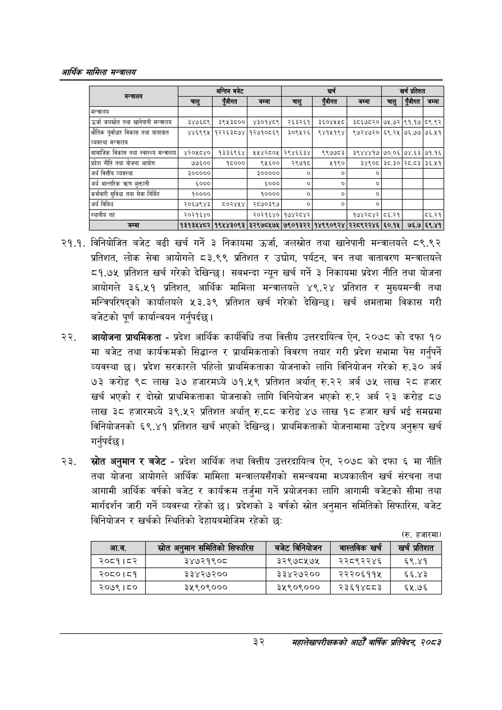

# Page 54 QA

## Rendered page


## Extracted text

```text
आर्थिक मामिला सन्वबालय
२१.१. विनियोजित बजेट बढी खर्च गर्ने ३ निकायमा उर्जा, जलस्रोत तथा खानेपानी मन्त्रालयले ८९.९२ प्रतिशत, लोक सेवा आयोगले ८३.९९ प्रतिशत र उद्योग, पर्यटन, वन तथा वातावरण मन्त्रालयले ८१.७५ प्रतिशत खर्च गरेको देखिन्छ। सबभन्दा न्यून खर्च गर्ने ३ निकायमा प्रदेश नीति तथा योजना आयोगले ३६.५१ प्रतिशत, आर्थिक मामिला मन्त्रालयले ४९.२४ प्रतिशत र मुख्यमन्त्री तथा मन्त्रिपरिषद्को कार्यालयले ५३.३९ प्रतिशत खर्च गरेको देखिन्छ। खर्च क्षमतामा विकास गरी बजेटको पूर्ण कार्यान्वयन गर्नुपर्दछ |
आयोजना प्राथमिकता -प्रदेश आर्थिक कार्यविधि तथा वित्तीय उत्तरदायित्व ऐन, २०७८ को दफा १० मा बजेट तथा कार्यक्रमको सिद्धान्त र प्राथमिकताको विवरण तयार गरी प्रदेश सभामा पेस गर्नुपर्ने व्यवस्था छु। प्रदेश सरकारले पहिलो प्राथमिकताका योजनाको लागि विनियोजन गरेको रु.३० अर्ब ७३ करोड ९८ लाख ३७ हजारमध्ये ७१.५९ प्रतिशत अर्थात्‌ रु.२२ अर्ब ७५ लाख २८ हजार खर्च भएको र दोस्रो प्राथमिकताका योजनाको लागि विनियोजन भएको रु.२ अर्ब २३ करोड ८७ लाख ३८ हजारमध्ये ३९.५२ प्रतिशत अर्थात्‌ रु.८टद करोड ४७ लाख १८ हजार खर्च भई समग्रमा विनियोजनको ६९.४१ प्रतिशत खर्च भएको देखिन्छ। प्राथमिकताको योजनामामा उद्देश्य अनुरूप खर्च गर्नुपर्दछ |
स्रोत अनुमान र बजेट -प्रदेश आर्थिक तथा वित्तीय उत्तरदायित्व ऐन, २०७८ को दफा ६ मा नीति तथा योजना आयोगले आर्थिक मामिला मन्त्रालयसँगको समन्वयमा मध्यकालीन खर्च संरचना तथा आगामी आर्थिक वर्षको बजेट र कार्यक्रम तर्जुमा गर्ने प्रयोजनका लागि आगामी बजेटको सीमा तथा मार्गदर्शन जारी गर्ने व्यवस्था रहेको छ। प्रदेशको ३ वर्षको स्रोत अनुमान समितिको सिफारिस, बजेट विनियोजन र खर्चको स्थितिको देहायबमोजिम रहेको छः
(रु. हजारमा)
३२
महालेखापरीक्षकको आठौ वाषिकि प्रतिवेदन २०८२

| अन्तालय |  | अन्तिम बजेट |  |  | खर्च |  |  | खर्च प्रतिशत |  |
| --- | --- | --- | --- | --- | --- | --- | --- | --- | --- |
|  | चालु | सजीगत | जम्मा | चालु | एबीगत | जम्मा | चालु | 'जीगत | जम्मा |
| मन्त्रालय |  |  |  |  |  |  |  |  |  |
| जलस्रोत तथा खानेपानी मन्त्रालय | ३४७६८९ | ३९४५३८०० | ४३०१४८९ | २६३२६१ | ३६०४४५४८ | ३८६७८२० | ७५.७२ | ९१.१७ | ८६.६२ |
| भौतिक पूर्वाधार विकास तथा यातायात व्यवस्था मन्त्रालय | ४४६९९५ | १२२६३८७४ | १२७१०८६९ | ३०९५२६ | ९४१५१९४ | ९७२४७२० | ६९.२५ | ७५,६७७ | ७६.५१ |
| सामाजिक विकास तथा स्वास्थ्य मन्त्रालय | ४२०५८४० | १३३६९६४ | ५५४२८०५ | २९४६६३४ | ९९७७८३ | ३९४४४१७ | ७०.०६ | ७४.६३ | ७१.१६ |
| प्रदेश नीति तथा योजना आयोग | ७७०० | १६००० | ९५६०० | २९७१८ | ५१९० | ३४९०८ | ३८.३० | २८.८३ | ३६.५१ |
| अर्ब वित्तीय व्यवस्था | ३००००० |  | ३००००० |  |  |  |  |  |  |
| अर्थ आन्तरिक तरण भुक्तानी | ६००० |  | ६००० | ० | ० | ० |  |  |  |
| कर्मचारी सुविधा तथा सेवा निर्वित | १०००० |  | १०००० | ० | ० | ० |  |  |  |
| अर्थ बिविध | २०६७९४३ | ८०२४१४ | २८७०३९७ | ० | ० | ० |  |  |  |
| स्थानीय तह | २०२१६४० |  | २०२१६४० | १७४२८४२ |  | १७४२८४२ | ८६.२१ |  | ५६.२१ |
| जम्मा | १३१३५४८२ | १९५४३०९३ | ३२९७८५७५ | ७९०१३२२ | १४९९०९२४ | २२८९२२४६ | ६०.१५ | ७६.७ | ६९.४१ |

| आ.व. | स्रोत अन्मान सामातिका सिपभारत | बजेट निनबाोजन | नाल्तनिक खर्च | खर्च प्रतिशत |
| --- | --- | --- | --- | --- |
| २०८१। ८२ | ३४७२१९०८ | ३२९७८५७५ | २२८९२२४६ | ६९.४१ |
| २०८०।८१ | ३३४२७२०० | ३३४२७२०० | २२२०६११५ | ६६.४३ |
| २०७९।८० | ३५९०९००० | ३५९०९००० | २३६१४८८३ | ६२५.७६ |
```

## Flags
- table_page
- medium_quality_table
