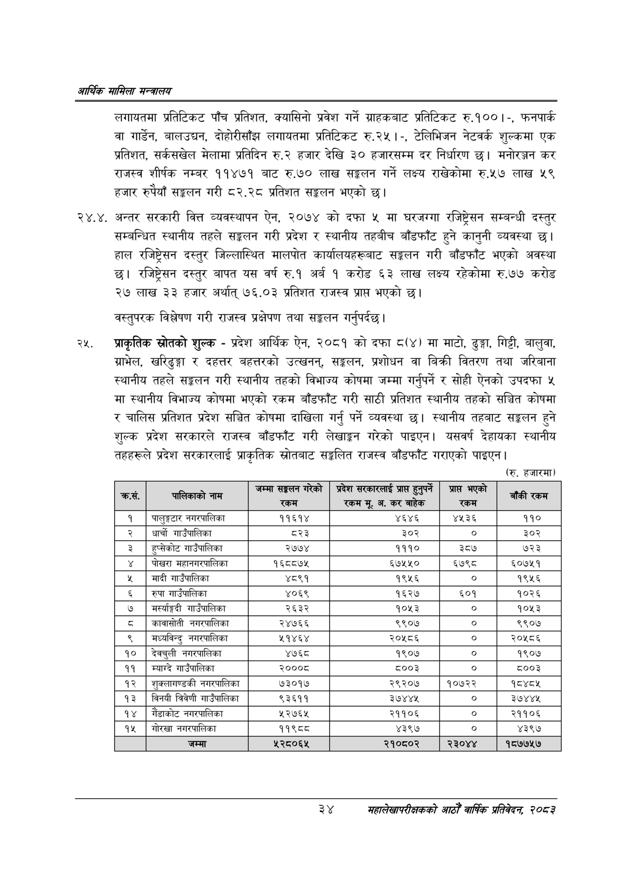

# Page 56 QA

## Rendered page


## Extracted text

```text
आर्थिक मामिला सन्वबालय
लगायतमा प्रतिटिकट पाँच प्रतिशत, क्यासिनो प्रवेश गर्ने ग्राहकबाट प्रतिटिकट रु.१००।-, फनपार्क वा गार्डेन, बालउद्चन, दोहोरीसाँझ लगायतमा प्रतिटिकट रु.२५ |-, टेलिभिजन नेटवर्क शुल्कमा एक प्रतिशत, सर्कसखेल मेलामा प्रतिदिन रु.२ हजार देखि ३० हजारसम्म दर निर्धारण | मनोरञ्जन कर राजस्व शीर्षक नम्बर ११४७१ बाट रु.७० लाख सङ्कलन गर्ने लक्ष्य राखेकोमा रु.५७ लाख ५९ हजार रुपैयाँ सङ्लन गरी ८२.२८ प्रतिशत सङ्कलन भएको |
२४.४. अन्तर सरकारी वित्त व्यवस्थापन ऐन, २०७४ को दफा ५ मा घरजग्गा रजिष्ट्रेसन सम्बन्धी दस्तुर सम्बन्धित स्थानीय तहले सङ्कलन गरी प्रदेश र स्थानीय तहबीच बाँडफाँट हुने कानुनी व्यवस्था | हाल रजिष्ट्रेसत दस्तुर जिल्लास्थित मालपोत कार्यालयहरूबाट सङ्कलन गरी बाँडफाँट भएको अवस्था छ। रजिष्ट्रेसन दस्तुर बापत यस वर्ष रु.१ अर्ब १ करोड ६३ लाख लक्ष्य रहेकोमा रु.७७ करोड २७ लाख ३३ हजार अर्थात्‌ ७६.०३ प्रतिशत राजस्व प्रापत भएको छ।
वस्तुपरक विश्लेषण गरी राजस्व प्रक्षेपण तथा सङ्कलन गर्नुपर्दछ |
प्राकृतिक स्रोतको शुल्क -प्रदेश आर्थिक ऐन, २०८१ को दफा ८(४) मा माटो, ढुङ्गा, गिट्टी, बालुवा, ग्राभेल, खरिढुङ्गा र दहत्तर बहत्तरको उत्खनन्‌, सङ्गलन, प्रशोधन वा बिक्री वितरण तथा जरिबाना स्थानीय तहले सङ्कलन गरी स्थानीय तहको विभाज्य कोषमा जम्मा गर्नुपर्ने र सोही ऐनको उपदफा ५ मा स्थानीय विभाज्य कोषमा भएको रकम बाँडफाँट गरी साठी प्रतिशत स्थानीय तहको सञ्चित कोषमा र चालिस प्रतिशत प्रदेश सञ्चित कोषमा दाखिला गर्नु पर्ने व्यवस्था छ। स्थानीय तहबाट सङ्कलन हुने शुल्क प्रदेश सरकारले राजस्व बाँडफाँट गरी लेखाङ्गन गरेको पाइएन। यसवर्ष देहायका स्थानीय तहहरूले प्रदेश सरकारलाई प्राकृतिक स्रोतबाट सङ्लित राजस्व बाँडफाँट गराएको पाइएन |
(रु. हजारमा)
३४
महालेखापरीक्षकको आठौ वाषिकि प्रतिवेदन २०८२

| कस, | पालिकाको नाम | जम्मा सङ्कलन गरेको 'रकम | प्रदेश स९क९०ाई प्रा हुनुपर्ने 'रकम मू. अ. कर बाहेक | प्राप्त भएको 'रकम |
| --- | --- | --- | --- | --- |
| १ | पालुङ्गटार | ११६१४ | ४६४६ | ४५३६ |
| २ | धार्चो नाउँपालका | ८२३ | ३०२ |  |
| ३ | हुप्सेकोट नाउँपालिका | २७७४ | १११० | ३८७ |
| ४ | पोखरा महानगरपालिका | १६८८७४५ | ६७५५० | ६७९८ |
| ५ | मादी गाउँपालिका | ४८९१ | १९५६ | ० |
| ६ | रुपा नाउँपालिका | ४०६९ | १६२७ | ६०१ |
| ७ | भनर्च्यङ्गदी गाउँपालिका | २६३२ | १०५३ | ० |
| ८ | कावासोदी | २४७६६ | ९९०७ | ० |
| ९ | नगरपालिका | २१४६४ | २०५८६ | ० |
| १० | देवचुली नभरपालिका | ४७६८ | १९०७ | ० |
| ११ | म्याग्दै नाउँपालिका | २०००८ | ८००३ |  |
| १२ | शुक्लागण्डकी नगरपालिका | ७३०१७ | २९२०७ | १०७२२ |
| १३ | विनयी त्रिवेणी भ॥उँपालिका | ९३६११ | ३७४४४५ |  |
| १४ | गाँडाकोट नगरपालिका | ५२७६५ | २११०६ | ० |
| १५ | गोरखा नगरपालिका | ११९८८ | ४३९७ | ० |
| १६ | जम्मा | ५२८०६४५ | २१०६०२ | २३०४४ |
```

## Flags
- table_page
- medium_quality_table
