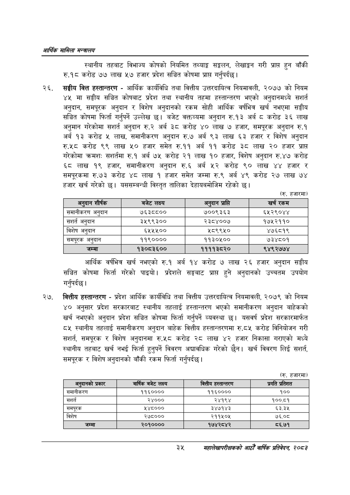

# Page 57 QA

## Rendered page


## Extracted text

```text
आर्थिक मामिला सन्वबालय
स्थानीय तहबाट विभाज्य कोषको नियमित तथ्याङ्क सङ्कलन, लेखाङ्कन गरी प्राप्त हुन बाँकी रु.१८ करोड ७७ लाख ५७ हजार प्रदेश सञ्चित कोषमा प्राप्त गर्नुपर्दछ |
सङ्घीय वित्त हस्तान्तरण -आर्थिक कार्यविधि तथा वित्तीय उत्तरदायित्व नियमावली, २०७७ को नियम ४५ मा सङ्घीय सञ्चित कोषबाट प्रदेश तथा स्थानीय तहमा हस्तान्तरण भएको अनुदानमध्ये सशर्त अनुदान, समपूरक अनुदान र विशेष अनुदानको रकम सोही आर्थिक वर्षभित्र खर्च नभएमा सङ्घीय सञ्चित कोषमा फिर्ता गर्नुपर्ने उल्लेख छ। बजेट वक्तव्यमा अनुदान रु.१३ अर्ब ८ करोड ३६ लाख अनुमान गरेकोमा संशर्त अनुदान रु.२ अर्ब ३८ करोड ४० लाख ७ हजार, समपूरक अनुदान रु.१ अर्ब १३ करोड ५ लाख, समानीकरण अनुदान रु.७ अर्ब ९३ लाख ६३ हजार र विशेष अनुदान रु.५८ करोड ९९ लाख ५० हजार समेत रु.११ अर्ब ११ करोड ३ लाख २० हजार प्राप्त गरेकोमा क्रमशः सशर्तमा रु.१ अर्ब ७५ करोड २१ लाख १० हजार, विशेष अनुदान रु.४७ करोड ६८ लाख १९ हजार, समानीकरण अनुदान रु.६ अर्ब ५२ करोड ९० लाख ४४ हजार समपूरकमा रु.७३ करोड ४८ लाख १ हजार समेत जम्मा रु.९ अर्ब ४९ करोड २७ लाख ७४ हजार खर्च गरेको छ। यससम्बन्धी विस्तृत तालिका देहायबमोजिम रहेको |
(रु. हजारमा)
आर्थिक वर्षभित्र खर्च नभएको रु.१ अर्ब १४ करोड ७ लाख २६ हजार अनुदान सङ्घीय सञ्चित कोषमा फिर्ता गरेको पाइयो। प्रदेशले सङ्घबाट प्राप्त हुने अनुदानको उच्चतम उपयोग गर्नुपर्दछ |
२७, वित्तीय हस्तान्तरण -प्रदेश आर्थिक कार्यविधि तथा वित्तीय उत्तरदायित्व नियमावली, २०७९ को नियम ४० अनुसार प्रदेश सरकारबाट स्थानीय तहलाई हस्तान्तरण भएको समानीकरण अनुदान बाहेकको खर्च नभएको अनुदान प्रदेश सञ्चित कोषमा फिर्ता गर्नुपर्ने व्यवस्था छ। यसवर्ष प्रदेश सरकारमार्फत ८५ स्थानीय तहलाई समानीकरण अनुदान बाहेक वित्तीय हस्तान्तरणमा रु.८५ करोड विनियोजन गरी संशर्त, समपूरक र विशेष अनुदानमा रु.५८ करोड २८ लाख ४२ हजार निकासा गराएको मध्ये स्थानीय तहबाट खर्च नभई फिर्ता हुनुपर्ने विवरण अद्यावधिक गरेको छैन। खर्च विवरण लिई सशार्त, समपूरक र विशेष अनुदानको बाँकी रकम फिर्ता गर्नुपर्दछ |
(रु. हजारमा)
३५
महालेखापरीक्षकको आठौ वाषिकि प्रतिवेदन २०८२

| अट्दान शीर्षक | बजेट लक्ष्य | अन्दान प्राप्त | खर्च रकम |
| --- | --- | --- | --- |
| समानीकरण अनुदान | ७६३८८०० | ७००९३६३ | ६५२९०४४ |
| सशर्त अनुदान | ३५९९३०० | २३८४००७ | १७५२११० |
| विशेष अनुदान | ६५५४५०० | ५८९९५० | ४७६८१९ |
| खभपूरक अनुदान | ११९०००० | ११३०५०० | ७३४८०१ |
| जम्मा | १३०८३६०० | ११११३८२० | ९४९२७७४ |

| अर्‌ कानको प्रकार | वार्षिक बजेट लक्ष्य | वित्तीय हस्तान्तरण | प्रगति प्रतिशत |
| --- | --- | --- | --- |
| समानीकरण | ११६०००० | ११६०००० | १०० |
| सशर्त | २४००० | २४१९४ | १००.८१ |
| 'समपूरक | ५४८००० | ३४७१४३ | ६३.३५ |
| विशेष | २७८००० | २११५०४५ | ७६.०८ |
| जम्मा | २०१०००० | १७४२८४२ | ८६.७१ |
```

## Flags
- table_page
- medium_quality_table
