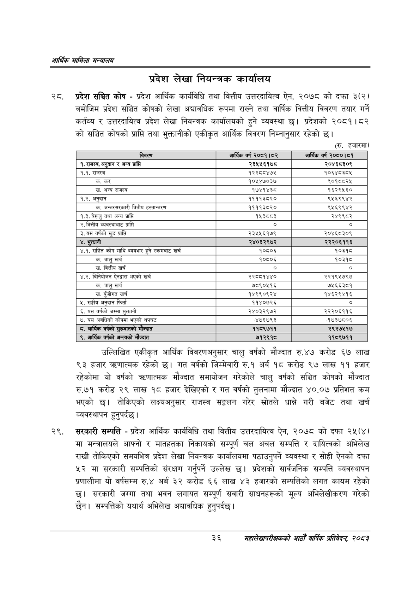

# Page 58 QA

## Rendered page


## Extracted text

```text
आर्थिक मामिला सन्वबालय
प्रदेश लेखा नियन्त्रक कार्यालय
रट. प्रदेश सञ्चित कोष -प्रदेश आर्थिक कार्यविधि तथा वित्तीय उत्तरदायित्व ऐन, २०७८ को दफा ३(२) बमोजिम प्रदेश सञ्चित कोषको लेखा अद्यावधिक रूपमा राख्ने तथा वार्षिक वित्तीय विवरण तयार गर्ने कर्तव्य र उत्तरदायित्व प्रदेश लेखा नियन्त्रक कार्यालयको हुने व्यवस्था छ। प्रदेशको २०८१।८२ को सञ्चित कोषको प्राप्ति तथा भुक्तानीको एकीकृत आर्थिक विवरण निम्नानुसार रहेको छ।
(रु. हजारमा)
उल्लिखित एकीकृत आर्थिक विवरणअनुसार चालु वर्षको मौज्दात रु.४७ करोड ६७ लाख ९३ हजार क्रणात्मक रहेको छ। गत वर्षको जिम्मेवारी रु.१ अर्ब १८ करोड ९७ लाख ११ हजार रहेकोमा यो वर्षको त्रणात्मक मौज्दात समायोजन गरेकोले चालु वर्षको सञ्चित कोषको मौज्दात रु.७१ करोड २९ लाख १८ हजार देखिएको र गत वर्षको तुलनामा मौज्दात ४०.०७ प्रतिशत कम भएको छ। तोकिएको लक्ष्यअनुसार राजस्व सङ्कलन गरेर स्रोतले धान्ने गरी बजेट तथा खर्च व्यवस्थापन हुनुपर्दछ |
सरकारी सम्पत्ति -प्रदेश आर्थिक कार्यविधि तथा वित्तीय उत्तरदायित्व ऐन, २०७८ को दफा २५(४) मा मन्त्रालयले आफ्नो र मातहतका निकायको सम्पूर्ण चल अचल सम्पत्ति र दायित्वको अभिलेख राखी तोकिएको समयभित्र प्रदेश लेखा नियन्त्रक कार्यालयमा पठाउनुपर्ने व्यवस्था र सोही ऐनको दफा मा सरकारी सम्पत्तिको संरक्षण गर्नुपर्ने उल्लेख छ। प्रदेशको सार्वजनिक सम्पत्ति व्यवस्थापन प्रणालीमा यो वर्षसम्म रु.४ अर्ब ३२ करोड ६६ लाख ४३ हजारको सम्पत्तिको लगत कायम रहेको छ। सरकारी जग्गा तथा भवन लगायत सम्पूर्ण सवारी साधनहरूको मूल्य अभिलेखीकरण गरेको छैन। सम्पत्तिको यथार्थ अभिलेख अद्यावधिक हुनुपर्दछ।
३६
महालेखापरीक्षकको आठौ वाषिकि प्रतिवेदन २०८२

| विवरण | आर्थिक वर्ष २०८१। ८२ | आर्थिक वर्ष २०८०।८१ |
| --- | --- | --- |
| १, राजस्व, अनुदान र अन्य प्राप्ति | २३५५६१७८ | २०४६८३०९ |
| १.१. राजस्व | १२२८८४७५ | १०६४८३८४ |
| क. कर | १०१४७०३७ | ९०१८८२५ |
| 'ख. अन्य राजस्व | १७४१४३८ | १६२९५६० |
| १.२. अनुदान | ११११३८२० | ९५६९९४२ |
| क. अन्तरसरकारी वितीय ह«्तान्तरण | ११११३८२० | ९६५६९९४२ |
| १.३. बेरूजु तथा अन्य प्राप्ति | १५३८८३ | २४९९८२ |
| २. वित्तीय व्यवस्थाबाट प्राप्ति | ० | ० |
| ३. यस वर्षको खुद प्राप्ति | २३५४५६१७९ | २०४६८३०९ |
| ४, भुक्तानी | २४०३२९७२ | २२२०६११६ |
| ४.१. संच्चित कोष माथि व्ययभार हुने रकमबाट खर्च | १०८०६ | १०३१८ |
| 'क. चालु खर्च | १०८०६ | १०३१८ |
| 'ख. वित्तीय खर्च | ० | ० |
| ४.२. विनियोजन ऐनद्वारा भएको खर्च | २२८८१४४० | २२१९५७९७ |
| 'क. चालु खर्च | ७८९०५१६ | ७५६६३८१ |
| 'ख. पुँजीगत खर्च | १४९९०९२४ | १४६२९४१६ |
| ५, सङ्घीय अनुदान फिर्ता | ११४०७२६ | ० |
| ६. यस वर्षको जम्मा भुक्तानी | २४०३२९७२ | २२२०६११६ |
| ७. यस अवधिको कोषमा भएको थपघट | -४७६७९३ | -१७३७८०६ |
| ८. आर्थिक वर्षको मौज्दात | ११८९७११ | २९२७५१७ |
| ९, आर्थिक वर्षको अन्त्यको मोज्दात | ७१२९१८ | ११८९७११ |
```

## Flags
- table_page
- medium_quality_table
