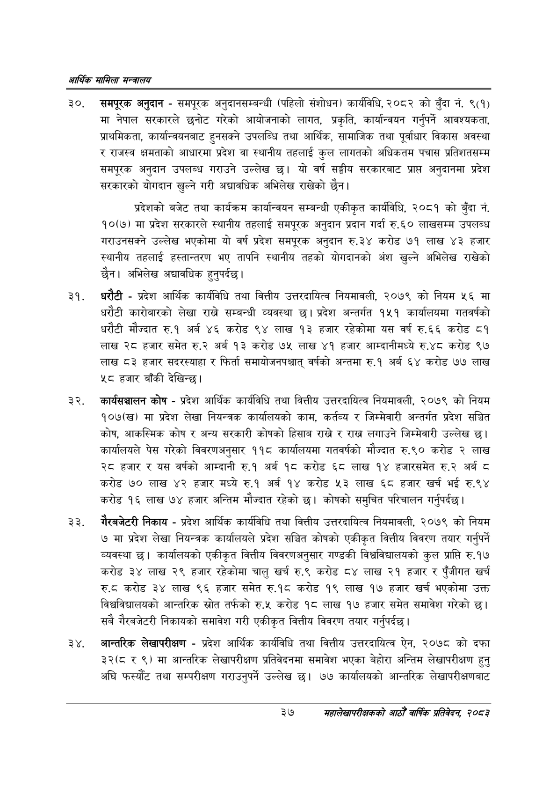

# Page 59 QA

## Rendered page


## Extracted text

```text
आर्थिक मामिला सन्वबालय
समपूरक अनुदान -समपूरक अनुदानसम्बन्धी (पहिलो संशोधन) कार्यविधि, २०८२ को बुँदा नं. ९(१) मा नेपाल सरकारले छनोट गरेको आयोजनाको लागत, प्रकृति, कार्यान्वयन गर्नुपर्ने आवश्यकता, प्राथमिकता, कार्यान्वयनबाट हुनसक्ने उपलब्धि तथा आर्थिक, सामाजिक तथा पूर्वाधार विकास अवस्था र राजस्व क्षमताको आधारमा प्रदेश वा स्थानीय तहलाई कुल लागतको अधिकतम पचास प्रतिशतसम्म समपूरक अनुदान उपलब्ध गराउने उल्लेख छ। यो वर्ष सङ्घीय सरकारबाट प्राप्त अनुदानमा प्रदेश सरकारको योगदान खुल्ने गरी अद्यावधिक अभिलेख राखेको छैन |
प्रदेशको बजेट तथा कार्यक्रम कार्यान्वयन सम्बन्धी एकीकृत कार्यविधि, २०८१ को बुँदा नं. १०(७) मा प्रदेश सरकारले स्थानीय तहलाई समपूरक अनुदान प्रदान गर्दा रु.६० लाखसम्म उपलब्ध गराउनसक्ने उल्लेख भएकोमा यो वर्ष प्रदेश समपूरक अनुदान रु.३४ करोड ७१ लाख ४३ हजार स्थानीय तहलाई हस्तान्तरण भए तापनि स्थानीय तहको योगदानको अंश खुल्ने अभिलेख राखेको छैन। अभिलेख अद्यावधिक हुनुपर्दछ |
धरौटी -प्रदेश आर्थिक कार्यविधि तथा वित्तीय उत्तरदायित्व नियमावली, २०७९ को नियम ५६ मा धरौटी कारोबारको लेखा राख्ने सम्बन्धी व्यवस्था छ। प्रदेश अन्तर्गत १५१ कार्यालयमा गतवर्षको धरौटी मौज्दात रु.१ अर्ब ४६ करोड ९४ लाख १३ हजार रहेकोमा यस वर्ष रु.६६ करोड ८१ लाख २८ हजार समेत रु.२ अर्ब १३ करोड ७५ लाख ४१ हजार आम्दानीमध्ये रु.४८ करोड ९७ लाख ८३ हजार सदरस्याहा र फिर्ता समायोजनपश्चात्‌ वर्षको अन्तमा रु.१ अर्ब ६४ करोड ७७ लाख ४८ हजार बाँकी देखिन्छ |
कार्यसञ्चालन कोष -प्रदेश आर्थिक कार्यविधि तथा वित्तीय उत्तरदायित्व नियमावली, २०७९ को नियम १०७(ख) मा प्रदेश लेखा नियन्त्रक कार्यालयको काम, कर्तव्य र जिम्मेवारी अन्तर्गत प्रदेश सञ्चित कोष, आकस्मिक कोष र अन्य सरकारी कोषको हिसाब राख्ने र राख लगाउने जिम्मेवारी उल्लेख | कार्यालयले पेस गरेको विवरणअनुसार ११८ कार्यालयमा गतवर्षको मौज्दात रु.९० करोड २ लाख २८ हजार र यस वर्षको आम्दानी रु.१ अर्ब १८ करोड ६८ लाख १४ हजारसमेत रु.२ अर्ब ८ करोड ७० लाख ४२ हजार मध्ये रु.१ अर्ब १४ करोड ५३ लाख ६८ हजार खर्च भई रु.९४ करोड १६ लाख ७४ हजार अन्तिम मौज्दात रहेको छ। कोषको समुचित परिचालन गर्नुपर्दछ |
गैरबजेटरी निकाय -प्रदेश आर्थिक कार्यविधि तथा वित्तीय उत्तरदायित्व नियमावली, २०७९ को नियम ७मा प्रदेश लेखा नियन्त्रक कार्यालयले प्रदेश सञ्चित कोषको एकीकृत वित्तीय विवरण तयार गर्नुपर्ने व्यवस्था | कार्यालयको एकीकृत वित्तीय विवरणअनुसार गण्डकी विश्वविद्यालयको कुल प्राप्ति रु.१७ करोड ३४ लाख २९ हजार रहेकोमा चालु खर्च रु.९ करोड ८४ लाख २१ हजार र पुँजीगत खर्च रु.८ठ करोड ३४ लाख ९६ हजार समेत रु.१८ करोड १९ लाख १७ हजार खर्च भएकोमा उक्त विश्वविद्यालयको आन्तरिक स्रोत तर्फको रु.५ करोड १८ लाख १७ हजार समेत समावेश गरेको छ। सबै गैरबजेटरी निकायको समावेश गरी एकीकृत वित्तीय विवरण तयार गर्नुपर्दछ )
आन्तरिक लेखापरीक्षण -प्रदेश आर्थिक कार्यविधि तथा वित्तीय उत्तरदायित्व ऐन, २०७८ को दफा ३२(८ र ९) मा आन्तरिक लेखापरीक्षण प्रतिवेदनमा समावेश भएका बेहोरा अन्तिम लेखापरीक्षण हुनु अघि फस्यौट तथा सम्परीक्षण गराउनुपर्ने उल्लेख ७७ कार्यालयको आन्तरिक लेखापरीक्षणबाट
३७
महालेखापरीक्षकको आठौ वाषिकि प्रतिवेदन २०८२
```

## Flags
- None
