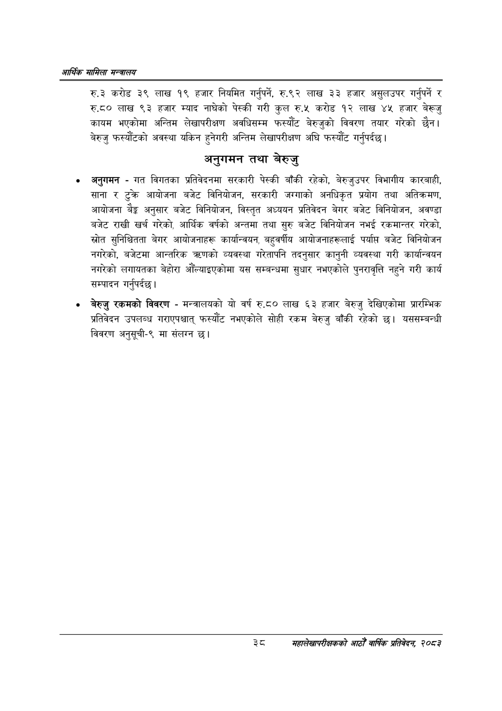

# Page 60 QA

## Rendered page


## Extracted text

```text
आर्थिक मामिला सन्वबालय
रु.३ करोड ३९ लाख १९ हजार नियमित गर्नुपर्ने, रु९२ लाख ३३ हजार असुलउपर गर्नुपर्ने र रु.द० लाख ९३ हजार म्याद नाघेको पेस्की गरी कुल रु.५ करोड १२ लाख ४५ हजार बेरूजु कायम भएकोमा अन्तिम लेखापरीक्षण अवधिसम्म फस्यौट बेरुजुको विवरण तयार गरेको छैन। बेरुजु फस्यौटको अवस्था यकिन हुनेगरी अन्तिम लेखापरीक्षण अघि फस्यौंट गर्नुपर्दछ।
अनुगमन तथा बेरुजु
अनुगमन -गत विगतका प्रतिवेदनमा सरकारी पेस्की बाँकी रहेको, बेरुजुउपर विभागीय कारबाही, साना र टुक्र आयोजना बजेट विनियोजन, सरकारी जग्गाको अनधिकृत प्रयोग तथा अतिक्रमण, आयोजना बैङ्क अनुसार बजेट विनियोजन, विस्तृत अध्ययन प्रतिवेदन बेगर बजेट विनियोजन, अवण्डा बजेट राखी खर्च गरेको, आर्थिक वर्षको अन्तमा तथा सुरु बजेट विनियोजन नभई रकमान्तर गरेको, स्रोत सुनिश्चितता बेगर आयोजनाहरू कार्यान्वयन, बहुवर्षीय आयोजनाहरूलाई पर्याप बजेट विनियोजन नगरेको, बजेटमा आन्तरिक त्रणको व्यवस्था गरेतापनि तदनुसार कानुनी व्यवस्था गरी कार्यान्वयन नगरेको लगायतका बेहोरा औँल्याइएकोमा यस सम्बन्धमा सुधार नभएकोले पुनरावृत्ति नहुने गरी कार्य सम्पादन गर्नुपर्दछ |
बेरुजु रकमको विवरण -मन्त्रालयको यो वर्ष रु.८० लाख ६३ हजार बेरुजु देखिएकोमा प्रारम्भिक प्रतिवेदन उपलब्ध गराएपश्चात्‌ फस्यौट नभएकोले सोही रकम बेरुजु बाँकी रहेको छ। यससम्बन्धी विवरण अनुसूची-९ मा संलग्न
३
महालेखापरीक्षकको आठौ वाषिकि प्रतिवेदन २०८२
```

## Flags
- None
