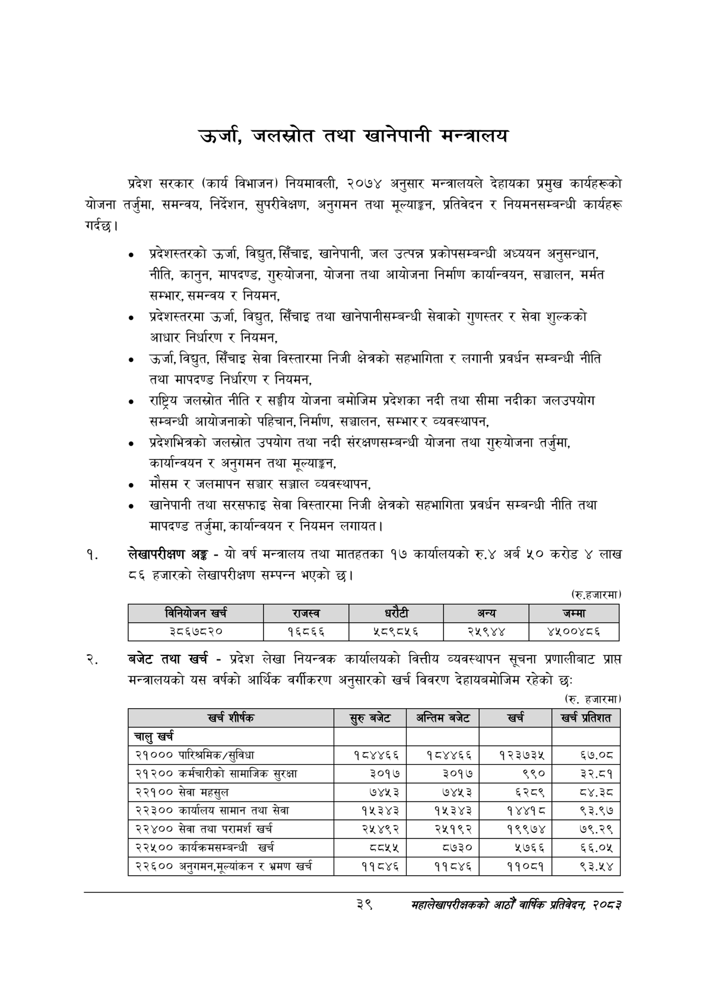

# Page 61 QA

## Rendered page


## Extracted text

```text
उर्जा, जलस्रोत तथा खानेपानी मन्त्रालय
प्रदेश सरकार (कार्य विभाजन) नियमावली, २०७४ अनुसार मन्त्रालयले देहायका प्रमुख कार्यहरूको योजना तर्जुमा, समन्वय, निर्देशन, सुपरीवेक्षण, अनुगमन तथा मूल्याङ्कन, प्रतिवेदन र नियमनसम्बन्धी कार्यहरू गर्दछ।
० प्रदेशस्तरको उर्जा, विद्युत, सिँचाइ, खानेपानी, जल उत्पन्न प्रकोपसम्बन्धी अध्ययन अनुसन्धान, नीति, कानुन, मापदण्ड, गुरुयोजना, योजना तथा आयोजना निर्माण कार्यान्वयन, सञ्चालन, मर्मत सम्भार, समन्वय र नियमन,
० प्रदेशस्तरमा उर्जा, विद्युत, सिँचाइ तथा खानेपानीसम्बन्धी सेवाको गुणस्तर र सेवा शुल्कको आधार निर्धारण र नियमन,
« उर्जा, विद्युत, सिँचाइ सेवा विस्तारमा निजी क्षेत्रको सहभागिता र लगानी प्रवर्धन सम्बन्धी नीति तथा मापदण्ड निर्धारण र नियमन,
० राष्ट्रिय जलस्रोत नीति र सङ्घीय योजना बमोजिम प्रदेशका नदी तथा सीमा नदीका जलउपयोग सम्बन्धी आयोजनाको पहिचान, निर्माण, सञ्चालन, सम्भार र व्यवस्थापन,
० प्रदेशभित्रको जलस्रोत उपयोग तथा नदी संरक्षणसम्बन्धी योजना तथा गुरुयोजना तर्जुमा, कार्यान्वयन र अनुगमन तथा मूल्याङ्कन,
मौसम र जलमापन सञ्चार सञ्जाल व्यवस्थापन,
० खानेपानी तथा सरसफाइ सेवा विस्तारमा निजी क्षेत्रको सहभागिता प्रवर्धन सम्बन्धी नीति तथा मापदण्ड तर्जुमा, कार्यान्वयन र नियमन लगायत |
लेखापरीक्षण अङ्ग -यो वर्ष मन्त्रालय तथा मातहतका १७ कार्यालयको रु.४ अर्ब ५० करोड ४ लाख ८६ हजारको लेखापरीक्षण सम्पन्न भएको |
(रु.हजारमा)
बजेट तथा खर्च -प्रदेश लेखा नियन्त्रक कार्यालयको वित्तीय व्यवस्थापन सूचना प्रणालीबाट प्राप्त मन्त्रालयको यस वर्षको आर्थिक वर्गीकरण अनुसारको खर्च विवरण देहायबमोजिम रहेको छः
(रु. हजारमा)
३९
महालेखापरीक्षकको आठौँ वार्षिक प्रतिवेदन २०५३

|  |  | 'ननेवोजन खर्च | राजस्व |  | धरटी | अन्य | जम्मा |
| --- | --- | --- | --- | --- | --- | --- | --- |
|  |  | ३८६७८२० | १६८६६ | ५८९८५६ |  | २५९४४ | ४५००४८६ |

| खर्च शीर्षक | सुरु बबेट | अन्तिम बजेट | खर्च | खर्च प्रतिशत |
| --- | --- | --- | --- | --- |
| चालु खर्च |  |  |  |  |
| २१००० पारिश्रमिक/सुविधा | १८४४६६ | १८४४६६ | १२३७३५ | ६७.०८ |
| २१२०० कर्मचारीको सामाजिक सुरक्षा | ३०१७ | ३०१७ | ९९० | ३२.८१ |
| २२१०० सेवा महसुल | ७४५३ | ७४५३ | ६२८९ | ८४.३८ |
| २२३०० कार्यालष सामान तथा सेवा | १५३४३ | १५३४३ | १४४१८ | ९३.९७ |
| २२४०० सेवा तथा परामर्श खर्च | २५४९२ | २५१९२ | १९९७४ | ७९.२९ |
| २२५०० कार्यक्रमसम्बन्धी खर्च |  | ८७३० | ५७६६ | €.०% |
| २२६०० अनुगमन,भूल्याकन भ्रमण खर्च | ११८४६ | ११८४६ | ११०८१ | ९३.५४ |
```

## Flags
- table_page
- medium_quality_table
