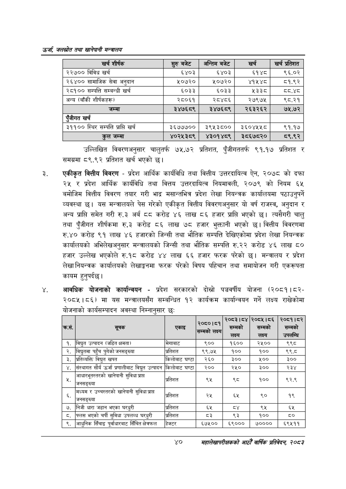

# Page 62 QA

## Rendered page


## Extracted text

```text
उर्जा जलखोत तथा खानेपानी सन्तालय
उल्लिखित विवरणअनुसार चालुतर्फ ७५.७२ प्रतिशत, पुँजीगततर्फ ९१.१७ प्रतिशत र समग्रमा ८९.९२ प्रतिशत खर्च भएको |
एकीकृत वित्तीय विवरण -प्रदेश आर्थिक कार्यविधि तथा वित्तीय उत्तरदायित्व ऐन, २०७८ को दफा २५ र प्रदेश आर्थिक कार्यविधि तथा वित्तय उत्तरदायित्व नियमावली, २०७९ को नियम ६५ बमोजिम वित्तीय विवरण तयार गरी भाद्र मसान्तभित्र प्रदेश लेखा नियन्त्रक कार्यालयमा पठाउनुपर्ने व्यवस्था | यस मन्त्रालयले पेस गरेको एकीकृत वित्तीय विवरणअनुसार यो वर्ष राजस्व, अनुदान र अन्य प्राप्ति समेत गरी रु.३ अर्ब दद करोड ४६ लाख ८६ हजार प्राप्ति भएको छ। त्यसैगरी चालु तथा पुँजीगत शीर्षकमा रु.३ करोड ८६ लाख ७८ हजार भुक्तानी भएको छ। वित्तीय विवरणमा रु.४० करोड ९१ लाख ४६ हजारको जिन्सी तथा भौतिक सम्पत्ति देखिएकोमा प्रदेश लेखा नियन्त्रक कार्यालयको अभिलेखअनुसार मन्त्रालयको जिन्सी तथा भौतिक सम्पत्ति रु.२२ करोड ४६ लाख ८० हजार उल्लेख भएकोले रु.१८ करोड ४४ लाख ६६ हजार फरक परेको छ। मन्त्रालय र प्रदेश लेखा नियन्त्रक कार्यालयको लेखाङ्गममा फरक परेको विषय पहिचान तथा समायोजन गरी एकरूपता कायम हुनुपर्दछ |
आवधिक योजनाको कार्यान्वयन -प्रदेश सरकारको दोस्रो पञ्चवर्षीय योजना (२०८१।८२२०८५।८६) मा यस मन्त्रालयसँग सम्बन्धित १२ कार्यक्रम कार्यान्वयन गर्ने लक्ष्य राखेकोमा योजनाको कार्यसम्पादन अवस्था निम्नानुसार छः
४०
महालेखापरीक्षकको आठौ वाषिकि प्रतिवेदन २०८२

| खर्च शीर्षक | सुरु बबेट | अन्तिम बजेट | खर्च | खर्च प्रतिशत |
| --- | --- | --- | --- | --- |
| २२७०० विविध खर्च | ६४०३ | ६४०३ | ६१४८ | ९६.०२ |
| २६४०० सामाजिक सेवा अनुदान | ४०३० | १०७२० | ४१४५४८ | ८५१.९२ |
| २८१०० सम्पत्ति सम्बन्धी खर्च | ६०३३ | ६०३३ | ५३३८ | द्व.४८ |
| अन्य (बाँकी शीर्षकहरू। | २८०६१ | २८४८६ | २७९७५ | ९८.२१ |
| जम्मा | ३४७६८९ | २४७६८९ | २६३२६२ | ७५.७२ |
| पूँजीगत खर्च |  |  |  |  |
| ३११०० स्थिर सम्पत्ति प्राप्ति खर्च | ३६७७७०० | ३९५३८०० | ३६०४५४५८ | ९१.१७ |
| कुल जम्मा | ४०२५३८९ | ४३०१४८९ | ३८६७८२० | ८९.९२ |

| क्रस. | 'सूचक | एकाइ | २०७०।५) सम्मको लक्ष्य | २०८३।८४ सम्मको लक्ष्य | २०८५।८६ सम्मको लक्ष्य | २०८१।८२ सम्मको ~ उपलान्य |
| --- | --- | --- | --- | --- | --- | --- |
| १ | विद्युत उत्पादन (जडित क्षमता) | मेगावाट | ९०० | १६०० | २५०० | ९९८ |
| २ | विद्युतमा पहुँच पुगेको जनसङ्ख्या | प्रतिशत | ९९.७४५ | १०० | १०० | ९९८ |
| ३ | श्रतिव्यत्ति विद्युत खपत | किलोबाट घण्टा | २६० | ३०० | ५०० | ३०० |
| ४ | संस्थागत सौर्य उर्जा ५५१८ विद्युत उत्पादन | किलोबाट घण्टा | २०० | २५० | ३०० | २३४ |
| ५ | आधारभूतस्तरको खानेपानी सुविधा प्राप्त दि जनसङ्ख्या | प्रतिशत | ६५ | %५ | १०० | ९२.९ |
| ६ | मध्यम र डच १ खानेपानी सुविधा प्राप्त जनसङ्ख्या | प्रतिशत | २५ |  | <० | १९ |
| ७ | निजी धारा जडान भएका घरधुरी | प्रतिशत | ६५ |  | ९५ | ६५ |
| ८ | फ्लस भएको चर्पी सुविधा उपलब्ध घरधुरी | प्रतिशत | दे | ९३ | १०० | ८० |
| ९ | आधुनिक सिँचाइ पूर्वाधारबाट सिँचित क्षेत्रफल | हेक्टर | ६७५०० | ६९००० | ७०००० | ६९५११ |
```

## Flags
- table_page
- medium_quality_table
