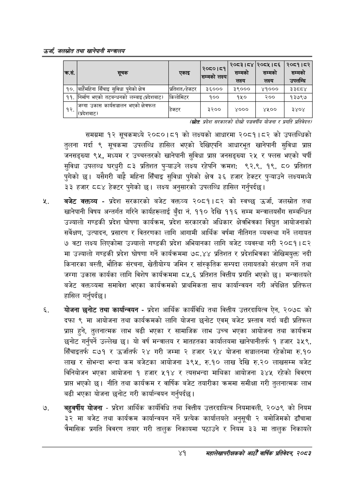

# Page 63 QA

## Rendered page


## Extracted text

```text
उर्जा जलखोत तथा खानेपानी सन्तालय
(स्रोतः प्रदेश सरकारको दोस्रो पञ्चवर्षीय योजना र प्रगति प्रतिवेदन
समग्रमा १२ सूचकमध्ये २०८०।८१ को लक्ष्यको आधारमा २०८१।८२ को उपलब्धिको तुलना गर्दा ९ सूचकमा उपलब्धि हासिल भएको देखिएपनि आधारभूत खानेपानी सुविधा प्राप्त जनसङ्ख्या ९५, मध्यम र उच्चस्तरको खानेपानी सुविधा प्रापत जनसङ्ख्या २५ र फ्लस भएको चर्पी सुविधा उपलब्ध घरधुरी ८३ प्रतिशत पुन्याउने लक्ष्य रहेपनि क्रमशः ९२.९, १९, ८० प्रतिशत पुगेको छ। यसैगरी बाहै महिना सिँचाइ सुविधा पुगेको क्षेत्र ३६ हजार हेक्टर पुन्याउने लक्ष्यमध्ये ३३ हजार ८८४ हेक्टर पुगेको छ। लक्ष्य अनुसारको उपलब्धि हासिल गर्नुपर्दछ |
बजेट वक्तव्य -प्रदेश सरकारको बजेट वक्तव्य २०८१।८२ को स्वच्छ उर्जा, जलस्रोत तथा खानेपानी विषय अन्तर्गत गरिने कार्यहरूलाई बुँदा नं. ११० देखि ११६ सम्म मन्त्रालयसँग सम्बन्धित उज्यालो गण्डकी प्रदेश घोषणा कार्यक्रम, प्रदेश सरकारको अधिकार क्षेत्रभित्रका विद्युत आयोजनाको सर्वेक्षण, उत्पादन, प्रसारण र वितरणका लागि आगामी आर्थिक वर्षमा नीतिगत व्यवस्था गर्ने लगायत ७ वटा लक्ष्य लिएकोमा उज्यालो गण्डकी प्रदेश अभियानका लागि बजेट व्यवस्था गरी २०८१। ८२ मा उज्यालो गण्डकी प्रदेश घोषणा गर्ने कार्यक्रममा ७८.४४ प्रतिशत र प्रदेशभित्रका जोखिमयुक्त नदी किनारका बस्ती, भौतिक संरचना, खेतीयोग्य जमिन र सांस्कृतिक सम्पदा लगायतको संरक्षण गर्ने तथा जग्गा उकास कार्यका लागि विशेष कार्यक्रममा ८५.६ प्रतिशत वित्तीय प्रगति भएको छ। मन्त्रालयले बजेट वक्तव्यमा समावेश भएका कार्यक्रमको प्राथमिकता साथ कार्यान्वयन गरी अपेक्षित प्रतिफल हासिल गर्नुपर्दछ |
योजना छनोट तथा कार्यान्वयन -प्रदेश आर्थिक कार्यविधि तथा वित्तीय उत्तरदायित्व ऐन, २०७८ को दफा ९ मा आयोजना तथा कार्यक्रमको लागि योजना छनोट एवम्‌ बजेट प्रस्ताव गर्दा बढी प्रतिफल प्राप्त हुने, तुलनात्मक लाभ बढी भएका र सामाजिक लाभ उच्च भएका आयोजना तथा कार्यक्रम छनोट गर्नुपर्ने उल्लेख छ। यो वर्ष मन्त्रालय र मातहतका कार्यालयमा खानेपानीतर्फ १ हजार ३५९, सिँचाइतर्फ ८७१ र उर्जातर्फ २४ गरी जम्मा २ हजार २५४ योजना सञ्चालनमा रहेकोमा रु.१० लाख र सोभन्दा भन्दा कम बजेटका आयोजना ३९५, रु.१० लाख देखि रु.२० लाखसम्म बजेट विनियोजन भएका आयोजना १ हजार ५१४ र त्यसभन्दा माथिका आयोजना ३४५ रहेको विवरण प्रापत भएको | नीति तथा कार्यक्रम र वार्षिक बजेट तयारीका क्रममा समीक्षा गरी तुलनात्मक लाभ बढी भएका योजना छनोट गरी कार्यान्वयन गर्नुपर्दछ |
बहुवर्षीय योजना -प्रदेश आर्थिक कार्यविधि तथा वित्तीय उत्तरदायित्व नियमावली, २०७९ को नियम ३२ मा बजेट तथा कार्यक्रम कार्यान्वयन गर्ने प्रत्येक कार्यालयले अनुसूची २ बमोजिमको ढाँचामा चैमासिक प्रगति विवरण तयार गरी तालुक निकायमा पठाउने र नियम ३३ मा तालुक निकायले
४१
महालेखापरीक्षकको आठौ वाषिकि प्रतिवेदन २०८२

| क्रस. | 'सूचक | एकाइ | सम्मको लक्ष्य | 'सम्मको लक्ष्य | ज्त्व्त्न्ति२५४०५४२२२५०५५४४[२५०५२ सम्मको लक्ष्य | सम्मको ~ उपलन्धि |
| --- | --- | --- | --- | --- | --- | --- |
| १०. | जाहेभहिना सिँचाइ सुविधा पुगेको क्षेत्र | प्रतिशत/हेक्ट | ३६००० | ३९००० | ४१००० | ३३ |
| ११. | निर्माण भएको तटबन्धनको लम्बाइ (न्रदेशबाट) | किलोमिटर | १०० | १५० | २०० | १३७९७ |
| _ १२, | जग्गा उकास कार्यक्षच्रालन भएको क्षेत्रफल (देशबाट) | २ हेक्टर | रि ३२०० | ४००० | ४५०० | ३४०४ |
```

## Flags
- table_page
- medium_quality_table
