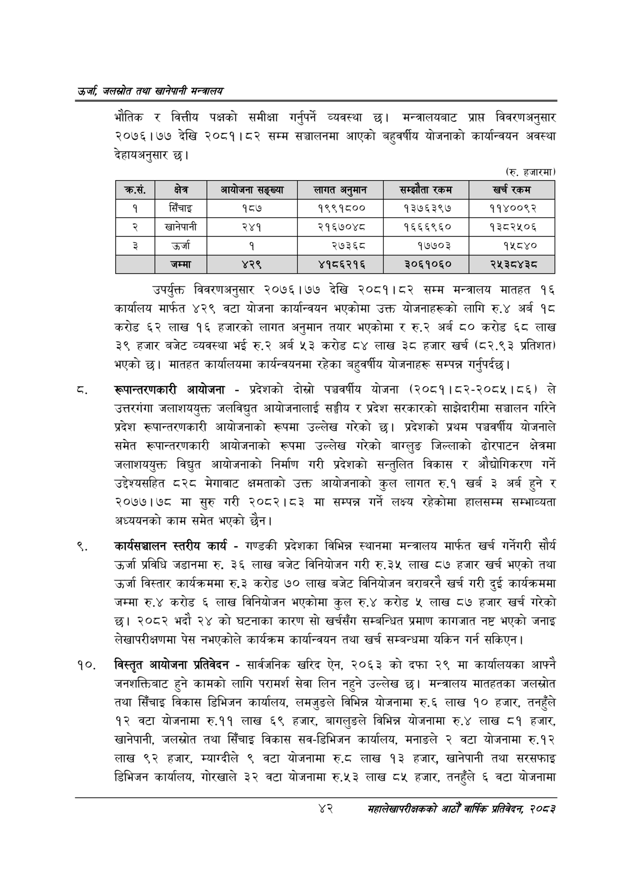

# Page 64 QA

## Rendered page


## Extracted text

```text
उर्जा जलखोत तथा खानेपानी सन्तालय
भौतिक र वित्तीय पक्षको समीक्षा गर्नुपर्ने व्यवस्था छ। मन्त्रालयबाट प्राप्त विवरणअनुसार २०७६।७७ देखि २०८१।८२ सम्म सञ्चालनमा आएको बहुवर्षीय योजनाको कार्यान्वयन अवस्था देहायअनुसार छ।
(रु. हजारमा)
उपर्युक्त विवरणअनुसार २०७६।७७ देखि २०८१।८२ सम्म मन्त्रालय मातहत १६ कार्यालय मार्फत ४२९ वटा योजना कार्यान्वयन भएकोमा उक्त योजनाहरूको लागि रु.४ अर्ब १८ करोड ६२ लाख १६ हजारको लागत अनुमान तयार भएकोमा र रु.२ अर्ब ८० करोड ६८ लाख ३९ हजार बजेट व्यवस्था भई रु.२ अर्ब ५३ करोड ८४ लाख ३८ हजार खर्च (८२.९३ प्रतिशत) भएको छ। मातहत कार्यालयमा कार्यन्वयनमा रहेका बहुवर्षीय योजनाहरू सम्पन्न गर्नुपर्दछ |
रूपान्तरणकारी आयोजना -प्रदेशको दोस्रो पञ्चवर्षीय योजना (२०८१।८२-२०८५।८६) ले उत्तरगंगा जलाशययुक्त जलविद्युत आयोजनालाई सङ्घीय र प्रदेश सरकारको साझेदारीमा सञ्चालन गरिने प्रदेश रूपान्तरणकारी आयोजनाको रूपमा उल्लेख गरेको छ। प्रदेशको प्रथम पञ्चवर्षीय योजनाले समेत रूपान्तरणकारी आयोजनाको रूपमा उल्लेख गरेको बाग्लुङ जिल्लाको ढोरपाटन क्षेत्रमा जलाशययुक्त विधुत आयोजनाको निर्माण गरी प्रदेशको सन्तुलित विकास र औद्योगिकरण गर्ने उद्देश्यसहित ८२८ मेगावाट क्षमताको उक्त आयोजनाको कुल लागत रु.१ खर्ब ३ अर्ब हुने र २०७७।७८ मा सुरु गरी २०८२।८३ मा सम्पन्न गर्ने लक्ष्य रहेकोमा हालसम्म सम्भाव्यता अध्ययनको काम समेत भएको |
कार्यसञ्चालन स्तरीय कार्य -गण्डकी प्रदेशका विभिन्न स्थानमा मन्त्रालय मार्फत खर्च गर्नेगरी सौर्य उर्जा प्रविधि जडानमा रु. ३६ लाख बजेट विनियोजन गरी रु.३५ लाख ८७ हजार खर्च भएको तथा उर्जा विस्तार कार्यक्रममा रु.३ करोड ७० लाख बजेट विनियोजन बराबरनै खर्च गरी दुई कार्यक्रममा जम्मा रु.४ करोड ६ लाख विनियोजन भएकोमा कुल रु.४ करोड ५ लाख ८७ हजार खर्च गरेको छ। २०८२ भदौ २४ को घटनाका कारण सो खर्चसँग सम्बन्धित प्रमाण कागजात नष्ट भएको जनाइ लेखापरीक्षणमा पेस नभएकोले कार्यक्रम कार्यान्वयन तथा खर्च सम्बन्धमा यकिन गर्न सकिएन |
विस्तृत आयोजना प्रतिवेदन -सार्वजनिक खरिद ऐन, २०६३ को दफा २९ मा कार्यालयका आफ्नै जनशक्तिबाट हुने कामको लागि परामर्श सेवा लिन नहुने उल्लेख छ। मन्त्रालय मातहतका जलस्रोत तथा सिँचाइ विकास डिभिजन कार्यालय, लमजुङले विभिन्न योजनामा रु.६ लाख १० हजार, तनहुँले १२ वटा योजनामा रु.११ लाख ६९ हजार, बागलुङले विभिन्न योजनामा रु.४ लाख ८१ हजार, खानेपानी, जलस्रोत तथा सिँचाइ विकास सव-डिभिजन कार्यालय, मनाङले २ वटा योजनामा रु.१२ लाख ९२ हजार, म्याग्दीले ९ वटा योजनामा ६.५ लाख १३ हजार, खानेपानी तथा सरसफाइ डिभिजन कार्यालय, गोरखाले ३२ वटा योजनामा रु.५३ लाख ८५ हजार, तनहुँले ६ वटा योजनामा
४२
महालेखापरीक्षकको आठौ वाषिकि प्रतिवेदन २०८२

| क्रस. | क्षेत्र | सङ्ख्या | 'लागत अनुमान | सन्झेता रकम | खर्च रकम |
| --- | --- | --- | --- | --- | --- |
| १ | सिँचाइ | १८७ | १९९१८०० | १३७६३९७ | ११४००९२ |
| २ | खानेपानी | २४१ | २१६७०४८ | १६६६९६० | १३८२५०६ |
| ३ | उर्जा | १ | २७३६८ | १७७०३ | १४८४० |
| ४ | जम्मा | ४२९ | ४१८६२१६ | ३०६१०६० | २५३८४३८ |
```

## Flags
- table_page
- medium_quality_table
