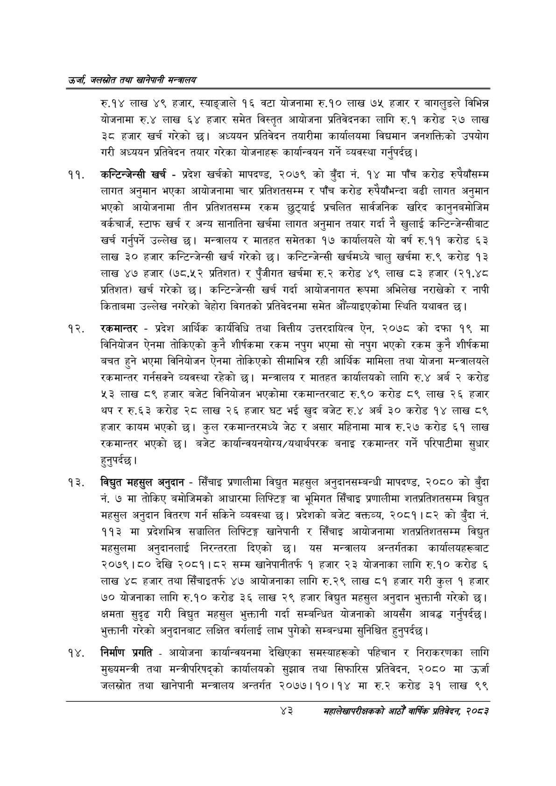

# Page 65 QA

## Rendered page


## Extracted text

```text
उर्जा जलखोत तथा खानेपानी सन्तालय
रु.१४ लाख ४९ हजार, स्याङ्जाले १६ वटा योजनामा रु.१० लाख ७५ हजार र बागलुङले विभिन्न योजनामा रु.४ लाख ६४ हजार समेत विस्तृत आयोजना प्रतिवेदनका लागि रु.१ करोड २७ लाख ३८ हजार खर्च गरेको | अध्ययन प्रतिवेदन तयारीमा कार्यालयमा विद्यमान जनशक्तिको उपयोग गरी अध्ययन प्रतिवेदन तयार गरेका योजनाहरू कार्यान्वयन गर्ने व्यवस्था गर्नुपर्दछ |
कन्टिन्जेन्सी खर्च -प्रदेश खर्चको मापदण्ड, २०७९ को बुँदा नं. १४ मा पाँच करोड रुपैयाँसम्म लागत अनुमान भएका आयोजनामा चार प्रतिशतसम्म र पाँच करोड रुपैयाँभन्दा बढी लागत अनुमान भएको आयोजनामा तीन प्रतिशतसम्म रकम छुट्याई प्रचलित सार्वजनिक खरिद कानुनबमोजिम वर्कचार्ज, स्टाफ खर्च र अन्य सानातिना खर्चमा लागत अनुमान तयार गर्दा नै खुलाई कन्टिन्जेन्सीबाट खर्च गर्नुपर्ने उल्लेख छ। मन्त्रालय र मातहत समेतका १७ कार्यालयले यो वर्ष रु.११ करोड ६३ लाख ३० हजार कन्टिन्जेन्सी खर्च गरेको | कन्टिन्जेन्सी खर्चमध्ये चालु खर्चमा रु.९ करोड १३ लाख ४७ हजार (७८.५२ प्रतिशत) र पुँजीगत खर्चमा रु.२ करोड ४९ लाख ८३ हजार (२१.४८ प्रतिशत) खर्च गरेको छ। कन्टिन्जेन्सी खर्च गर्दा आयोजनागत रूपमा अभिलेख नराखेको र नापी किताबमा उल्लेख नगरेको बेहोरा विगतको प्रतिवेदनमा समेत औंँल्याइएकोमा स्थिति यथावत छ।
रकमान्तर -प्रदेश आर्थिक कार्यविधि तथा वित्तीय उत्तरदायित्व ऐन, २०७८ को दफा १९ मा विनियोजन ऐनमा तोकिएको कुनै शीर्षकमा रकम नपुग भएमा सो नपुग भएको रकम कुनै शीर्षकमा बचत हुने भएमा विनियोजन ऐनमा तोकिएको सीमाभित्र रही आर्थिक मामिला तथा योजना मन्त्रालयले रकमान्तर गर्नसक्ने व्यवस्था रहेको छ। मन्त्रालय र मातहत कार्यालयको लागि रु.४ अर्ब २ करोड ५३ लाख ८९ हजार बजेट विनियोजन भएकोमा रकमान्तरबाट रु.९० करोड ८९ लाख २६ हजार थप र रु.६३ करोड २८ लाख २६ हजार घट भई खुद बजेट रु.४ अर्ब ३० करोड १४ लाख ८९ हजार कायम भएको | कुल रकमान्तरमध्ये जेठ र असार महिनामा मात्र रु.२७ करोड ६१ लाख रकमान्तर भएको छ। बजेट कार्यान्वयनयोग्य/यथार्थपरक बनाइ रकमान्तर गर्ने परिपाटीमा सुधार हुनुपर्दछ |
विद्युत महसुल अनुदान -सिँचाइ प्रणालीमा विद्युत महसुल अनुदानसम्बन्धी मापदण्ड, २०८० को बुँदा नं. ७ मा तोकिए बमोजिमको आधारमा लिफ्टिङ्ग वा भूमिगत सिँचाइ प्रणालीमा शतप्रतिशतसम्म विद्युत महसुल अनुदान वितरण गर्न सकिने व्यवस्था छ। प्रदेशको बजेट वक्तव्य, २०८१।८२ को बुँदा नं. ११३ मा प्रदेशभित्र सञ्चालित लिफ्टिङ्ग खानेपानी र सिँचाइ आयोजनामा शतप्रतिशतसम्म विद्युत महसुलमा अनुदानलाई निरन्तरता दिएको छ। यस मन्त्रालय अन्तर्गतका कार्यालयहरूबाट २०७९।८० देखि २०८१।८२ सम्म खानेपानीतर्फ १ हजार २३ योजनाका लागि रु.१० करोड ६ लाख ४८ हजार तथा सिँचाइतर्फ ४७ आयोजनाका लागि रु.२९ लाख ८१ हजार गरी कुल १ हजार ७० योजनाका लागि रु.१० करोड ३६ लाख २९ हजार विद्युत महसुल अनुदान भुक्तानी गरेको छ। क्षमता सुदृढ गरी विद्युत महसुल भुक्तानी गर्दा सम्बन्धित योजनाको आयसँग आबद्ध गर्नुपर्दछ। भुक्तानी गरेको अनुदानबाट लक्षित वर्गलाई लाभ पुगेको सम्बन्धमा सुनिश्चित हुनुपर्दछ |
निर्माण प्रगति -आयोजना कार्यान्वयनमा देखिएका समस्याहरूको पहिचान र निराकरणका लागि मुख्यमन्त्री तथा मन्त्रीपरिषद्को कार्यालयको सुझाव तथा सिफारिस प्रतिवेदन, २०८० मा उर्जा जलस्रोत तथा खानेपानी मन्त्रालय अन्तर्गत २०७७।१०।१४ मा रु.२ करोड ३१ लाख ९९
४३
महालेखापरीक्षकको आठौ वाषिकि प्रतिवेदन २०८२
```

## Flags
- None
